# Grow Log

## Grow details

**Name:** Aurora Indica

**Strain:** Nirvana seeds

**Planted:** 2019-08-13 20:06

**From clone?:** false

**Medium:** Coco Coir

**Harvested:** 2019-12-21 13:40

## Stages

 - Planted

	 - **Set on:** 2019-08-13 20:06
	 - **In stage for:** 0 days


 - Germination

	 - **Set on:** 2019-08-13 20:07
	 - **In stage for:** 2 days


 - Seedling

	 - **Set on:** 2019-08-15 20:07
	 - **In stage for:** 4.54 days


 - Vegetation

	 - **Set on:** 2019-08-20 09:11
	 - **In stage for:** 40.4 days


 - Flowering

	 - **Set on:** 2019-09-29 18:50
	 - **In stage for:** 68.99 days


 - Drying

	 - **Set on:** 2019-12-07 17:42
	 - **In stage for:** 8.17 days


 - Curing

	 - **Set on:** 2019-12-15 21:46
	 - **In stage for:** 5.66 days


 - Harvested

	 - **Set on:** 2019-12-21 13:40


## Stats

 - **Total grow time:** 129.77 days
 - **Total waters:** 55
 - **Total water used:** 528.5l
 - **Total flushes:** 0
 - **Average time between watering:** 1.93 days

### Nutrients used

 - Rhizotonic (total: 327.25ml)
 - Canna A&B (total: 1526.5ml)
 - Canna Calmag (total: 883.5ml)
 - Cannazym (total: 1365ml)
 - Canna pk 13/14 (total: 205ml)
 - Overdrive (total: 300ml)
 - Seasol (total: 1105ml)

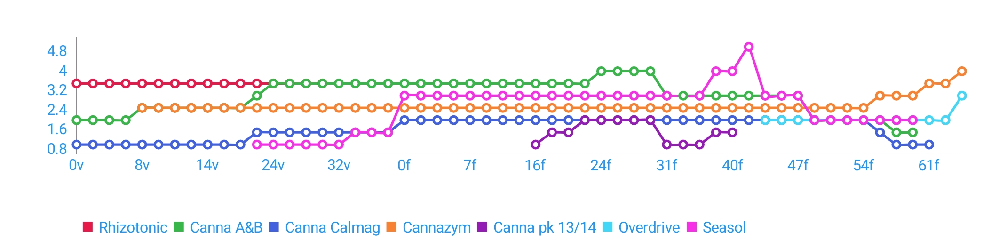

### Input/runoff pH

 - **Minimum input pH:** 5.3
 - **Maximum input pH:** 5.8
 - **Average input pH:** 5.62

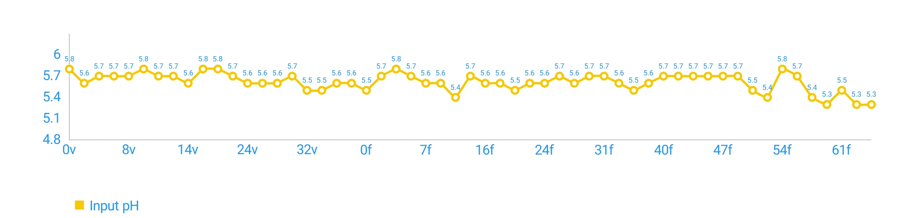

### EC

 - **Minimum input EC**: 0.4mS/cm
 - **Maximum input EC**: 3mS/cm
 - **Average input EC**: 2.16mS/cm

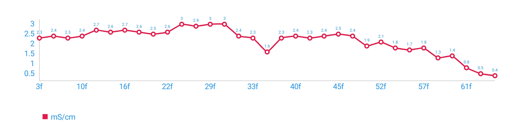

### Temperature (°C)

 - **Minimum input temperature**: -°C
 - **Maximum input temperature**: -°C
 - **Average input temperature**: 0°C


## Actions

| Date | Stage | Action | Details | Notes |
| ---- | ----- | ------ | ------- | ----- |
| 2019-12-21 13:40 | 129/1h | Note |   | 702g |
| 2019-12-21 13:40 | 129/5c | StageChange | Changed to Harvested |  |
| 2019-12-15 21:46 | 124/8d | StageChange | Changed to Curing |  |
| 2019-12-07 17:42 | 115/68f | StageChange | Changed to Drying |  |
| 2019-12-04 18:08 | 112/66f | Water | **pH:** 5.3 **amount:** 10l **EC:** 0.4mS/cm  / **Cannazym:** 4ml/l – **Overdrive:** 3ml/l |  |
| 2019-12-02 18:21 | 110/64f | Water | **pH:** 5.3 **amount:** 10l **EC:** 0.5mS/cm  / **Cannazym:** 3.5ml/l – **Overdrive:** 2ml/l |  |
| 2019-11-30 16:33 | 108/61f | Water | **pH:** 5.5 **amount:** 15l **EC:** 0.8mS/cm  / **Canna Calmag:** 1ml/l – **Cannazym:** 3.5ml/l – **Overdrive:** 2ml/l |  |
| 2019-11-28 18:12 | 106/60f | Water | **pH:** 5.3 **amount:** 10l **EC:** 1.4mS/cm  / **Canna A&B:** 1.5ml/l – **Cannazym:** 3ml/l – **Canna Calmag:** 1ml/l – **Seasol:** 2ml/l – **Overdrive:** 2ml/l |  |
| 2019-11-26 18:37 | 104/58f | Water | **pH:** 5.4 **amount:** 10l **EC:** 1.3mS/cm  / **Canna A&B:** 1.5ml/l – **Cannazym:** 3ml/l – **Canna Calmag:** 1ml/l – **Seasol:** 2ml/l – **Overdrive:** 2ml/l |  |
| 2019-11-25 18:20 | 103/57f | Water | **pH:** 5.7 **amount:** 10l **EC:** 1.8mS/cm  / **Canna A&B:** 2ml/l – **Cannazym:** 3ml/l – **Canna Calmag:** 1.5ml/l – **Seasol:** 2ml/l – **Overdrive:** 2ml/l |  |
| 2019-11-23 16:49 | 101/54f | Water | **pH:** 5.8 **amount:** 10l **EC:** 1.7mS/cm  / **Canna A&B:** 2ml/l – **Cannazym:** 2.5ml/l – **Canna Calmag:** 2ml/l – **Seasol:** 2ml/l – **Overdrive:** 2ml/l |  |
| 2019-11-22 19:58 | 101/54f | Water | **pH:** 5.4 **amount:** 10l **EC:** 1.8mS/cm  / **Canna A&B:** 2ml/l – **Cannazym:** 2.5ml/l – **Canna Calmag:** 2ml/l – **Seasol:** 2ml/l – **Overdrive:** 2ml/l |  |
| 2019-11-20 18:37 | 98/52f | Water | **pH:** 5.5 **amount:** 15l **EC:** 2.1mS/cm  / **Canna A&B:** 2ml/l – **Cannazym:** 2.5ml/l – **Canna Calmag:** 2ml/l – **Seasol:** 2ml/l – **Overdrive:** 2ml/l |  |
| 2019-11-18 18:14 | 96/50f | Water | **pH:** 5.7 **amount:** 10l **EC:** 1.9mS/cm  / **Canna A&B:** 2ml/l – **Cannazym:** 2.5ml/l – **Canna Calmag:** 2ml/l – **Seasol:** 2ml/l – **Overdrive:** 2ml/l |  |
| 2019-11-16 16:42 | 94/47f | Water | **pH:** 5.7 **amount:** 10l **EC:** 2.4mS/cm  / **Canna A&B:** 3ml/l – **Cannazym:** 2.5ml/l – **Canna Calmag:** 2ml/l – **Seasol:** 3ml/l – **Overdrive:** 2ml/l |  |
| 2019-11-14 17:12 | 92/45f | Water | **pH:** 5.7 **amount:** 15l **EC:** 2.5mS/cm  / **Canna A&B:** 3ml/l – **Cannazym:** 2.5ml/l – **Canna Calmag:** 2ml/l – **Seasol:** 3ml/l – **Overdrive:** 2ml/l |  |
| 2019-11-12 18:16 | 90/44f | Water | **pH:** 5.7 **amount:** 10l **EC:** 2.4mS/cm  / **Canna A&B:** 3ml/l – **Cannazym:** 2.5ml/l – **Canna Calmag:** 2ml/l – **Seasol:** 3ml/l – **Overdrive:** 2ml/l |  |
| 2019-11-10 17:16 | 88/41f | Water | **pH:** 5.7 **amount:** 10l **EC:** 2.3mS/cm  / **Canna A&B:** 3ml/l – **Cannazym:** 2.5ml/l – **Canna Calmag:** 2ml/l – **Seasol:** 5ml/l |  |
| 2019-11-08 19:58 | 87/40f | Water | **pH:** 5.7 **amount:** 10l **EC:** 2.4mS/cm  / **Canna A&B:** 3ml/l – **Cannazym:** 2.5ml/l – **Canna Calmag:** 2ml/l – **Canna pk 13/14:** 1.5ml/l – **Seasol:** 4ml/l |  |
| 2019-11-06 18:17 | 84/38f | Water | **pH:** 5.6 **amount:** 10l **EC:** 2.3mS/cm  / **Canna A&B:** 3ml/l – **Cannazym:** 2.5ml/l – **Canna Calmag:** 2ml/l – **Canna pk 13/14:** 1.5ml/l – **Seasol:** 4ml/l |  |
| 2019-11-04 18:20 | 82/36f | Water | **pH:** 5.5 **amount:** 10l **EC:** 1.6mS/cm  / **Canna A&B:** 3ml/l – **Cannazym:** 2.5ml/l – **Canna Calmag:** 2ml/l – **Canna pk 13/14:** 1ml/l – **Seasol:** 3ml/l |  |
| 2019-11-02 16:36 | 80/33f | Water | **pH:** 5.6 **amount:** 10l **EC:** 2.3mS/cm  / **Canna A&B:** 3ml/l – **Cannazym:** 2.5ml/l – **Canna Calmag:** 2ml/l – **Canna pk 13/14:** 1ml/l |  |
| 2019-10-31 17:43 | 78/31f | Water | **pH:** 5.7 **amount:** 10l **EC:** 2.4mS/cm  / **Canna A&B:** 3ml/l – **Cannazym:** 2.5ml/l – **Seasol:** 3ml/l – **Canna Calmag:** 2ml/l – **Canna pk 13/14:** 1ml/l |  |
| 2019-10-29 18:22 | 76/30f | Water | **pH:** 5.7 **amount:** 10l **EC:** 3mS/cm  / **Canna A&B:** 4ml/l – **Cannazym:** 2.5ml/l – **Seasol:** 3ml/l – **Canna Calmag:** 2ml/l – **Canna pk 13/14:** 2ml/l |  |
| 2019-10-28 18:06 | 75/29f | Water | **pH:** 5.6 **amount:** 10l **EC:** 3mS/cm  / **Canna A&B:** 4ml/l – **Cannazym:** 2.5ml/l – **Seasol:** 3ml/l – **Canna Calmag:** 2ml/l – **Canna pk 13/14:** 2ml/l |  |
| 2019-10-26 17:12 | 73/26f | Water | **pH:** 5.7 **amount:** 10l **EC:** 2.9mS/cm  / **Canna A&B:** 4ml/l – **Cannazym:** 2.5ml/l – **Seasol:** 3ml/l – **Canna Calmag:** 2ml/l – **Canna pk 13/14:** 2ml/l |  |
| 2019-10-24 18:44 | 71/24f | Water | **pH:** 5.6 **amount:** 10l **EC:** 3mS/cm  / **Canna A&B:** 4ml/l – **Cannazym:** 2.5ml/l – **Seasol:** 3ml/l – **Canna Calmag:** 2ml/l – **Canna pk 13/14:** 2ml/l |  |
| 2019-10-22 18:22 | 69/22f | Water | **pH:** 5.6 **amount:** 10l **EC:** 2.6mS/cm  / **Canna A&B:** 3.5ml/l – **Cannazym:** 2.5ml/l – **Seasol:** 3ml/l – **Canna Calmag:** 2ml/l – **Canna pk 13/14:** 2ml/l |  |
| 2019-10-20 17:03 | 67/20f | Water | **pH:** 5.5 **amount:** 10l **EC:** 2.5mS/cm  / **Canna A&B:** 3.5ml/l – **Cannazym:** 2.5ml/l – **Seasol:** 3ml/l – **Canna Calmag:** 2ml/l – **Canna pk 13/14:** 1.5ml/l |  |
| 2019-10-18 17:15 | 65/18f | Water | **pH:** 5.6 **amount:** 10l **EC:** 2.6mS/cm  / **Canna A&B:** 3.5ml/l – **Cannazym:** 2.5ml/l – **Seasol:** 3ml/l – **Canna Calmag:** 2ml/l – **Canna pk 13/14:** 1.5ml/l |  |
| 2019-10-16 17:18 | 63/16f | Water | **pH:** 5.6 **amount:** 15l **EC:** 2.7mS/cm  / **Canna A&B:** 3.5ml/l – **Cannazym:** 2.5ml/l – **Seasol:** 3ml/l – **Canna Calmag:** 2ml/l – **Canna pk 13/14:** 1ml/l |  |
| 2019-10-14 16:32 | 61/14f | Water | **pH:** 5.7 **amount:** 15l **EC:** 2.6mS/cm  / **Canna A&B:** 3.5ml/l – **Cannazym:** 2.5ml/l – **Seasol:** 3ml/l – **Canna Calmag:** 2ml/l |  |
| 2019-10-12 19:23 | 59/13f | Water | **pH:** 5.4 **amount:** 15l **EC:** 2.7mS/cm  / **Canna A&B:** 3.5ml/l – **Cannazym:** 2.5ml/l – **Seasol:** 3ml/l – **Canna Calmag:** 2ml/l |  |
| 2019-10-09 19:36 | 56/10f | Water | **pH:** 5.6 **amount:** 10l **EC:** 2.4mS/cm  / **Canna A&B:** 3.5ml/l – **Cannazym:** 2.5ml/l – **Seasol:** 3ml/l – **Canna Calmag:** 2ml/l |  |
| 2019-10-07 18:01 | 54/7f | Water | **pH:** 5.6 **amount:** 10l **EC:** 2.3mS/cm  / **Canna A&B:** 3.5ml/l – **Cannazym:** 2.5ml/l – **Seasol:** 3ml/l – **Canna Calmag:** 2ml/l |  |
| 2019-10-05 17:21 | 52/5f | Water | **pH:** 5.7 **amount:** 10l **EC:** 2.4mS/cm  / **Canna A&B:** 3.5ml/l – **Cannazym:** 2.5ml/l – **Seasol:** 3ml/l – **Canna Calmag:** 2ml/l |  |
| 2019-10-03 18:35 | 50/3f | Water | **pH:** 5.8 **amount:** 10l **EC:** 2.3mS/cm  / **Canna A&B:** 3.5ml/l – **Cannazym:** 2.5ml/l – **Seasol:** 3ml/l – **Canna Calmag:** 2ml/l |  |
| 2019-10-01 13:07 | 48/1f | Water | **pH:** 5.7 **amount:** 10l  / **Canna A&B:** 3.5ml/l – **Cannazym:** 2.5ml/l – **Seasol:** 3ml/l – **Canna Calmag:** 2ml/l |  |
| 2019-09-29 18:54 | 46/1f | Water | **pH:** 5.5 **amount:** 15l  / **Canna A&B:** 3.5ml/l – **Cannazym:** 2.5ml/l – **Seasol:** 3ml/l – **Canna Calmag:** 2ml/l |  |
| 2019-09-29 18:50 | 46/40v | StageChange | Changed to Flowering |  |
| 2019-09-27 08:00 | 44/37v | Water | **pH:** 5.6 **amount:** 15l  / **Canna A&B:** 3.5ml/l – **Cannazym:** 2.5ml/l – **Seasol:** 1.5ml/l – **Canna Calmag:** 1.5ml/l |  |
| 2019-09-25 18:23 | 42/36v | Water | **pH:** 5.6 **amount:** 15l  / **Canna A&B:** 3.5ml/l – **Cannazym:** 2.5ml/l – **Seasol:** 1.5ml/l – **Canna Calmag:** 1.5ml/l |  |
| 2019-09-24 18:53 | 41/35v | Action | Trim |  |
| 2019-09-23 18:18 | 40/34v | Water | **pH:** 5.5 **amount:** 10l  / **Canna A&B:** 3.5ml/l – **Cannazym:** 2.5ml/l – **Seasol:** 1.5ml/l – **Canna Calmag:** 1.5ml/l |  |
| 2019-09-21 17:19 | 38/32v | Water | **pH:** 5.5 **amount:** 10l  / **Canna A&B:** 3.5ml/l – **Cannazym:** 2.5ml/l – **Seasol:** 1ml/l – **Canna Calmag:** 1.5ml/l |  |
| 2019-09-19 12:47 | 36/30v | Water | **pH:** 5.7 **amount:** 10l  / **Canna A&B:** 3.5ml/l – **Cannazym:** 2.5ml/l – **Rhizotonic:** 3.5ml/l – **Seasol:** 1ml/l – **Canna Calmag:** 1.5ml/l |  |
| 2019-09-17 12:56 | 34/28v | Water | **pH:** 5.6 **amount:** 10l  / **Canna A&B:** 3.5ml/l – **Cannazym:** 2.5ml/l – **Rhizotonic:** 3.5ml/l – **Seasol:** 1ml/l – **Canna Calmag:** 1.5ml/l |  |
| 2019-09-15 18:52 | 32/26v | Water | **pH:** 5.6 **amount:** 10l  / **Canna A&B:** 3.5ml/l – **Cannazym:** 2.5ml/l – **Rhizotonic:** 3.5ml/l – **Seasol:** 1ml/l – **Canna Calmag:** 1.5ml/l |  |
| 2019-09-13 19:33 | 30/24v | Water | **pH:** 5.6 **amount:** 10l  / **Canna A&B:** 3.5ml/l – **Cannazym:** 2.5ml/l – **Rhizotonic:** 3.5ml/l – **Seasol:** 1ml/l – **Canna Calmag:** 1.5ml/l |  |
| 2019-09-12 19:23 | 29/23v | Action | Low Stress Training |  |
| 2019-09-11 19:35 | 28/22v | Action | Topped |  |
| 2019-09-11 19:35 | 28/22v | Action | Trim |  |
| 2019-09-11 18:22 | 28/22v | Water | **pH:** 5.7 **amount:** 10l  / **Canna A&B:** 3ml/l – **Cannazym:** 2.5ml/l – **Rhizotonic:** 3.5ml/l – **Canna Calmag:** 1.5ml/l – **Seasol:** 1ml/l |  |
| 2019-09-08 18:25 | 25/19v | Water | **pH:** 5.8 **amount:** 10l  / **Canna A&B:** 2.5ml/l – **Rhizotonic:** 3.5ml/l – **Canna Calmag:** 1ml/l – **Cannazym:** 2.5ml/l |  |
| 2019-09-06 18:07 | 23/17v | Water | **pH:** 5.8  / **Canna A&B:** 2.5ml/l – **Rhizotonic:** 3.5ml/l – **Canna Calmag:** 1ml/l – **Cannazym:** 2.5ml/l |  |
| 2019-09-04 18:23 | 21/15v | Action | Trim | trimmed first nodes |
| 2019-09-04 18:22 | 21/15v | Action | Topped | topped third node |
| 2019-09-03 17:09 | 20/14v | Water | **pH:** 5.6 **amount:** 10l  / **Canna A&B:** 2.5ml/l – **Rhizotonic:** 3.5ml/l – **Canna Calmag:** 1ml/l – **Cannazym:** 2.5ml/l |  |
| 2019-09-02 18:52 | 19/13v | Water | **pH:** 5.7 **amount:** 10l  / **Canna A&B:** 2.5ml/l – **Rhizotonic:** 3.5ml/l – **Canna Calmag:** 1ml/l – **Cannazym:** 2.5ml/l |  |
| 2019-09-01 17:59 | 18/12v | Water | **pH:** 5.7 **amount:** 5l  / **Canna A&B:** 2.5ml/l – **Rhizotonic:** 3.5ml/l – **Canna Calmag:** 1ml/l – **Cannazym:** 2.5ml/l |  |
| 2019-08-31 20:23 | 18/11v | Action | Transplanted |  |
| 2019-08-30 17:46 | 16/10v | Water | **pH:** 5.8 **amount:** 2l  / **Canna A&B:** 2.5ml/l – **Rhizotonic:** 3.5ml/l – **Canna Calmag:** 1ml/l – **Cannazym:** 2.5ml/l |  |
| 2019-08-28 18:19 | 14/8v | Water | **pH:** 5.7 **amount:** 2l  / **Canna A&B:** 2.5ml/l – **Rhizotonic:** 3.5ml/l – **Canna Calmag:** 1ml/l – **Cannazym:** 2.5ml/l |  |
| 2019-08-26 12:38 | 12/6v | Water | **pH:** 5.7 **amount:** 2l  / **Canna A&B:** 2ml/l – **Rhizotonic:** 3.5ml/l – **Canna Calmag:** 1ml/l |  |
| 2019-08-24 08:34 | 10/3v | Water | **pH:** 5.7 **amount:** 1l  / **Canna A&B:** 2ml/l – **Rhizotonic:** 3.5ml/l – **Canna Calmag:** 1ml/l |  |
| 2019-08-21 17:43 | 7/1v | Water | **pH:** 5.6 **amount:** 1l  / **Canna A&B:** 2ml/l – **Rhizotonic:** 3.5ml/l – **Canna Calmag:** 1ml/l |  |
| 2019-08-20 09:21 | 6/1v | Water | **pH:** 5.8 **amount:** 0.5l  / **Canna A&B:** 2ml/l – **Rhizotonic:** 3.5ml/l – **Canna Calmag:** 1ml/l |  |
| 2019-08-20 09:11 | 6/4s | StageChange | Changed to Vegetation |  |
| 2019-08-15 20:07 | 2/2g | StageChange | Changed to Seedling |  |
| 2019-08-13 20:07 | 1/1p | StageChange | Changed to Germination |  |
| 2019-08-13 20:06 |   | StageChange | Changed to Planted |  |

## Images

[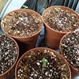](images/18-08-2019/1566155282534.jpg)
[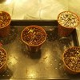](images/20-08-2019/1566288700039.jpg)
[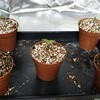](images/21-08-2019/1566405813243.jpg)
[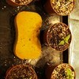](images/24-08-2019/1566632751951.jpg)
[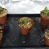](images/26-08-2019/1566810684199.jpg)
[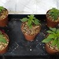](images/28-08-2019/1567012771712.jpg)
[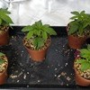](images/30-08-2019/1567184005671.jpg)
[](images/31-08-2019/1567279396373.jpg)
[](images/01-09-2019/1567358073934.jpg)
[](images/02-09-2019/1567447119616.jpg)
[](images/04-09-2019/1567617736080.jpg)
[](images/05-09-2019/1567709464769.jpg)
[](images/06-09-2019/1567795867946.jpg)
[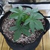](images/06-09-2019/1567795889820.jpg)
[](images/06-09-2019/1567795896112.jpg)
[](images/06-09-2019/1567795901328.jpg)
[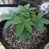](images/06-09-2019/1567795907392.jpg)
[](images/08-09-2019/1567964350096.jpg)
[](images/08-09-2019/1567964358496.jpg)
[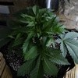](images/08-09-2019/1567964364025.jpg)
[](images/08-09-2019/1567964377522.jpg)
[](images/08-09-2019/1567964383853.jpg)
[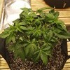](images/11-09-2019/1568226873487.jpg)
[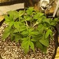](images/11-09-2019/1568226883425.jpg)
[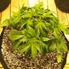](images/11-09-2019/1568227060105.jpg)
[](images/11-09-2019/1568227191289.jpg)
[](images/11-09-2019/1568227385108.jpg)
[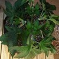](images/12-09-2019/1568310914741.jpg)
[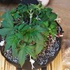](images/12-09-2019/1568311256765.jpg)
[](images/12-09-2019/1568311563743.jpg)
[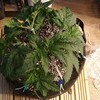](images/12-09-2019/1568311902887.jpg)
[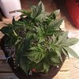](images/12-09-2019/1568312202834.jpg)
[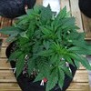](images/13-09-2019/1568399548631.jpg)
[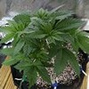](images/13-09-2019/1568399555803.jpg)
[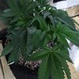](images/13-09-2019/1568399562337.jpg)
[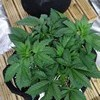](images/13-09-2019/1568399567806.jpg)
[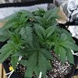](images/13-09-2019/1568399573284.jpg)
[](images/14-09-2019/1568484052927.jpg)
[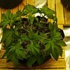](images/14-09-2019/1568484219368.jpg)
[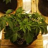](images/14-09-2019/1568484941214.jpg)
[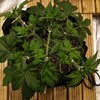](images/14-09-2019/1568485152633.jpg)
[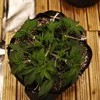](images/14-09-2019/1568485362490.jpg)
[](images/17-09-2019/1568743839446.jpg)
[](images/17-09-2019/1568743852702.jpg)
[](images/17-09-2019/1568743859162.jpg)
[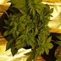](images/17-09-2019/1568743865997.jpg)
[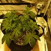](images/17-09-2019/1568743873400.jpg)
[](images/18-09-2019/1568827450070.jpg)
[](images/18-09-2019/1568827768109.jpg)
[](images/18-09-2019/1568828296125.jpg)
[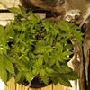](images/18-09-2019/1568828302052.jpg)
[](images/21-09-2019/1569085585040.jpg)
[](images/21-09-2019/1569085818860.jpg)
[](images/21-09-2019/1569086138006.jpg)
[](images/21-09-2019/1569086362692.jpg)
[](images/21-09-2019/1569086556814.jpg)
[](images/24-09-2019/1569346605310.jpg)
[](images/24-09-2019/1569346950614.jpg)
[](images/24-09-2019/1569347171846.jpg)
[](images/24-09-2019/1569347496454.jpg)
[](images/24-09-2019/1569347633487.jpg)
[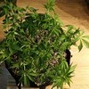](images/28-09-2019/1569660049957.jpg)
[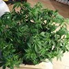](images/28-09-2019/1569660806251.jpg)
[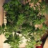](images/28-09-2019/1569661742105.jpg)
[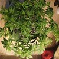](images/28-09-2019/1569662630233.jpg)
[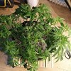](images/28-09-2019/1569663449758.jpg)
[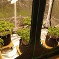](images/28-09-2019/1569666506396.jpg)
[](images/29-09-2019/1569780322918.jpg)
[](images/29-09-2019/1569780329031.jpg)
[](images/29-09-2019/1569780335463.jpg)
[](images/29-09-2019/1569780340780.jpg)
[](images/29-09-2019/1569780346062.jpg)
[](images/03-10-2019/1570122445019.jpg)
[](images/03-10-2019/1570122927411.jpg)
[](images/03-10-2019/1570123331996.jpg)
[](images/03-10-2019/1570123829385.jpg)
[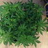](images/03-10-2019/1570124012748.jpg)
[](images/06-10-2019/1570385233501.jpg)
[](images/06-10-2019/1570385244857.jpg)
[](images/06-10-2019/1570385252711.jpg)
[](images/06-10-2019/1570385270779.jpg)
[](images/06-10-2019/1570385278530.jpg)
[](images/11-10-2019/1570819794674.jpg)
[](images/11-10-2019/1570819801188.jpg)
[](images/11-10-2019/1570819806252.jpg)
[](images/11-10-2019/1570819811622.jpg)
[](images/11-10-2019/1570819817300.jpg)
[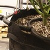](images/12-10-2019/1570904379780.jpg)
[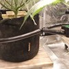](images/12-10-2019/1570904411230.jpg)
[](images/12-10-2019/1570904417959.jpg)
[](images/16-10-2019/1571242369000.jpg)
[](images/16-10-2019/1571242377218.jpg)
[](images/16-10-2019/1571242382335.jpg)
[](images/16-10-2019/1571242394132.jpg)
[](images/16-10-2019/1571242406547.jpg)
[](images/18-10-2019/1571415890126.jpg)
[](images/18-10-2019/1571415900922.jpg)
[](images/18-10-2019/1571415906169.jpg)
[](images/18-10-2019/1571415910809.jpg)
[](images/18-10-2019/1571415917086.jpg)
[](images/24-10-2019/1571940495535.jpg)
[](images/24-10-2019/1571940505485.jpg)
[](images/24-10-2019/1571940511351.jpg)
[](images/24-10-2019/1571940517015.jpg)
[](images/24-10-2019/1571940523280.jpg)
[](images/26-10-2019/1572111425187.jpg)
[](images/26-10-2019/1572111426176.jpg)
[](images/26-10-2019/1572111426651.jpg)
[](images/26-10-2019/1572111427074.jpg)
[](images/28-10-2019/1572287146866.jpg)
[](images/28-10-2019/1572287147162.jpg)
[](images/28-10-2019/1572287147623.jpg)
[](images/01-11-2019/1572638428502.jpg)
[](images/01-11-2019/1572638441189.jpg)
[](images/01-11-2019/1572638449487.jpg)
[](images/01-11-2019/1572638455903.jpg)
[](images/01-11-2019/1572638462339.jpg)
[](images/02-11-2019/1572713893893.jpg)
[](images/02-11-2019/1572713900000.jpg)
[](images/02-11-2019/1572713907286.jpg)
[](images/02-11-2019/1572713913518.jpg)
[](images/02-11-2019/1572713920435.jpg)
[](images/02-11-2019/1572713928174.jpg)
[](images/02-11-2019/1572713936353.jpg)
[](images/02-11-2019/1572713945197.jpg)
[](images/02-11-2019/1572713955112.jpg)
[](images/02-11-2019/1572713964556.jpg)
[](images/12-11-2019/1573583143674.jpg)
[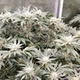](images/12-11-2019/1573583150973.jpg)
[](images/12-11-2019/1573583158521.jpg)
[](images/12-11-2019/1573583164462.jpg)
[](images/12-11-2019/1573583170848.jpg)
[](images/16-11-2019/1573923117039.jpg)
[](images/16-11-2019/1573923143532.jpg)
[](images/16-11-2019/1573923148791.jpg)
[](images/16-11-2019/1573923153761.jpg)
[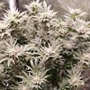](images/16-11-2019/1573923159002.jpg)
[](images/16-11-2019/1573923165923.jpg)
[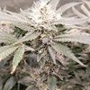](images/16-11-2019/1573923175151.jpg)
[](images/16-11-2019/1573923184864.jpg)
[](images/16-11-2019/1573923192561.jpg)
[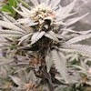](images/16-11-2019/1573923198675.jpg)
[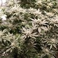](images/18-11-2019/1574101470387.jpg)
[](images/18-11-2019/1574101478179.jpg)
[](images/18-11-2019/1574101483508.jpg)
[](images/18-11-2019/1574101488945.jpg)
[](images/18-11-2019/1574101494641.jpg)
[](images/18-11-2019/1574101499923.jpg)
[](images/18-11-2019/1574101505640.jpg)
[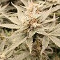](images/18-11-2019/1574101511917.jpg)
[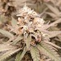](images/18-11-2019/1574101516336.jpg)
[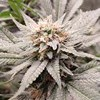](images/18-11-2019/1574101521186.jpg)
[](images/18-11-2019/1574101540170.jpg)
[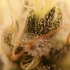](images/18-11-2019/1574101570199.jpg)
[](images/18-11-2019/1574101598041.jpg)
[](images/18-11-2019/1574101616092.jpg)
[](images/18-11-2019/1574101642887.jpg)
[](images/25-11-2019/1574705821417.jpg)
[](images/25-11-2019/1574705828516.jpg)
[](images/25-11-2019/1574705834354.jpg)
[](images/25-11-2019/1574705839192.jpg)
[](images/25-11-2019/1574705847361.jpg)
[](images/25-11-2019/1574705863308.jpg)
[](images/25-11-2019/1574705869882.jpg)
[](images/25-11-2019/1574705876248.jpg)
[](images/25-11-2019/1574705882397.jpg)
[](images/25-11-2019/1574705888291.jpg)
[](images/01-12-2019/1575224403925.jpg)
[](images/01-12-2019/1575224436015.jpg)
[](images/04-12-2019/1575483196694.jpg)
[](images/04-12-2019/1575483205232.jpg)
[](images/04-12-2019/1575483211230.jpg)
[](images/04-12-2019/1575483216873.jpg)
[](images/04-12-2019/1575483223695.jpg)
[](images/07-12-2019/1575723461539.jpg)
[](images/16-12-2019/1576532826892.jpg)
[](images/16-12-2019/1576532826984.jpg)

## Raw plant data

```
{"id":"3fc5a691-0c02-49f1-8bf8-0ba11837941e","name":"Aurora Indica","strain":"Nirvana seeds","plantDate":1565723186924,"clone":false,"medium":"COCO","mediumDetails":"","images":["/storage/emulated/0/DCIM/GrowTracker/3fc5a691-0c02-49f1-8bf8-0ba11837941e/1566155282534.jpg","/storage/emulated/0/DCIM/GrowTracker/3fc5a691-0c02-49f1-8bf8-0ba11837941e/1566288700039.jpg","/storage/emulated/0/DCIM/GrowTracker/3fc5a691-0c02-49f1-8bf8-0ba11837941e/1566405813243.jpg","/storage/emulated/0/DCIM/GrowTracker/3fc5a691-0c02-49f1-8bf8-0ba11837941e/1566632751951.jpg","/storage/emulated/0/DCIM/GrowTracker/3fc5a691-0c02-49f1-8bf8-0ba11837941e/1566810684199.jpg","/storage/emulated/0/DCIM/GrowTracker/3fc5a691-0c02-49f1-8bf8-0ba11837941e/1567012771712.jpg","/storage/emulated/0/DCIM/GrowTracker/3fc5a691-0c02-49f1-8bf8-0ba11837941e/1567184005671.jpg","/storage/emulated/0/DCIM/GrowTracker/3fc5a691-0c02-49f1-8bf8-0ba11837941e/1567279396373.jpg","/storage/emulated/0/DCIM/GrowTracker/3fc5a691-0c02-49f1-8bf8-0ba11837941e/1567358073934.jpg","/storage/emulated/0/DCIM/GrowTracker/3fc5a691-0c02-49f1-8bf8-0ba11837941e/1567447119616.jpg","/storage/emulated/0/DCIM/GrowTracker/3fc5a691-0c02-49f1-8bf8-0ba11837941e/1567617736080.jpg","/storage/emulated/0/DCIM/GrowTracker/3fc5a691-0c02-49f1-8bf8-0ba11837941e/1567709464769.jpg","/storage/emulated/0/DCIM/GrowTracker/3fc5a691-0c02-49f1-8bf8-0ba11837941e/1567795867946.jpg","/storage/emulated/0/DCIM/GrowTracker/3fc5a691-0c02-49f1-8bf8-0ba11837941e/1567795889820.jpg","/storage/emulated/0/DCIM/GrowTracker/3fc5a691-0c02-49f1-8bf8-0ba11837941e/1567795896112.jpg","/storage/emulated/0/DCIM/GrowTracker/3fc5a691-0c02-49f1-8bf8-0ba11837941e/1567795901328.jpg","/storage/emulated/0/DCIM/GrowTracker/3fc5a691-0c02-49f1-8bf8-0ba11837941e/1567795907392.jpg","/storage/emulated/0/DCIM/GrowTracker/3fc5a691-0c02-49f1-8bf8-0ba11837941e/1567964350096.jpg","/storage/emulated/0/DCIM/GrowTracker/3fc5a691-0c02-49f1-8bf8-0ba11837941e/1567964358496.jpg","/storage/emulated/0/DCIM/GrowTracker/3fc5a691-0c02-49f1-8bf8-0ba11837941e/1567964364025.jpg","/storage/emulated/0/DCIM/GrowTracker/3fc5a691-0c02-49f1-8bf8-0ba11837941e/1567964377522.jpg","/storage/emulated/0/DCIM/GrowTracker/3fc5a691-0c02-49f1-8bf8-0ba11837941e/1567964383853.jpg","/storage/emulated/0/DCIM/GrowTracker/3fc5a691-0c02-49f1-8bf8-0ba11837941e/1568226873487.jpg","/storage/emulated/0/DCIM/GrowTracker/3fc5a691-0c02-49f1-8bf8-0ba11837941e/1568226883425.jpg","/storage/emulated/0/DCIM/GrowTracker/3fc5a691-0c02-49f1-8bf8-0ba11837941e/1568227060105.jpg","/storage/emulated/0/DCIM/GrowTracker/3fc5a691-0c02-49f1-8bf8-0ba11837941e/1568227191289.jpg","/storage/emulated/0/DCIM/GrowTracker/3fc5a691-0c02-49f1-8bf8-0ba11837941e/1568227385108.jpg","/storage/emulated/0/DCIM/GrowTracker/3fc5a691-0c02-49f1-8bf8-0ba11837941e/1568310914741.jpg","/storage/emulated/0/DCIM/GrowTracker/3fc5a691-0c02-49f1-8bf8-0ba11837941e/1568311256765.jpg","/storage/emulated/0/DCIM/GrowTracker/3fc5a691-0c02-49f1-8bf8-0ba11837941e/1568311563743.jpg","/storage/emulated/0/DCIM/GrowTracker/3fc5a691-0c02-49f1-8bf8-0ba11837941e/1568311902887.jpg","/storage/emulated/0/DCIM/GrowTracker/3fc5a691-0c02-49f1-8bf8-0ba11837941e/1568312202834.jpg","/storage/emulated/0/DCIM/GrowTracker/3fc5a691-0c02-49f1-8bf8-0ba11837941e/1568399548631.jpg","/storage/emulated/0/DCIM/GrowTracker/3fc5a691-0c02-49f1-8bf8-0ba11837941e/1568399555803.jpg","/storage/emulated/0/DCIM/GrowTracker/3fc5a691-0c02-49f1-8bf8-0ba11837941e/1568399562337.jpg","/storage/emulated/0/DCIM/GrowTracker/3fc5a691-0c02-49f1-8bf8-0ba11837941e/1568399567806.jpg","/storage/emulated/0/DCIM/GrowTracker/3fc5a691-0c02-49f1-8bf8-0ba11837941e/1568399573284.jpg","/storage/emulated/0/DCIM/GrowTracker/3fc5a691-0c02-49f1-8bf8-0ba11837941e/1568484052927.jpg","/storage/emulated/0/DCIM/GrowTracker/3fc5a691-0c02-49f1-8bf8-0ba11837941e/1568484219368.jpg","/storage/emulated/0/DCIM/GrowTracker/3fc5a691-0c02-49f1-8bf8-0ba11837941e/1568484941214.jpg","/storage/emulated/0/DCIM/GrowTracker/3fc5a691-0c02-49f1-8bf8-0ba11837941e/1568485152633.jpg","/storage/emulated/0/DCIM/GrowTracker/3fc5a691-0c02-49f1-8bf8-0ba11837941e/1568485362490.jpg","/storage/emulated/0/DCIM/GrowTracker/3fc5a691-0c02-49f1-8bf8-0ba11837941e/1568743839446.jpg","/storage/emulated/0/DCIM/GrowTracker/3fc5a691-0c02-49f1-8bf8-0ba11837941e/1568743852702.jpg","/storage/emulated/0/DCIM/GrowTracker/3fc5a691-0c02-49f1-8bf8-0ba11837941e/1568743859162.jpg","/storage/emulated/0/DCIM/GrowTracker/3fc5a691-0c02-49f1-8bf8-0ba11837941e/1568743865997.jpg","/storage/emulated/0/DCIM/GrowTracker/3fc5a691-0c02-49f1-8bf8-0ba11837941e/1568743873400.jpg","/storage/emulated/0/DCIM/GrowTracker/3fc5a691-0c02-49f1-8bf8-0ba11837941e/1568827450070.jpg","/storage/emulated/0/DCIM/GrowTracker/3fc5a691-0c02-49f1-8bf8-0ba11837941e/1568827768109.jpg","/storage/emulated/0/DCIM/GrowTracker/3fc5a691-0c02-49f1-8bf8-0ba11837941e/1568828296125.jpg","/storage/emulated/0/DCIM/GrowTracker/3fc5a691-0c02-49f1-8bf8-0ba11837941e/1568828302052.jpg","/storage/emulated/0/DCIM/GrowTracker/3fc5a691-0c02-49f1-8bf8-0ba11837941e/1569085585040.jpg","/storage/emulated/0/DCIM/GrowTracker/3fc5a691-0c02-49f1-8bf8-0ba11837941e/1569085818860.jpg","/storage/emulated/0/DCIM/GrowTracker/3fc5a691-0c02-49f1-8bf8-0ba11837941e/1569086138006.jpg","/storage/emulated/0/DCIM/GrowTracker/3fc5a691-0c02-49f1-8bf8-0ba11837941e/1569086362692.jpg","/storage/emulated/0/DCIM/GrowTracker/3fc5a691-0c02-49f1-8bf8-0ba11837941e/1569086556814.jpg","/storage/emulated/0/DCIM/GrowTracker/3fc5a691-0c02-49f1-8bf8-0ba11837941e/1569346605310.jpg","/storage/emulated/0/DCIM/GrowTracker/3fc5a691-0c02-49f1-8bf8-0ba11837941e/1569346950614.jpg","/storage/emulated/0/DCIM/GrowTracker/3fc5a691-0c02-49f1-8bf8-0ba11837941e/1569347171846.jpg","/storage/emulated/0/DCIM/GrowTracker/3fc5a691-0c02-49f1-8bf8-0ba11837941e/1569347496454.jpg","/storage/emulated/0/DCIM/GrowTracker/3fc5a691-0c02-49f1-8bf8-0ba11837941e/1569347633487.jpg","/storage/emulated/0/DCIM/GrowTracker/3fc5a691-0c02-49f1-8bf8-0ba11837941e/1569660049957.jpg","/storage/emulated/0/DCIM/GrowTracker/3fc5a691-0c02-49f1-8bf8-0ba11837941e/1569660806251.jpg","/storage/emulated/0/DCIM/GrowTracker/3fc5a691-0c02-49f1-8bf8-0ba11837941e/1569661742105.jpg","/storage/emulated/0/DCIM/GrowTracker/3fc5a691-0c02-49f1-8bf8-0ba11837941e/1569662630233.jpg","/storage/emulated/0/DCIM/GrowTracker/3fc5a691-0c02-49f1-8bf8-0ba11837941e/1569663449758.jpg","/storage/emulated/0/DCIM/GrowTracker/3fc5a691-0c02-49f1-8bf8-0ba11837941e/1569666506396.jpg","/storage/emulated/0/DCIM/GrowTracker/3fc5a691-0c02-49f1-8bf8-0ba11837941e/1569780322918.jpg","/storage/emulated/0/DCIM/GrowTracker/3fc5a691-0c02-49f1-8bf8-0ba11837941e/1569780329031.jpg","/storage/emulated/0/DCIM/GrowTracker/3fc5a691-0c02-49f1-8bf8-0ba11837941e/1569780335463.jpg","/storage/emulated/0/DCIM/GrowTracker/3fc5a691-0c02-49f1-8bf8-0ba11837941e/1569780340780.jpg","/storage/emulated/0/DCIM/GrowTracker/3fc5a691-0c02-49f1-8bf8-0ba11837941e/1569780346062.jpg","/storage/emulated/0/DCIM/GrowTracker/3fc5a691-0c02-49f1-8bf8-0ba11837941e/1570122445019.jpg","/storage/emulated/0/DCIM/GrowTracker/3fc5a691-0c02-49f1-8bf8-0ba11837941e/1570122927411.jpg","/storage/emulated/0/DCIM/GrowTracker/3fc5a691-0c02-49f1-8bf8-0ba11837941e/1570123331996.jpg","/storage/emulated/0/DCIM/GrowTracker/3fc5a691-0c02-49f1-8bf8-0ba11837941e/1570123829385.jpg","/storage/emulated/0/DCIM/GrowTracker/3fc5a691-0c02-49f1-8bf8-0ba11837941e/1570124012748.jpg","/storage/emulated/0/DCIM/GrowTracker/3fc5a691-0c02-49f1-8bf8-0ba11837941e/1570385233501.jpg","/storage/emulated/0/DCIM/GrowTracker/3fc5a691-0c02-49f1-8bf8-0ba11837941e/1570385244857.jpg","/storage/emulated/0/DCIM/GrowTracker/3fc5a691-0c02-49f1-8bf8-0ba11837941e/1570385252711.jpg","/storage/emulated/0/DCIM/GrowTracker/3fc5a691-0c02-49f1-8bf8-0ba11837941e/1570385270779.jpg","/storage/emulated/0/DCIM/GrowTracker/3fc5a691-0c02-49f1-8bf8-0ba11837941e/1570385278530.jpg","/storage/emulated/0/DCIM/GrowTracker/3fc5a691-0c02-49f1-8bf8-0ba11837941e/1570819794674.jpg","/storage/emulated/0/DCIM/GrowTracker/3fc5a691-0c02-49f1-8bf8-0ba11837941e/1570819801188.jpg","/storage/emulated/0/DCIM/GrowTracker/3fc5a691-0c02-49f1-8bf8-0ba11837941e/1570819806252.jpg","/storage/emulated/0/DCIM/GrowTracker/3fc5a691-0c02-49f1-8bf8-0ba11837941e/1570819811622.jpg","/storage/emulated/0/DCIM/GrowTracker/3fc5a691-0c02-49f1-8bf8-0ba11837941e/1570819817300.jpg","/storage/emulated/0/DCIM/GrowTracker/3fc5a691-0c02-49f1-8bf8-0ba11837941e/1570904379780.jpg","/storage/emulated/0/DCIM/GrowTracker/3fc5a691-0c02-49f1-8bf8-0ba11837941e/1570904411230.jpg","/storage/emulated/0/DCIM/GrowTracker/3fc5a691-0c02-49f1-8bf8-0ba11837941e/1570904417959.jpg","/storage/emulated/0/DCIM/GrowTracker/3fc5a691-0c02-49f1-8bf8-0ba11837941e/1571242369000.jpg","/storage/emulated/0/DCIM/GrowTracker/3fc5a691-0c02-49f1-8bf8-0ba11837941e/1571242377218.jpg","/storage/emulated/0/DCIM/GrowTracker/3fc5a691-0c02-49f1-8bf8-0ba11837941e/1571242382335.jpg","/storage/emulated/0/DCIM/GrowTracker/3fc5a691-0c02-49f1-8bf8-0ba11837941e/1571242394132.jpg","/storage/emulated/0/DCIM/GrowTracker/3fc5a691-0c02-49f1-8bf8-0ba11837941e/1571242406547.jpg","/storage/emulated/0/DCIM/GrowTracker/3fc5a691-0c02-49f1-8bf8-0ba11837941e/1571415890126.jpg","/storage/emulated/0/DCIM/GrowTracker/3fc5a691-0c02-49f1-8bf8-0ba11837941e/1571415900922.jpg","/storage/emulated/0/DCIM/GrowTracker/3fc5a691-0c02-49f1-8bf8-0ba11837941e/1571415906169.jpg","/storage/emulated/0/DCIM/GrowTracker/3fc5a691-0c02-49f1-8bf8-0ba11837941e/1571415910809.jpg","/storage/emulated/0/DCIM/GrowTracker/3fc5a691-0c02-49f1-8bf8-0ba11837941e/1571415917086.jpg","/storage/emulated/0/DCIM/GrowTracker/3fc5a691-0c02-49f1-8bf8-0ba11837941e/1571940495535.jpg","/storage/emulated/0/DCIM/GrowTracker/3fc5a691-0c02-49f1-8bf8-0ba11837941e/1571940505485.jpg","/storage/emulated/0/DCIM/GrowTracker/3fc5a691-0c02-49f1-8bf8-0ba11837941e/1571940511351.jpg","/storage/emulated/0/DCIM/GrowTracker/3fc5a691-0c02-49f1-8bf8-0ba11837941e/1571940517015.jpg","/storage/emulated/0/DCIM/GrowTracker/3fc5a691-0c02-49f1-8bf8-0ba11837941e/1571940523280.jpg","/storage/emulated/0/DCIM/GrowTracker/3fc5a691-0c02-49f1-8bf8-0ba11837941e/1572111425187.jpg","/storage/emulated/0/DCIM/GrowTracker/3fc5a691-0c02-49f1-8bf8-0ba11837941e/1572111426176.jpg","/storage/emulated/0/DCIM/GrowTracker/3fc5a691-0c02-49f1-8bf8-0ba11837941e/1572111426651.jpg","/storage/emulated/0/DCIM/GrowTracker/3fc5a691-0c02-49f1-8bf8-0ba11837941e/1572111427074.jpg","/storage/emulated/0/DCIM/GrowTracker/3fc5a691-0c02-49f1-8bf8-0ba11837941e/1572287146866.jpg","/storage/emulated/0/DCIM/GrowTracker/3fc5a691-0c02-49f1-8bf8-0ba11837941e/1572287147162.jpg","/storage/emulated/0/DCIM/GrowTracker/3fc5a691-0c02-49f1-8bf8-0ba11837941e/1572287147623.jpg","/storage/emulated/0/DCIM/GrowTracker/3fc5a691-0c02-49f1-8bf8-0ba11837941e/1572638428502.jpg","/storage/emulated/0/DCIM/GrowTracker/3fc5a691-0c02-49f1-8bf8-0ba11837941e/1572638441189.jpg","/storage/emulated/0/DCIM/GrowTracker/3fc5a691-0c02-49f1-8bf8-0ba11837941e/1572638449487.jpg","/storage/emulated/0/DCIM/GrowTracker/3fc5a691-0c02-49f1-8bf8-0ba11837941e/1572638455903.jpg","/storage/emulated/0/DCIM/GrowTracker/3fc5a691-0c02-49f1-8bf8-0ba11837941e/1572638462339.jpg","/storage/emulated/0/DCIM/GrowTracker/3fc5a691-0c02-49f1-8bf8-0ba11837941e/1572713893893.jpg","/storage/emulated/0/DCIM/GrowTracker/3fc5a691-0c02-49f1-8bf8-0ba11837941e/1572713900000.jpg","/storage/emulated/0/DCIM/GrowTracker/3fc5a691-0c02-49f1-8bf8-0ba11837941e/1572713907286.jpg","/storage/emulated/0/DCIM/GrowTracker/3fc5a691-0c02-49f1-8bf8-0ba11837941e/1572713913518.jpg","/storage/emulated/0/DCIM/GrowTracker/3fc5a691-0c02-49f1-8bf8-0ba11837941e/1572713920435.jpg","/storage/emulated/0/DCIM/GrowTracker/3fc5a691-0c02-49f1-8bf8-0ba11837941e/1572713928174.jpg","/storage/emulated/0/DCIM/GrowTracker/3fc5a691-0c02-49f1-8bf8-0ba11837941e/1572713936353.jpg","/storage/emulated/0/DCIM/GrowTracker/3fc5a691-0c02-49f1-8bf8-0ba11837941e/1572713945197.jpg","/storage/emulated/0/DCIM/GrowTracker/3fc5a691-0c02-49f1-8bf8-0ba11837941e/1572713955112.jpg","/storage/emulated/0/DCIM/GrowTracker/3fc5a691-0c02-49f1-8bf8-0ba11837941e/1572713964556.jpg","/storage/emulated/0/DCIM/GrowTracker/3fc5a691-0c02-49f1-8bf8-0ba11837941e/1573583143674.jpg","/storage/emulated/0/DCIM/GrowTracker/3fc5a691-0c02-49f1-8bf8-0ba11837941e/1573583150973.jpg","/storage/emulated/0/DCIM/GrowTracker/3fc5a691-0c02-49f1-8bf8-0ba11837941e/1573583158521.jpg","/storage/emulated/0/DCIM/GrowTracker/3fc5a691-0c02-49f1-8bf8-0ba11837941e/1573583164462.jpg","/storage/emulated/0/DCIM/GrowTracker/3fc5a691-0c02-49f1-8bf8-0ba11837941e/1573583170848.jpg","/storage/emulated/0/DCIM/GrowTracker/3fc5a691-0c02-49f1-8bf8-0ba11837941e/1573923117039.jpg","/storage/emulated/0/DCIM/GrowTracker/3fc5a691-0c02-49f1-8bf8-0ba11837941e/1573923143532.jpg","/storage/emulated/0/DCIM/GrowTracker/3fc5a691-0c02-49f1-8bf8-0ba11837941e/1573923148791.jpg","/storage/emulated/0/DCIM/GrowTracker/3fc5a691-0c02-49f1-8bf8-0ba11837941e/1573923153761.jpg","/storage/emulated/0/DCIM/GrowTracker/3fc5a691-0c02-49f1-8bf8-0ba11837941e/1573923159002.jpg","/storage/emulated/0/DCIM/GrowTracker/3fc5a691-0c02-49f1-8bf8-0ba11837941e/1573923165923.jpg","/storage/emulated/0/DCIM/GrowTracker/3fc5a691-0c02-49f1-8bf8-0ba11837941e/1573923175151.jpg","/storage/emulated/0/DCIM/GrowTracker/3fc5a691-0c02-49f1-8bf8-0ba11837941e/1573923184864.jpg","/storage/emulated/0/DCIM/GrowTracker/3fc5a691-0c02-49f1-8bf8-0ba11837941e/1573923192561.jpg","/storage/emulated/0/DCIM/GrowTracker/3fc5a691-0c02-49f1-8bf8-0ba11837941e/1573923198675.jpg","/storage/emulated/0/DCIM/GrowTracker/3fc5a691-0c02-49f1-8bf8-0ba11837941e/1574101470387.jpg","/storage/emulated/0/DCIM/GrowTracker/3fc5a691-0c02-49f1-8bf8-0ba11837941e/1574101478179.jpg","/storage/emulated/0/DCIM/GrowTracker/3fc5a691-0c02-49f1-8bf8-0ba11837941e/1574101483508.jpg","/storage/emulated/0/DCIM/GrowTracker/3fc5a691-0c02-49f1-8bf8-0ba11837941e/1574101488945.jpg","/storage/emulated/0/DCIM/GrowTracker/3fc5a691-0c02-49f1-8bf8-0ba11837941e/1574101494641.jpg","/storage/emulated/0/DCIM/GrowTracker/3fc5a691-0c02-49f1-8bf8-0ba11837941e/1574101499923.jpg","/storage/emulated/0/DCIM/GrowTracker/3fc5a691-0c02-49f1-8bf8-0ba11837941e/1574101505640.jpg","/storage/emulated/0/DCIM/GrowTracker/3fc5a691-0c02-49f1-8bf8-0ba11837941e/1574101511917.jpg","/storage/emulated/0/DCIM/GrowTracker/3fc5a691-0c02-49f1-8bf8-0ba11837941e/1574101516336.jpg","/storage/emulated/0/DCIM/GrowTracker/3fc5a691-0c02-49f1-8bf8-0ba11837941e/1574101521186.jpg","/storage/emulated/0/DCIM/GrowTracker/3fc5a691-0c02-49f1-8bf8-0ba11837941e/1574101540170.jpg","/storage/emulated/0/DCIM/GrowTracker/3fc5a691-0c02-49f1-8bf8-0ba11837941e/1574101570199.jpg","/storage/emulated/0/DCIM/GrowTracker/3fc5a691-0c02-49f1-8bf8-0ba11837941e/1574101598041.jpg","/storage/emulated/0/DCIM/GrowTracker/3fc5a691-0c02-49f1-8bf8-0ba11837941e/1574101616092.jpg","/storage/emulated/0/DCIM/GrowTracker/3fc5a691-0c02-49f1-8bf8-0ba11837941e/1574101642887.jpg","/storage/emulated/0/DCIM/GrowTracker/3fc5a691-0c02-49f1-8bf8-0ba11837941e/1574705821417.jpg","/storage/emulated/0/DCIM/GrowTracker/3fc5a691-0c02-49f1-8bf8-0ba11837941e/1574705828516.jpg","/storage/emulated/0/DCIM/GrowTracker/3fc5a691-0c02-49f1-8bf8-0ba11837941e/1574705834354.jpg","/storage/emulated/0/DCIM/GrowTracker/3fc5a691-0c02-49f1-8bf8-0ba11837941e/1574705839192.jpg","/storage/emulated/0/DCIM/GrowTracker/3fc5a691-0c02-49f1-8bf8-0ba11837941e/1574705847361.jpg","/storage/emulated/0/DCIM/GrowTracker/3fc5a691-0c02-49f1-8bf8-0ba11837941e/1574705863308.jpg","/storage/emulated/0/DCIM/GrowTracker/3fc5a691-0c02-49f1-8bf8-0ba11837941e/1574705869882.jpg","/storage/emulated/0/DCIM/GrowTracker/3fc5a691-0c02-49f1-8bf8-0ba11837941e/1574705876248.jpg","/storage/emulated/0/DCIM/GrowTracker/3fc5a691-0c02-49f1-8bf8-0ba11837941e/1574705882397.jpg","/storage/emulated/0/DCIM/GrowTracker/3fc5a691-0c02-49f1-8bf8-0ba11837941e/1574705888291.jpg","/storage/emulated/0/DCIM/GrowTracker/3fc5a691-0c02-49f1-8bf8-0ba11837941e/1575224403925.jpg","/storage/emulated/0/DCIM/GrowTracker/3fc5a691-0c02-49f1-8bf8-0ba11837941e/1575224436015.jpg","/storage/emulated/0/DCIM/GrowTracker/3fc5a691-0c02-49f1-8bf8-0ba11837941e/1575483196694.jpg","/storage/emulated/0/DCIM/GrowTracker/3fc5a691-0c02-49f1-8bf8-0ba11837941e/1575483205232.jpg","/storage/emulated/0/DCIM/GrowTracker/3fc5a691-0c02-49f1-8bf8-0ba11837941e/1575483211230.jpg","/storage/emulated/0/DCIM/GrowTracker/3fc5a691-0c02-49f1-8bf8-0ba11837941e/1575483216873.jpg","/storage/emulated/0/DCIM/GrowTracker/3fc5a691-0c02-49f1-8bf8-0ba11837941e/1575483223695.jpg","/storage/emulated/0/DCIM/GrowTracker/3fc5a691-0c02-49f1-8bf8-0ba11837941e/1575723461539.jpg","/storage/emulated/0/DCIM/GrowTracker/3fc5a691-0c02-49f1-8bf8-0ba11837941e/1576532826892.jpg","/storage/emulated/0/DCIM/GrowTracker/3fc5a691-0c02-49f1-8bf8-0ba11837941e/1576532826984.jpg"],"actions":[{"newStage":"PLANTED","date":1565723186924,"type":"StageChange"},{"newStage":"GERMINATION","date":1565723256189,"type":"StageChange"},{"newStage":"SEEDLING","date":1565896063843,"type":"StageChange"},{"newStage":"VEGETATION","date":1566288694640,"type":"StageChange"},{"ph":5.8,"amount":500.0,"additives":[{"amount":2.0,"description":"Canna A&B"},{"amount":3.5,"description":"Rhizotonic"},{"amount":1.0,"description":"Canna Calmag"}],"date":1566289294386,"type":"Water"},{"ph":5.6,"amount":1000.0,"additives":[{"amount":2.0,"description":"Canna A&B"},{"amount":3.5,"description":"Rhizotonic"},{"amount":1.0,"description":"Canna Calmag"}],"date":1566405827314,"type":"Water"},{"ph":5.7,"amount":1000.0,"additives":[{"amount":2.0,"description":"Canna A&B"},{"amount":3.5,"description":"Rhizotonic"},{"amount":1.0,"description":"Canna Calmag"}],"date":1566632049425,"type":"Water"},{"ph":5.7,"amount":2000.0,"additives":[{"amount":2.0,"description":"Canna A&B"},{"amount":3.5,"description":"Rhizotonic"},{"amount":1.0,"description":"Canna Calmag"}],"date":1566819493754,"type":"Water"},{"ph":5.7,"amount":2000.0,"additives":[{"amount":2.5,"description":"Canna A&B"},{"amount":3.5,"description":"Rhizotonic"},{"amount":1.0,"description":"Canna Calmag"},{"amount":2.5,"description":"Cannazym"}],"date":1567012784143,"type":"Water"},{"ph":5.8,"amount":2000.0,"additives":[{"amount":2.5,"description":"Canna A&B"},{"amount":3.5,"description":"Rhizotonic"},{"amount":1.0,"description":"Canna Calmag"},{"amount":2.5,"description":"Cannazym"}],"date":1567183591369,"type":"Water"},{"action":"TRANSPLANTED","date":1567279412271,"type":"Action"},{"ph":5.7,"amount":5000.0,"additives":[{"amount":2.5,"description":"Canna A&B"},{"amount":3.5,"description":"Rhizotonic"},{"amount":1.0,"description":"Canna Calmag"},{"amount":2.5,"description":"Cannazym"}],"date":1567357176150,"type":"Water"},{"ph":5.7,"amount":10000.0,"additives":[{"amount":2.5,"description":"Canna A&B"},{"amount":3.5,"description":"Rhizotonic"},{"amount":1.0,"description":"Canna Calmag"},{"amount":2.5,"description":"Cannazym"}],"date":1567446779611,"type":"Water"},{"ph":5.6,"amount":10000.0,"additives":[{"amount":2.5,"description":"Canna A&B"},{"amount":3.5,"description":"Rhizotonic"},{"amount":1.0,"description":"Canna Calmag"},{"amount":2.5,"description":"Cannazym"}],"date":1567526945695,"type":"Water"},{"action":"TOP","date":1567617754935,"notes":"topped third node","type":"Action"},{"action":"TRIM","date":1567617786934,"notes":"trimmed first nodes","type":"Action"},{"ph":5.8,"additives":[{"amount":2.5,"description":"Canna A&B"},{"amount":3.5,"description":"Rhizotonic"},{"amount":1.0,"description":"Canna Calmag"},{"amount":2.5,"description":"Cannazym"}],"date":1567789669251,"type":"Water"},{"ph":5.8,"amount":10000.0,"additives":[{"amount":2.5,"description":"Canna A&B"},{"amount":3.5,"description":"Rhizotonic"},{"amount":1.0,"description":"Canna Calmag"},{"amount":2.5,"description":"Cannazym"}],"date":1567963540614,"type":"Water"},{"ph":5.7,"amount":10000.0,"additives":[{"amount":3.0,"description":"Canna A&B"},{"amount":2.5,"description":"Cannazym"},{"amount":3.5,"description":"Rhizotonic"},{"amount":1.5,"description":"Canna Calmag"},{"amount":1.0,"description":"Seasol"}],"date":1568222575843,"type":"Water"},{"action":"TRIM","date":1568226904423,"type":"Action"},{"action":"TOP","date":1568226912606,"type":"Action"},{"action":"LST","date":1568312615085,"type":"Action"},{"ph":5.6,"amount":10000.0,"additives":[{"amount":3.5,"description":"Canna A&B"},{"amount":2.5,"description":"Cannazym"},{"amount":3.5,"description":"Rhizotonic"},{"amount":1.0,"description":"Seasol"},{"amount":1.5,"description":"Canna Calmag"}],"date":1568399586080,"type":"Water"},{"ph":5.6,"amount":10000.0,"additives":[{"amount":3.5,"description":"Canna A&B"},{"amount":2.5,"description":"Cannazym"},{"amount":3.5,"description":"Rhizotonic"},{"amount":1.0,"description":"Seasol"},{"amount":1.5,"description":"Canna Calmag"}],"date":1568569963876,"type":"Water"},{"ph":5.6,"amount":10000.0,"additives":[{"amount":3.5,"description":"Canna A&B"},{"amount":2.5,"description":"Cannazym"},{"amount":3.5,"description":"Rhizotonic"},{"amount":1.0,"description":"Seasol"},{"amount":1.5,"description":"Canna Calmag"}],"date":1568721412531,"type":"Water"},{"ph":5.7,"amount":10000.0,"additives":[{"amount":3.5,"description":"Canna A&B"},{"amount":2.5,"description":"Cannazym"},{"amount":3.5,"description":"Rhizotonic"},{"amount":1.0,"description":"Seasol"},{"amount":1.5,"description":"Canna Calmag"}],"date":1568893627624,"type":"Water"},{"ph":5.5,"amount":10000.0,"additives":[{"amount":3.5,"description":"Canna A&B"},{"amount":2.5,"description":"Cannazym"},{"amount":1.0,"description":"Seasol"},{"amount":1.5,"description":"Canna Calmag"}],"date":1569082741691,"type":"Water"},{"ph":5.5,"amount":10000.0,"additives":[{"amount":3.5,"description":"Canna A&B"},{"amount":2.5,"description":"Cannazym"},{"amount":1.5,"description":"Seasol"},{"amount":1.5,"description":"Canna Calmag"}],"date":1569259123054,"type":"Water"},{"action":"TRIM","date":1569347639857,"type":"Action"},{"ph":5.6,"amount":15000.0,"additives":[{"amount":3.5,"description":"Canna A&B"},{"amount":2.5,"description":"Cannazym"},{"amount":1.5,"description":"Seasol"},{"amount":1.5,"description":"Canna Calmag"}],"date":1569432229463,"type":"Water"},{"ph":5.6,"amount":15000.0,"additives":[{"amount":3.5,"description":"Canna A&B"},{"amount":2.5,"description":"Cannazym"},{"amount":1.5,"description":"Seasol"},{"amount":1.5,"description":"Canna Calmag"}],"date":1569567611380,"type":"Water"},{"newStage":"FLOWER","date":1569779443293,"type":"StageChange"},{"ph":5.5,"amount":15000.0,"additives":[{"amount":3.5,"description":"Canna A&B"},{"amount":2.5,"description":"Cannazym"},{"amount":3.0,"description":"Seasol"},{"amount":2.0,"description":"Canna Calmag"}],"date":1569779658466,"type":"Water"},{"ph":5.7,"amount":10000.0,"additives":[{"amount":3.5,"description":"Canna A&B"},{"amount":2.5,"description":"Cannazym"},{"amount":3.0,"description":"Seasol"},{"amount":2.0,"description":"Canna Calmag"}],"date":1569931626851,"type":"Water"},{"tds":{"amount":2.3,"type":"EC"},"ph":5.8,"amount":10000.0,"additives":[{"amount":3.5,"description":"Canna A&B"},{"amount":2.5,"description":"Cannazym"},{"amount":3.0,"description":"Seasol"},{"amount":2.0,"description":"Canna Calmag"}],"date":1570124112369,"type":"Water"},{"tds":{"amount":2.4,"type":"EC"},"ph":5.7,"amount":10000.0,"additives":[{"amount":3.5,"description":"Canna A&B"},{"amount":2.5,"description":"Cannazym"},{"amount":3.0,"description":"Seasol"},{"amount":2.0,"description":"Canna Calmag"}],"date":1570292488144,"type":"Water"},{"tds":{"amount":2.3,"type":"EC"},"ph":5.6,"amount":10000.0,"additives":[{"amount":3.5,"description":"Canna A&B"},{"amount":2.5,"description":"Cannazym"},{"amount":3.0,"description":"Seasol"},{"amount":2.0,"description":"Canna Calmag"}],"date":1570467703827,"type":"Water"},{"tds":{"amount":2.4,"type":"EC"},"ph":5.6,"amount":10000.0,"additives":[{"amount":3.5,"description":"Canna A&B"},{"amount":2.5,"description":"Cannazym"},{"amount":3.0,"description":"Seasol"},{"amount":2.0,"description":"Canna Calmag"}],"date":1570646218399,"type":"Water"},{"tds":{"amount":2.7,"type":"EC"},"ph":5.4,"amount":15000.0,"additives":[{"amount":3.5,"description":"Canna A&B"},{"amount":2.5,"description":"Cannazym"},{"amount":3.0,"description":"Seasol"},{"amount":2.0,"description":"Canna Calmag"}],"date":1570904614988,"type":"Water"},{"tds":{"amount":2.6,"type":"EC"},"ph":5.7,"amount":15000.0,"additives":[{"amount":3.5,"description":"Canna A&B"},{"amount":2.5,"description":"Cannazym"},{"amount":3.0,"description":"Seasol"},{"amount":2.0,"description":"Canna Calmag"}],"date":1571067163992,"type":"Water"},{"tds":{"amount":2.7,"type":"EC"},"ph":5.6,"amount":15000.0,"additives":[{"amount":3.5,"description":"Canna A&B"},{"amount":2.5,"description":"Cannazym"},{"amount":3.0,"description":"Seasol"},{"amount":2.0,"description":"Canna Calmag"},{"amount":1.0,"description":"Canna pk 13/14"}],"date":1571242682493,"type":"Water"},{"tds":{"amount":2.6,"type":"EC"},"ph":5.6,"amount":10000.0,"additives":[{"amount":3.5,"description":"Canna A&B"},{"amount":2.5,"description":"Cannazym"},{"amount":3.0,"description":"Seasol"},{"amount":2.0,"description":"Canna Calmag"},{"amount":1.5,"description":"Canna pk 13/14"}],"date":1571415336615,"type":"Water"},{"tds":{"amount":2.5,"type":"EC"},"ph":5.5,"amount":10000.0,"additives":[{"amount":3.5,"description":"Canna A&B"},{"amount":2.5,"description":"Cannazym"},{"amount":3.0,"description":"Seasol"},{"amount":2.0,"description":"Canna Calmag"},{"amount":1.5,"description":"Canna pk 13/14"}],"date":1571587397419,"type":"Water"},{"tds":{"amount":2.6,"type":"EC"},"ph":5.6,"amount":10000.0,"additives":[{"amount":3.5,"description":"Canna A&B"},{"amount":2.5,"description":"Cannazym"},{"amount":3.0,"description":"Seasol"},{"amount":2.0,"description":"Canna Calmag"},{"amount":2.0,"description":"Canna pk 13/14"}],"date":1571764921436,"type":"Water"},{"tds":{"amount":3.0,"type":"EC"},"ph":5.6,"amount":10000.0,"additives":[{"amount":4.0,"description":"Canna A&B"},{"amount":2.5,"description":"Cannazym"},{"amount":3.0,"description":"Seasol"},{"amount":2.0,"description":"Canna Calmag"},{"amount":2.0,"description":"Canna pk 13/14"}],"date":1571939098803,"type":"Water"},{"tds":{"amount":2.9,"type":"EC"},"ph":5.7,"amount":10000.0,"additives":[{"amount":4.0,"description":"Canna A&B"},{"amount":2.5,"description":"Cannazym"},{"amount":3.0,"description":"Seasol"},{"amount":2.0,"description":"Canna Calmag"},{"amount":2.0,"description":"Canna pk 13/14"}],"date":1572106341880,"type":"Water"},{"tds":{"amount":3.0,"type":"EC"},"ph":5.6,"amount":10000.0,"additives":[{"amount":4.0,"description":"Canna A&B"},{"amount":2.5,"description":"Cannazym"},{"amount":3.0,"description":"Seasol"},{"amount":2.0,"description":"Canna Calmag"},{"amount":2.0,"description":"Canna pk 13/14"}],"date":1572285999349,"type":"Water"},{"tds":{"amount":3.0,"type":"EC"},"ph":5.7,"amount":10000.0,"additives":[{"amount":4.0,"description":"Canna A&B"},{"amount":2.5,"description":"Cannazym"},{"amount":3.0,"description":"Seasol"},{"amount":2.0,"description":"Canna Calmag"},{"amount":2.0,"description":"Canna pk 13/14"}],"date":1572373326141,"type":"Water"},{"tds":{"amount":2.4,"type":"EC"},"ph":5.7,"amount":10000.0,"additives":[{"amount":3.0,"description":"Canna A&B"},{"amount":2.5,"description":"Cannazym"},{"amount":3.0,"description":"Seasol"},{"amount":2.0,"description":"Canna Calmag"},{"amount":1.0,"description":"Canna pk 13/14"}],"date":1572543786135,"type":"Water"},{"tds":{"amount":2.3,"type":"EC"},"ph":5.6,"amount":10000.0,"additives":[{"amount":3.0,"description":"Canna A&B"},{"amount":2.5,"description":"Cannazym"},{"amount":2.0,"description":"Canna Calmag"},{"amount":1.0,"description":"Canna pk 13/14"}],"date":1572712590171,"type":"Water"},{"tds":{"amount":1.6,"type":"EC"},"ph":5.5,"amount":10000.0,"additives":[{"amount":3.0,"description":"Canna A&B"},{"amount":2.5,"description":"Cannazym"},{"amount":2.0,"description":"Canna Calmag"},{"amount":1.0,"description":"Canna pk 13/14"},{"amount":3.0,"description":"Seasol"}],"date":1572891644444,"type":"Water"},{"tds":{"amount":2.3,"type":"EC"},"ph":5.6,"amount":10000.0,"additives":[{"amount":3.0,"description":"Canna A&B"},{"amount":2.5,"description":"Cannazym"},{"amount":2.0,"description":"Canna Calmag"},{"amount":1.5,"description":"Canna pk 13/14"},{"amount":4.0,"description":"Seasol"}],"date":1573064242707,"type":"Water"},{"tds":{"amount":2.4,"type":"EC"},"ph":5.7,"amount":10000.0,"additives":[{"amount":3.0,"description":"Canna A&B"},{"amount":2.5,"description":"Cannazym"},{"amount":2.0,"description":"Canna Calmag"},{"amount":1.5,"description":"Canna pk 13/14"},{"amount":4.0,"description":"Seasol"}],"date":1573243127718,"type":"Water"},{"tds":{"amount":2.3,"type":"EC"},"ph":5.7,"amount":10000.0,"additives":[{"amount":3.0,"description":"Canna A&B"},{"amount":2.5,"description":"Cannazym"},{"amount":2.0,"description":"Canna Calmag"},{"amount":5.0,"description":"Seasol"}],"date":1573406194793,"type":"Water"},{"tds":{"amount":2.4,"type":"EC"},"ph":5.7,"amount":10000.0,"additives":[{"amount":3.0,"description":"Canna A&B"},{"amount":2.5,"description":"Cannazym"},{"amount":2.0,"description":"Canna Calmag"},{"amount":3.0,"description":"Seasol"},{"amount":2.0,"description":"Overdrive"}],"date":1573582591419,"type":"Water"},{"tds":{"amount":2.5,"type":"EC"},"ph":5.7,"amount":15000.0,"additives":[{"amount":3.0,"description":"Canna A&B"},{"amount":2.5,"description":"Cannazym"},{"amount":2.0,"description":"Canna Calmag"},{"amount":3.0,"description":"Seasol"},{"amount":2.0,"description":"Overdrive"}],"date":1573751538317,"type":"Water"},{"tds":{"amount":2.4,"type":"EC"},"ph":5.7,"amount":10000.0,"additives":[{"amount":3.0,"description":"Canna A&B"},{"amount":2.5,"description":"Cannazym"},{"amount":2.0,"description":"Canna Calmag"},{"amount":3.0,"description":"Seasol"},{"amount":2.0,"description":"Overdrive"}],"date":1573922539225,"type":"Water"},{"tds":{"amount":1.9,"type":"EC"},"ph":5.7,"amount":10000.0,"additives":[{"amount":2.0,"description":"Canna A&B"},{"amount":2.5,"description":"Cannazym"},{"amount":2.0,"description":"Canna Calmag"},{"amount":2.0,"description":"Seasol"},{"amount":2.0,"description":"Overdrive"}],"date":1574100859020,"type":"Water"},{"tds":{"amount":2.1,"type":"EC"},"ph":5.5,"amount":15000.0,"additives":[{"amount":2.0,"description":"Canna A&B"},{"amount":2.5,"description":"Cannazym"},{"amount":2.0,"description":"Canna Calmag"},{"amount":2.0,"description":"Seasol"},{"amount":2.0,"description":"Overdrive"}],"date":1574275027418,"type":"Water"},{"tds":{"amount":1.8,"type":"EC"},"ph":5.4,"amount":10000.0,"additives":[{"amount":2.0,"description":"Canna A&B"},{"amount":2.5,"description":"Cannazym"},{"amount":2.0,"description":"Canna Calmag"},{"amount":2.0,"description":"Seasol"},{"amount":2.0,"description":"Overdrive"}],"date":1574452695747,"type":"Water"},{"tds":{"amount":1.7,"type":"EC"},"ph":5.8,"amount":10000.0,"additives":[{"amount":2.0,"description":"Canna A&B"},{"amount":2.5,"description":"Cannazym"},{"amount":2.0,"description":"Canna Calmag"},{"amount":2.0,"description":"Seasol"},{"amount":2.0,"description":"Overdrive"}],"date":1574527777161,"type":"Water"},{"tds":{"amount":1.8,"type":"EC"},"ph":5.7,"amount":10000.0,"additives":[{"amount":2.0,"description":"Canna A&B"},{"amount":3.0,"description":"Cannazym"},{"amount":1.5,"description":"Canna Calmag"},{"amount":2.0,"description":"Seasol"},{"amount":2.0,"description":"Overdrive"}],"date":1574706054074,"type":"Water"},{"tds":{"amount":1.3,"type":"EC"},"ph":5.4,"amount":10000.0,"additives":[{"amount":1.5,"description":"Canna A&B"},{"amount":3.0,"description":"Cannazym"},{"amount":1.0,"description":"Canna Calmag"},{"amount":2.0,"description":"Seasol"},{"amount":2.0,"description":"Overdrive"}],"date":1574793437428,"type":"Water"},{"tds":{"amount":1.4,"type":"EC"},"ph":5.3,"amount":10000.0,"additives":[{"amount":1.5,"description":"Canna A&B"},{"amount":3.0,"description":"Cannazym"},{"amount":1.0,"description":"Canna Calmag"},{"amount":2.0,"description":"Seasol"},{"amount":2.0,"description":"Overdrive"}],"date":1574964738767,"type":"Water"},{"tds":{"amount":0.8,"type":"EC"},"ph":5.5,"amount":15000.0,"additives":[{"amount":1.0,"description":"Canna Calmag"},{"amount":3.5,"description":"Cannazym"},{"amount":2.0,"description":"Overdrive"}],"date":1575131586746,"type":"Water"},{"tds":{"amount":0.5,"type":"EC"},"ph":5.3,"amount":10000.0,"additives":[{"amount":3.5,"description":"Cannazym"},{"amount":2.0,"description":"Overdrive"}],"date":1575310869106,"type":"Water"},{"tds":{"amount":0.4,"type":"EC"},"ph":5.3,"amount":10000.0,"additives":[{"amount":4.0,"description":"Cannazym"},{"amount":3.0,"description":"Overdrive"}],"date":1575482906590,"type":"Water"},{"newStage":"DRYING","date":1575740574457,"type":"StageChange"},{"newStage":"CURING","date":1576446371617,"type":"StageChange"},{"newStage":"HARVESTED","date":1576935612636,"type":"StageChange"},{"date":1576935623407,"notes":"702g","type":"Note"}]}
```

Generated using [Grow Tracker](https://github.com/7LPdWcaW/GrowTracker-Android)