# Grow Log

## Grow details

**Name:** Berries and Cheese

**Strain:** Sumo seeds - Berries and Cheese

**Planted:** 2019-03-15 17:35

**From clone?:** false

**Medium:** Soil

**Harvested:** 2019-09-17 15:36

## Stages

 - Planted

	 - **Set on:** 2019-03-15 17:35
	 - **In stage for:** 3 days


 - Germination

	 - **Set on:** 2019-03-18 17:36
	 - **In stage for:** 9.02 days


 - Vegetation

	 - **Set on:** 2019-03-27 18:06
	 - **In stage for:** 48.99 days


 - Flowering

	 - **Set on:** 2019-05-15 18:52
	 - **In stage for:** 89.76 days


 - Drying

	 - **Set on:** 2019-08-13 13:09
	 - **In stage for:** 6.05 days


 - Curing

	 - **Set on:** 2019-08-19 14:29
	 - **In stage for:** 29.05 days


 - Harvested

	 - **Set on:** 2019-09-17 15:36


## Stats

 - **Total grow time:** 185.88 days
 - **Total waters:** 56
 - **Total water used:** 150.25l
 - **Total flushes:** 0
 - **Average time between watering:** 2.39 days

### Nutrients used

 - Rhizotonic
 - Canna zym
 - Pk 13/14
 - Topmax
 - Calmag
 - Canna b
 - Canna a
 - Canna boost

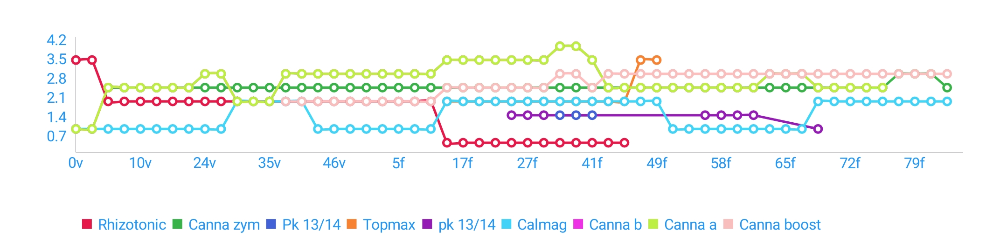

### Input/runoff pH

 - **Minimum input pH:** 5.4
 - **Maximum input pH:** 5.8
 - **Average input pH:** 5.6

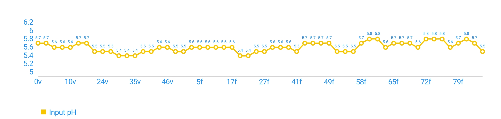

### EC

 - **Minimum input EC:** 0.25mS/cm
 - **Maximum input EC:** 2mS/cm
 - **Average input EC:** 1.42mS/cm

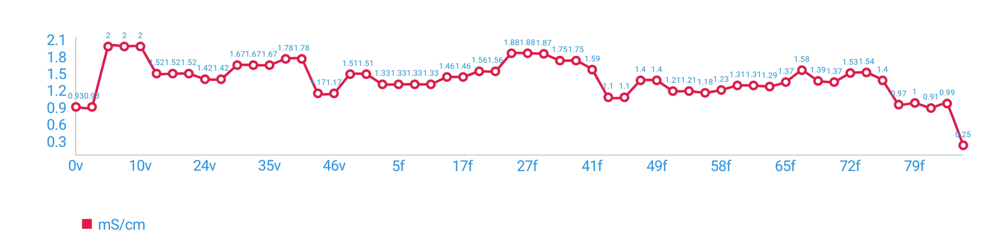

### Temperature (°C)

 - **Minimum input temperature:** -°C
 - **Maximum input temperature:** -°C
 - **Average input temperature:** 0°C


## Actions

| Date | Stage | Action | Details | Notes |
| ---- | ----- | ------ | ------- | ----- |
| 2019-09-17 15:36 | 185/29c | StageChange | Changed to Harvested |  |
| 2019-08-19 14:29 | 156/6d | StageChange | Changed to Curing |  |
| 2019-08-19 14:28 | 156/6d | Note |   | 153g |
| 2019-08-13 13:09 | 150/89f | StageChange | Changed to Drying |  |
| 2019-08-08 18:28 | 145/84f | Water | **pH:** 5.5 **EC:** 0.25mS/cm  |  |
| 2019-08-06 18:14 | 143/82f | Water | **pH:** 5.7 **amount:** 15l **EC:** 0.99mS/cm  / **Calmag:** 2ml/l – **Canna boost:** 3ml/l**Canna zym:** 2.5ml/l –  |  |
| 2019-08-04 19:13 | 142/81f | Water | **pH:** 5.8 **amount:** 10l **EC:** 0.91mS/cm  / **Calmag:** 2ml/l – **Canna boost:** 3ml/l**Canna zym:** 3ml/l –  |  |
| 2019-08-02 20:25 | 140/79f | Water | **pH:** 5.7 **amount:** 15l **EC:** 1mS/cm  / **Calmag:** 2ml/l – **Canna boost:** 3ml/l**Canna zym:** 3ml/l –  |  |
| 2019-07-31 18:22 | 137/76f | Water | **pH:** 5.6 **amount:** 15l **EC:** 0.97mS/cm  / **Calmag:** 2ml/l – **Canna boost:** 3ml/l**Canna zym:** 3ml/l –  |  |
| 2019-07-29 18:11 | 135/74f | Water | **pH:** 5.8 **EC:** 1.4mS/cm  / **Calmag:** 2ml/l – **Canna a:** 2.5ml/l – **Canna b:** 2.5ml/l – **Canna boost:** 3ml/l**Canna zym:** 2.5ml/l –  |  |
| 2019-07-28 19:14 | 135/74f | Water | **pH:** 5.8 **EC:** 1.54mS/cm  / **Calmag:** 2ml/l – **Canna a:** 2.5ml/l – **Canna b:** 2.5ml/l – **Canna boost:** 3ml/l**Canna zym:** 2.5ml/l –  |  |
| 2019-07-26 21:29 | 133/72f | Water | **pH:** 5.8 **EC:** 1.53mS/cm  / **Calmag:** 2ml/l – **Canna a:** 2.5ml/l – **Canna b:** 2.5ml/l – **Canna boost:** 3ml/l**Canna zym:** 2.5ml/l –  |  |
| 2019-07-25 18:44 | 132/70f | Water | **pH:** 5.6 **EC:** 1.37mS/cm  / **Calmag:** 2ml/l – **Canna a:** 2.5ml/l – **Canna b:** 2.5ml/l – **Canna boost:** 3ml/l**Canna zym:** 2.5ml/l –  |  |
| 2019-07-23 17:59 | 129/68f | Water | **pH:** 5.7 **amount:** 10l **EC:** 1.39mS/cm  / **Calmag:** 2ml/l – **Canna a:** 2.5ml/l – **Canna b:** 2.5ml/l – **Canna boost:** 3ml/l – **Canna zym:** 2.5ml/l – **pk 13/14:** 1ml/l |  |
| 2019-07-21 19:54 | 128/67f | Water | **pH:** 5.7 **amount:** 4l **EC:** 1.58mS/cm  / **Calmag:** 1ml/l – **Canna a:** 3ml/l – **Canna b:** 3ml/l – **Canna boost:** 3ml/l**Canna zym:** 2.5ml/l –  |  |
| 2019-07-19 20:38 | 126/65f | Water | **pH:** 5.7 **amount:** 4l **EC:** 1.37mS/cm  / **Calmag:** 1ml/l – **Canna a:** 3ml/l – **Canna b:** 3ml/l – **Canna boost:** 3ml/l**Canna zym:** 2.5ml/l –  |  |
| 2019-07-17 19:00 | 124/63f | Water | **pH:** 5.6 **amount:** 10l **EC:** 1.29mS/cm  / **Calmag:** 1ml/l – **Canna a:** 3ml/l – **Canna b:** 3ml/l – **Canna boost:** 3ml/l**Canna zym:** 2.5ml/l –  |  |
| 2019-07-17 18:58 | 124/63f | Water | **pH:** 5.8 **amount:** 10l **EC:** 1.31mS/cm  / **Calmag:** 1ml/l – **Canna a:** 2.5ml/l – **Canna b:** 2.5ml/l – **Canna boost:** 3ml/l – **Canna zym:** 2.5ml/l – **pk 13/14:** 1.5ml/l |  |
| 2019-07-14 19:45 | 121/60f | Water | **pH:** 5.8 **amount:** 10l **EC:** 1.31mS/cm  / **Calmag:** 1ml/l – **Canna a:** 2.5ml/l – **Canna b:** 2.5ml/l – **Canna boost:** 3ml/l – **Canna zym:** 2.5ml/l – **pk 13/14:** 1.5ml/l |  |
| 2019-07-12 21:10 | 119/58f | Water | **pH:** 5.7 **amount:** 5l **EC:** 1.23mS/cm  / **Calmag:** 1ml/l – **Canna a:** 2.5ml/l – **Canna b:** 2.5ml/l – **Canna boost:** 3ml/l – **Canna zym:** 2.5ml/l – **pk 13/14:** 1.5ml/l |  |
| 2019-07-10 18:21 | 116/55f | Water | **pH:** 5.5 **amount:** 5l **EC:** 1.18mS/cm  / **Calmag:** 1ml/l – **Canna a:** 2.5ml/l – **Canna b:** 2.5ml/l – **Canna boost:** 3ml/l – **Canna zym:** 2.5ml/l – **pk 13/14:** 1.5ml/l |  |
| 2019-07-10 07:57 | 116/55f | Note |   | Showing signs of revegging |
| 2019-07-08 19:05 | 115/54f | Water | **pH:** 5.5 **EC:** 1.21mS/cm  / **Calmag:** 1ml/l – **Canna a:** 2.5ml/l – **Canna b:** 2.5ml/l – **Canna boost:** 3ml/l**Canna zym:** 2.5ml/l –  |  |
| 2019-07-06 19:49 | 113/52f | Action | Trim |  |
| 2019-07-06 19:41 | 113/52f | Water | **pH:** 5.5 **EC:** 1.21mS/cm  / **Calmag:** 1ml/l – **Canna a:** 2.5ml/l – **Canna b:** 2.5ml/l – **Canna boost:** 3ml/l**Canna zym:** 2.5ml/l –  |  |
| 2019-07-04 17:14 | 110/49f | Water | **pH:** 5.7 **EC:** 1.4mS/cm  / **Calmag:** 2ml/l – **Canna a:** 2.5ml/l – **Canna b:** 2.5ml/l – **Canna boost:** 3ml/l – **Canna zym:** 2.5ml/l – **Topmax:** 3.5ml/l |  |
| 2019-07-02 17:53 | 108/47f | Water | **pH:** 5.7 **EC:** 1.4mS/cm  / **Calmag:** 2ml/l – **Canna a:** 2.5ml/l – **Canna b:** 2.5ml/l – **Canna boost:** 3ml/l – **Canna zym:** 2.5ml/l – **Topmax:** 3.5ml/l |  |
| 2019-06-30 17:08 | 106/45f | Water | **pH:** 5.7 **amount:** 10l **EC:** 1.1mS/cm  / **Calmag:** 2ml/l – **Canna a:** 2.5ml/l – **Canna b:** 2.5ml/l – **Canna boost:** 3ml/l – **Canna zym:** 2.5ml/l – **Rhizotonic:** 0.5ml/l – **Topmax:** 2ml/l |  |
| 2019-06-28 16:30 | 104/43f | Water | **pH:** 5.7 **amount:** 10l **EC:** 1.1mS/cm  / **Calmag:** 2ml/l – **Canna a:** 2.5ml/l – **Canna b:** 2.5ml/l – **Canna boost:** 3ml/l – **Canna zym:** 2.5ml/l – **Rhizotonic:** 0.5ml/l – **Topmax:** 2ml/l |  |
| 2019-06-25 20:35 | 102/41f | Water | **pH:** 5.5 **amount:** 15l **EC:** 1.59mS/cm  / **Calmag:** 2ml/l – **Canna a:** 3.5ml/l – **Canna b:** 3.5ml/l – **Canna boost:** 2.5ml/l – **Canna zym:** 2.5ml/l – **Pk 13/14:** 1.5ml/l**Rhizotonic:** 0.5ml/l – **Topmax:** 2ml/l –  |  |
| 2019-06-22 19:49 | 99/38f | Water | **pH:** 5.6 **EC:** 1.75mS/cm  / **Calmag:** 2ml/l – **Canna a:** 4ml/l – **Canna b:** 4ml/l – **Canna boost:** 3ml/l – **Canna zym:** 2.5ml/l – **Pk 13/14:** 1.5ml/l**Rhizotonic:** 0.5ml/l – **Topmax:** 2ml/l –  |  |
| 2019-06-20 17:02 | 96/35f | Water | **pH:** 5.6 **EC:** 1.75mS/cm  / **Calmag:** 2ml/l – **Canna a:** 4ml/l – **Canna b:** 4ml/l – **Canna boost:** 3ml/l – **Canna zym:** 2.5ml/l – **Pk 13/14:** 1.5ml/l**Rhizotonic:** 0.5ml/l – **Topmax:** 2ml/l –  |  |
| 2019-06-15 19:21 | 92/31f | Water | **pH:** 5.6 **EC:** 1.87mS/cm  / **Calmag:** 2ml/l – **Canna a:** 3.5ml/l – **Canna b:** 3.5ml/l – **Canna boost:** 2.5ml/l – **Canna zym:** 2.5ml/l – **Rhizotonic:** 0.5ml/l – **Topmax:** 2ml/l – **pk 13/14:** 1.5ml/l |  |
| 2019-06-12 18:39 | 89/27f | Water | **pH:** 5.5 **EC:** 1.88mS/cm  / **Calmag:** 2ml/l – **Canna a:** 3.5ml/l – **Canna b:** 3.5ml/l – **Canna boost:** 2.5ml/l – **Canna zym:** 2.5ml/l – **Rhizotonic:** 0.5ml/l – **Topmax:** 2ml/l – **pk 13/14:** 1.5ml/l |  |
| 2019-06-10 17:22 | 86/25f | Water | **pH:** 5.5 **EC:** 1.88mS/cm  / **Calmag:** 2ml/l – **Canna a:** 3.5ml/l – **Canna b:** 3.5ml/l – **Canna boost:** 2.5ml/l – **Canna zym:** 2.5ml/l – **Rhizotonic:** 0.5ml/l – **Topmax:** 2ml/l – **pk 13/14:** 1.5ml/l |  |
| 2019-06-06 17:23 | 82/21f | Water | **pH:** 5.4 **EC:** 1.56mS/cm  / **Calmag:** 2ml/l – **Canna a:** 3.5ml/l – **Canna b:** 3.5ml/l – **Canna boost:** 2.5ml/l – **Canna zym:** 2.5ml/l – **Rhizotonic:** 0.5ml/l – **Topmax:** 2ml/l |  |
| 2019-06-03 20:24 | 80/19f | Water | **pH:** 5.4 **EC:** 1.56mS/cm  / **Calmag:** 2ml/l – **Canna a:** 3.5ml/l – **Canna b:** 3.5ml/l – **Canna boost:** 2.5ml/l – **Canna zym:** 2.5ml/l – **Rhizotonic:** 0.5ml/l – **Topmax:** 2ml/l |  |
| 2019-06-01 19:04 | 78/17f | Water | **pH:** 5.6 **EC:** 1.46mS/cm  / **Calmag:** 2ml/l – **Canna a:** 3.5ml/l – **Canna b:** 3.5ml/l – **Canna boost:** 2.5ml/l – **Canna zym:** 2.5ml/l – **Rhizotonic:** 0.5ml/l – **Topmax:** 2ml/l |  |
| 2019-05-30 17:05 | 75/14f | Water | **pH:** 5.6 **EC:** 1.46mS/cm  / **Calmag:** 2ml/l – **Canna a:** 3.5ml/l – **Canna b:** 3.5ml/l – **Canna boost:** 2.5ml/l – **Canna zym:** 2.5ml/l – **Rhizotonic:** 0.5ml/l – **Topmax:** 2ml/l |  |
| 2019-05-27 16:39 | 72/11f | Water | **pH:** 5.6 **EC:** 1.33mS/cm  / **Calmag:** 1ml/l – **Canna a:** 3ml/l – **Canna b:** 3ml/l – **Canna boost:** 2ml/l**Canna zym:** 2.5ml/l – **Rhizotonic:** 2ml/l –  |  |
| 2019-05-24 20:27 | 70/9f | Water | **pH:** 5.6 **EC:** 1.33mS/cm  / **Calmag:** 1ml/l – **Canna a:** 3ml/l – **Canna b:** 3ml/l – **Canna boost:** 2ml/l**Canna zym:** 2.5ml/l – **Rhizotonic:** 2ml/l –  |  |
| 2019-05-21 18:44 | 67/5f | Water | **pH:** 5.6 **EC:** 1.33mS/cm  / **Calmag:** 1ml/l – **Canna a:** 3ml/l – **Canna b:** 3ml/l – **Canna boost:** 2ml/l**Canna zym:** 2.5ml/l – **Rhizotonic:** 2ml/l –  |  |
| 2019-05-19 18:15 | 64/3f | Water | **pH:** 5.6 **EC:** 1.33mS/cm  / **Calmag:** 1ml/l – **Canna a:** 3ml/l – **Canna b:** 3ml/l – **Canna boost:** 2ml/l**Canna zym:** 2.5ml/l – **Rhizotonic:** 2ml/l –  |  |
| 2019-05-17 19:58 | 63/2f | Water | **pH:** 5.5 **EC:** 1.51mS/cm  / **Calmag:** 1ml/l – **Canna a:** 3ml/l – **Canna b:** 3ml/l – **Canna boost:** 2ml/l**Canna zym:** 2.5ml/l – **Rhizotonic:** 2ml/l –  |  |
| 2019-05-15 18:52 | 61/1f | Water | **pH:** 5.5 **EC:** 1.51mS/cm  / **Calmag:** 1ml/l – **Canna a:** 3ml/l – **Canna b:** 3ml/l – **Canna boost:** 2ml/l**Canna zym:** 2.5ml/l – **Rhizotonic:** 2ml/l –  |  |
| 2019-05-15 18:52 | 61/48v | StageChange | Changed to Flowering |  |
| 2019-05-13 17:34 | 58/46v | Water | **pH:** 5.6 **EC:** 1.17mS/cm  / **Calmag:** 1ml/l – **Canna a:** 3ml/l – **Canna b:** 3ml/l – **Canna boost:** 2ml/l**Canna zym:** 2.5ml/l – **Rhizotonic:** 2ml/l –  |  |
| 2019-05-11 17:43 | 56/44v | Water | **pH:** 5.6 **EC:** 1.17mS/cm  / **Calmag:** 1ml/l – **Canna a:** 3ml/l – **Canna b:** 3ml/l – **Canna boost:** 2ml/l**Canna zym:** 2.5ml/l – **Rhizotonic:** 2ml/l –  |  |
| 2019-05-09 20:35 | 55/43v | Action | Trim |  |
| 2019-05-09 20:34 | 55/43v | Water | **pH:** 5.5 **EC:** 1.78mS/cm  / **Calmag:** 2ml/l – **Canna a:** 3ml/l – **Canna b:** 3ml/l – **Canna boost:** 2ml/l**Canna zym:** 2.5ml/l – **Rhizotonic:** 2ml/l –  |  |
| 2019-05-05 18:03 | 50/38v | Water | **pH:** 5.5 **EC:** 1.78mS/cm  / **Calmag:** 2ml/l – **Canna a:** 3ml/l – **Canna b:** 3ml/l – **Canna boost:** 2ml/l**Canna zym:** 2.5ml/l – **Rhizotonic:** 2ml/l –  |  |
| 2019-05-02 18:30 | 47/35v | Water | **pH:** 5.4 **EC:** 1.67mS/cm  / **Calmag:** 2ml/l – **Canna a:** 2ml/l – **Canna b:** 2ml/l – **Canna zym:** 2.5ml/l**Rhizotonic:** 2ml/l –  |  |
| 2019-04-30 17:45 | 45/33v | Action | Topped |  |
| 2019-04-28 19:00 | 44/31v | Water | **pH:** 5.4 **EC:** 1.67mS/cm  / **Calmag:** 2ml/l – **Canna a:** 2ml/l – **Canna b:** 2ml/l – **Canna zym:** 2.5ml/l**Rhizotonic:** 2ml/l –  |  |
| 2019-04-27 11:36 | 42/30v | Action | Low Stress Training |  |
| 2019-04-27 11:35 | 42/30v | Action | Trim |  |
| 2019-04-27 11:20 | 42/30v | Water | **pH:** 5.4 **EC:** 1.67mS/cm  / **Calmag:** 2ml/l – **Canna a:** 2ml/l – **Canna b:** 2ml/l – **Canna zym:** 2.5ml/l**Rhizotonic:** 2ml/l –  |  |
| 2019-04-24 18:56 | 40/27v | Water | **pH:** 5.5 **EC:** 1.42mS/cm  / **Calmag:** 1ml/l – **Canna a:** 3ml/l – **Canna b:** 3ml/l – **Canna zym:** 2.5ml/l**Rhizotonic:** 2ml/l –  |  |
| 2019-04-22 20:59 | 38/26v | Action | Topped |  |
| 2019-04-21 17:43 | 36/24v | Action | Transplanted |  |
| 2019-04-21 17:43 | 36/24v | Water | **pH:** 5.5 **EC:** 1.42mS/cm  / **Calmag:** 1ml/l – **Canna a:** 3ml/l – **Canna b:** 3ml/l – **Canna zym:** 2.5ml/l**Rhizotonic:** 2ml/l –  |  |
| 2019-04-16 17:52 | 31/19v | Water | **pH:** 5.5 **EC:** 1.52mS/cm  / **Calmag:** 1ml/l – **Canna a:** 2.5ml/l – **Canna b:** 2.5ml/l – **Canna zym:** 2.5ml/l**Rhizotonic:** 2ml/l –  |  |
| 2019-04-11 18:24 | 26/14v | Water | **pH:** 5.7 **amount:** 0.25l **EC:** 1.52mS/cm  / **Calmag:** 1ml/l – **Canna a:** 2.5ml/l – **Canna b:** 2.5ml/l – **Canna zym:** 2.5ml/l**Rhizotonic:** 2ml/l –  |  |
| 2019-04-08 18:52 | 24/11v | Water | **pH:** 5.7 **amount:** 2l **EC:** 1.52mS/cm  / **Calmag:** 1ml/l – **Canna a:** 2.5ml/l – **Canna b:** 2.5ml/l – **Canna zym:** 2.5ml/l**Rhizotonic:** 2ml/l –  |  |
| 2019-04-06 19:29 | 22/10v | Water | **pH:** 5.6 **EC:** 2mS/cm  / **Calmag:** 1ml/l – **Canna a:** 2.5ml/l – **Canna b:** 2.5ml/l – **Canna zym:** 2.5ml/l**Rhizotonic:** 2ml/l –  |  |
| 2019-04-03 18:07 | 18/6v | Water | **pH:** 5.6 **EC:** 2mS/cm  / **Calmag:** 1ml/l – **Canna a:** 2.5ml/l – **Canna b:** 2.5ml/l – **Canna zym:** 2.5ml/l**Rhizotonic:** 2ml/l –  |  |
| 2019-04-01 19:22 | 17/5v | Water | **pH:** 5.6 **EC:** 2mS/cm  / **Calmag:** 1ml/l – **Canna a:** 2.5ml/l – **Canna b:** 2.5ml/l – **Canna zym:** 2.5ml/l**Rhizotonic:** 2ml/l –  |  |
| 2019-03-28 18:14 | 13/1v | Water | **pH:** 5.7 **EC:** 0.93mS/cm  / **Calmag:** 1ml/l**Canna a:** 1ml/l – **Canna b:** 1ml/l – **Rhizotonic:** 3.5ml/l –  |  |
| 2019-03-27 18:06 | 12/1v | Water | **pH:** 5.7 **EC:** 0.93mS/cm  / **Calmag:** 1ml/l**Canna a:** 1ml/l – **Canna b:** 1ml/l – **Rhizotonic:** 3.5ml/l –  |  |
| 2019-03-27 18:06 | 12/9g | StageChange | Changed to Vegetation |  |
| 2019-03-18 17:36 | 3/3p | StageChange | Changed to Germination |  |
| 2019-03-15 17:35 |   | StageChange | Changed to Planted |  |

## Images

### 2019-05-19 64/3f

[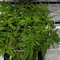](images/1558286103654.jpg)

### 2019-05-21 67/5f

[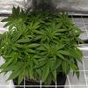](images/1558460676522.jpg)

### 2019-05-23 68/7f

[](images/1558632233628.jpg)

### 2019-05-27 72/11f

[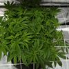](images/1558971560049.jpg)

### 2019-05-30 75/14f

[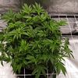](images/1559232866107.jpg)

### 2019-06-01 78/16f

[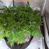](images/1559411257113.jpg)

### 2019-06-03 80/19f

[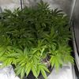](images/1559590652725.jpg)

### 2019-06-06 82/21f

[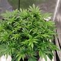](images/1559838230552.jpg)

### 2019-06-12 89/27f

[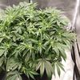](images/1560361159670.jpg)

### 2019-06-15 92/31f

[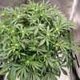](images/1560622745186.jpg)

### 2019-06-25 102/41f

[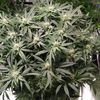](images/1561491940718.jpg) [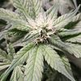](images/1561491955403.jpg)

### 2019-06-29 105/44f

[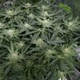](images/1561821453764.jpg) [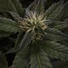](images/1561821470777.jpg)

### 2019-06-30 106/45f

[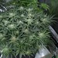](images/1561910855943.jpg)

### 2019-07-02 109/48f

[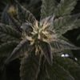](images/1562090202333.jpg)

### 2019-07-06 113/52f

[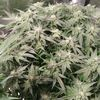](images/1562439029340.jpg) [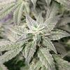](images/1562439037319.jpg)

### 2019-07-09 116/55f

[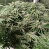](images/1562695494914.jpg) [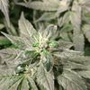](images/1562695500690.jpg)

### 2019-07-10 117/56f

[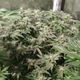](images/1562781830935.jpg) [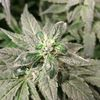](images/1562781835267.jpg)

### 2019-07-12 119/58f

[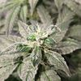](images/1562962842445.jpg)

### 2019-07-14 121/60f

[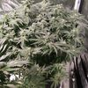](images/1563131105041.jpg) [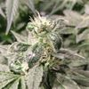](images/1563131110196.jpg)

### 2019-07-17 124/63f

[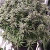](images/1563386299093.jpg) [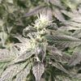](images/1563386305003.jpg)

### 2019-07-19 126/65f

[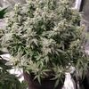](images/1563566296399.jpg) [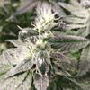](images/1563566304621.jpg)

### 2019-07-23 130/68f

[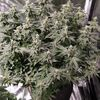](images/1563903729303.jpg) [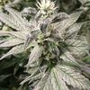](images/1563903735062.jpg)

### 2019-07-25 132/71f

[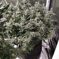](images/1564077700854.jpg) [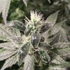](images/1564077706935.jpg) [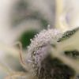](images/1564077767360.jpg)

### 2019-07-28 135/74f

[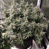](images/1564338349523.jpg) [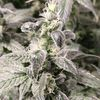](images/1564338354242.jpg) [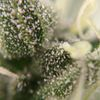](images/1564338495841.jpg)

### 2019-08-04 142/81f

[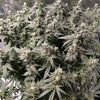](images/1564943099277.jpg) [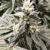](images/1564943106027.jpg) [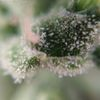](images/1564943276125.jpg)

### 2019-08-19 156/6d

[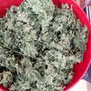](images/1566221320513.jpg)

## Raw plant data

```
{"id":"8231762e-0ef4-4f3b-b80a-3b5c41d9a653","name":"Berries and Cheese","strain":"Berries and Cheese","plantDate":1552671331574,"clone":false,"medium":"SOIL","mediumDetails":"","images":["/storage/emulated/0/DCIM/GrowTracker/8231762e-0ef4-4f3b-b80a-3b5c41d9a653/1553017014674.jpg","/storage/emulated/0/DCIM/GrowTracker/8231762e-0ef4-4f3b-b80a-3b5c41d9a653/1553623984628.jpg","/storage/emulated/0/DCIM/GrowTracker/8231762e-0ef4-4f3b-b80a-3b5c41d9a653/1553895122162.jpg","/storage/emulated/0/DCIM/GrowTracker/8231762e-0ef4-4f3b-b80a-3b5c41d9a653/1554143753602.jpg","/storage/emulated/0/DCIM/GrowTracker/8231762e-0ef4-4f3b-b80a-3b5c41d9a653/1554311249077.jpg","/storage/emulated/0/DCIM/GrowTracker/8231762e-0ef4-4f3b-b80a-3b5c41d9a653/1554746420813.jpg","/storage/emulated/0/DCIM/GrowTracker/8231762e-0ef4-4f3b-b80a-3b5c41d9a653/1555003477159.jpg","/storage/emulated/0/DCIM/GrowTracker/8231762e-0ef4-4f3b-b80a-3b5c41d9a653/1555169541100.jpg","/storage/emulated/0/DCIM/GrowTracker/8231762e-0ef4-4f3b-b80a-3b5c41d9a653/1555433413231.jpg","/storage/emulated/0/DCIM/GrowTracker/8231762e-0ef4-4f3b-b80a-3b5c41d9a653/1555864999075.jpg","/storage/emulated/0/DCIM/GrowTracker/8231762e-0ef4-4f3b-b80a-3b5c41d9a653/1555963185064.jpg","/storage/emulated/0/DCIM/GrowTracker/8231762e-0ef4-4f3b-b80a-3b5c41d9a653/1556174755101.jpg","/storage/emulated/0/DCIM/GrowTracker/8231762e-0ef4-4f3b-b80a-3b5c41d9a653/1556361370302.jpg","/storage/emulated/0/DCIM/GrowTracker/8231762e-0ef4-4f3b-b80a-3b5c41d9a653/1556642728600.jpg","/storage/emulated/0/DCIM/GrowTracker/8231762e-0ef4-4f3b-b80a-3b5c41d9a653/1556991019023.jpg","/storage/emulated/0/DCIM/GrowTracker/8231762e-0ef4-4f3b-b80a-3b5c41d9a653/1557247702958.jpg","/storage/emulated/0/DCIM/GrowTracker/8231762e-0ef4-4f3b-b80a-3b5c41d9a653/1557430486532.jpg","/storage/emulated/0/DCIM/GrowTracker/8231762e-0ef4-4f3b-b80a-3b5c41d9a653/1557943479470.jpg","/storage/emulated/0/DCIM/GrowTracker/8231762e-0ef4-4f3b-b80a-3b5c41d9a653/1558119505743.jpg","/storage/emulated/0/DCIM/GrowTracker/8231762e-0ef4-4f3b-b80a-3b5c41d9a653/1558286103654.jpg","/storage/emulated/0/DCIM/GrowTracker/8231762e-0ef4-4f3b-b80a-3b5c41d9a653/1558460676522.jpg","/storage/emulated/0/DCIM/GrowTracker/8231762e-0ef4-4f3b-b80a-3b5c41d9a653/1558632233628.jpg","/storage/emulated/0/DCIM/GrowTracker/8231762e-0ef4-4f3b-b80a-3b5c41d9a653/1558971560049.jpg","/storage/emulated/0/DCIM/GrowTracker/8231762e-0ef4-4f3b-b80a-3b5c41d9a653/1559232866107.jpg","/storage/emulated/0/DCIM/GrowTracker/8231762e-0ef4-4f3b-b80a-3b5c41d9a653/1559411257113.jpg","/storage/emulated/0/DCIM/GrowTracker/8231762e-0ef4-4f3b-b80a-3b5c41d9a653/1559590652725.jpg","/storage/emulated/0/DCIM/GrowTracker/8231762e-0ef4-4f3b-b80a-3b5c41d9a653/1559838230552.jpg","/storage/emulated/0/DCIM/GrowTracker/8231762e-0ef4-4f3b-b80a-3b5c41d9a653/1560361159670.jpg","/storage/emulated/0/DCIM/GrowTracker/8231762e-0ef4-4f3b-b80a-3b5c41d9a653/1560622745186.jpg","/storage/emulated/0/DCIM/GrowTracker/8231762e-0ef4-4f3b-b80a-3b5c41d9a653/1561491940718.jpg","/storage/emulated/0/DCIM/GrowTracker/8231762e-0ef4-4f3b-b80a-3b5c41d9a653/1561491955403.jpg","/storage/emulated/0/DCIM/GrowTracker/8231762e-0ef4-4f3b-b80a-3b5c41d9a653/1561821453764.jpg","/storage/emulated/0/DCIM/GrowTracker/8231762e-0ef4-4f3b-b80a-3b5c41d9a653/1561821470777.jpg","/storage/emulated/0/DCIM/GrowTracker/8231762e-0ef4-4f3b-b80a-3b5c41d9a653/1561910855943.jpg","/storage/emulated/0/DCIM/GrowTracker/8231762e-0ef4-4f3b-b80a-3b5c41d9a653/1562090202333.jpg","/storage/emulated/0/DCIM/GrowTracker/8231762e-0ef4-4f3b-b80a-3b5c41d9a653/1562439029340.jpg","/storage/emulated/0/DCIM/GrowTracker/8231762e-0ef4-4f3b-b80a-3b5c41d9a653/1562439037319.jpg","/storage/emulated/0/DCIM/GrowTracker/8231762e-0ef4-4f3b-b80a-3b5c41d9a653/1562695494914.jpg","/storage/emulated/0/DCIM/GrowTracker/8231762e-0ef4-4f3b-b80a-3b5c41d9a653/1562695500690.jpg","/storage/emulated/0/DCIM/GrowTracker/8231762e-0ef4-4f3b-b80a-3b5c41d9a653/1562781830935.jpg","/storage/emulated/0/DCIM/GrowTracker/8231762e-0ef4-4f3b-b80a-3b5c41d9a653/1562781835267.jpg","/storage/emulated/0/DCIM/GrowTracker/8231762e-0ef4-4f3b-b80a-3b5c41d9a653/1562962842445.jpg","/storage/emulated/0/DCIM/GrowTracker/8231762e-0ef4-4f3b-b80a-3b5c41d9a653/1563131105041.jpg","/storage/emulated/0/DCIM/GrowTracker/8231762e-0ef4-4f3b-b80a-3b5c41d9a653/1563131110196.jpg","/storage/emulated/0/DCIM/GrowTracker/8231762e-0ef4-4f3b-b80a-3b5c41d9a653/1563386299093.jpg","/storage/emulated/0/DCIM/GrowTracker/8231762e-0ef4-4f3b-b80a-3b5c41d9a653/1563386305003.jpg","/storage/emulated/0/DCIM/GrowTracker/8231762e-0ef4-4f3b-b80a-3b5c41d9a653/1563566296399.jpg","/storage/emulated/0/DCIM/GrowTracker/8231762e-0ef4-4f3b-b80a-3b5c41d9a653/1563566304621.jpg","/storage/emulated/0/DCIM/GrowTracker/8231762e-0ef4-4f3b-b80a-3b5c41d9a653/1563903729303.jpg","/storage/emulated/0/DCIM/GrowTracker/8231762e-0ef4-4f3b-b80a-3b5c41d9a653/1563903735062.jpg","/storage/emulated/0/DCIM/GrowTracker/8231762e-0ef4-4f3b-b80a-3b5c41d9a653/1564077700854.jpg","/storage/emulated/0/DCIM/GrowTracker/8231762e-0ef4-4f3b-b80a-3b5c41d9a653/1564077706935.jpg","/storage/emulated/0/DCIM/GrowTracker/8231762e-0ef4-4f3b-b80a-3b5c41d9a653/1564077767360.jpg","/storage/emulated/0/DCIM/GrowTracker/8231762e-0ef4-4f3b-b80a-3b5c41d9a653/1564338349523.jpg","/storage/emulated/0/DCIM/GrowTracker/8231762e-0ef4-4f3b-b80a-3b5c41d9a653/1564338354242.jpg","/storage/emulated/0/DCIM/GrowTracker/8231762e-0ef4-4f3b-b80a-3b5c41d9a653/1564338495841.jpg","/storage/emulated/0/DCIM/GrowTracker/8231762e-0ef4-4f3b-b80a-3b5c41d9a653/1564943099277.jpg","/storage/emulated/0/DCIM/GrowTracker/8231762e-0ef4-4f3b-b80a-3b5c41d9a653/1564943106027.jpg","/storage/emulated/0/DCIM/GrowTracker/8231762e-0ef4-4f3b-b80a-3b5c41d9a653/1564943276125.jpg","/storage/emulated/0/DCIM/GrowTracker/8231762e-0ef4-4f3b-b80a-3b5c41d9a653/1566221320513.jpg"],"actions":[{"newStage":"PLANTED","date":1552671331574,"type":"StageChange"},{"newStage":"GERMINATION","date":1552930587866,"type":"StageChange"},{"newStage":"VEGETATION","date":1553709989148,"type":"StageChange"},{"tds":{"amount":0.93,"type":"EC"},"ph":5.7,"additives":[{"amount":1.0,"description":"Canna a"},{"amount":1.0,"description":"Canna b"},{"amount":3.5,"description":"Rhizotonic"},{"amount":1.0,"description":"Calmag"}],"date":1553709995800,"type":"Water"},{"tds":{"amount":0.93,"type":"EC"},"ph":5.7,"additives":[{"amount":1.0,"description":"Canna a"},{"amount":1.0,"description":"Canna b"},{"amount":3.5,"description":"Rhizotonic"},{"amount":1.0,"description":"Calmag"}],"date":1553796877015,"type":"Water"},{"tds":{"amount":2.0,"type":"EC"},"ph":5.6,"additives":[{"amount":2.5,"description":"Canna a"},{"amount":2.5,"description":"Canna b"},{"amount":2.0,"description":"Rhizotonic"},{"amount":1.0,"description":"Calmag"},{"amount":2.5,"description":"Canna zym"}],"date":1554142931252,"type":"Water"},{"tds":{"amount":2.0,"type":"EC"},"ph":5.6,"additives":[{"amount":2.5,"description":"Canna a"},{"amount":2.5,"description":"Canna b"},{"amount":2.0,"description":"Rhizotonic"},{"amount":1.0,"description":"Calmag"},{"amount":2.5,"description":"Canna zym"}],"date":1554311255010,"type":"Water"},{"tds":{"amount":2.0,"type":"EC"},"ph":5.6,"additives":[{"amount":2.5,"description":"Canna a"},{"amount":2.5,"description":"Canna b"},{"amount":2.0,"description":"Rhizotonic"},{"amount":1.0,"description":"Calmag"},{"amount":2.5,"description":"Canna zym"}],"date":1554575394245,"type":"Water"},{"tds":{"amount":1.52,"type":"EC"},"ph":5.7,"amount":2000.0,"additives":[{"amount":2.5,"description":"Canna a"},{"amount":2.5,"description":"Canna b"},{"amount":2.0,"description":"Rhizotonic"},{"amount":1.0,"description":"Calmag"},{"amount":2.5,"description":"Canna zym"}],"date":1554745927594,"type":"Water"},{"tds":{"amount":1.52,"type":"EC"},"ph":5.7,"amount":250.0,"additives":[{"amount":2.5,"description":"Canna a"},{"amount":2.5,"description":"Canna b"},{"amount":2.0,"description":"Rhizotonic"},{"amount":1.0,"description":"Calmag"},{"amount":2.5,"description":"Canna zym"}],"date":1555003482328,"type":"Water"},{"tds":{"amount":1.52,"type":"EC"},"ph":5.5,"additives":[{"amount":2.5,"description":"Canna a"},{"amount":2.5,"description":"Canna b"},{"amount":2.0,"description":"Rhizotonic"},{"amount":1.0,"description":"Calmag"},{"amount":2.5,"description":"Canna zym"}],"date":1555433541243,"type":"Water"},{"tds":{"amount":1.42,"type":"EC"},"ph":5.5,"additives":[{"amount":3.0,"description":"Canna a"},{"amount":3.0,"description":"Canna b"},{"amount":2.0,"description":"Rhizotonic"},{"amount":1.0,"description":"Calmag"},{"amount":2.5,"description":"Canna zym"}],"date":1555864995239,"type":"Water"},{"action":"TRANSPLANTED","date":1555865007756,"type":"Action"},{"action":"TOP","date":1555963190957,"type":"Action"},{"tds":{"amount":1.42,"type":"EC"},"ph":5.5,"additives":[{"amount":3.0,"description":"Canna a"},{"amount":3.0,"description":"Canna b"},{"amount":2.0,"description":"Rhizotonic"},{"amount":1.0,"description":"Calmag"},{"amount":2.5,"description":"Canna zym"}],"date":1556128563224,"type":"Water"},{"tds":{"amount":1.67,"type":"EC"},"ph":5.4,"additives":[{"amount":2.0,"description":"Canna a"},{"amount":2.0,"description":"Canna b"},{"amount":2.0,"description":"Rhizotonic"},{"amount":2.0,"description":"Calmag"},{"amount":2.5,"description":"Canna zym"}],"date":1556360416213,"type":"Water"},{"action":"TRIM","date":1556361354721,"type":"Action"},{"action":"LST","date":1556361364246,"type":"Action"},{"tds":{"amount":1.67,"type":"EC"},"ph":5.4,"additives":[{"amount":2.0,"description":"Canna a"},{"amount":2.0,"description":"Canna b"},{"amount":2.0,"description":"Rhizotonic"},{"amount":2.0,"description":"Calmag"},{"amount":2.5,"description":"Canna zym"}],"date":1556474442444,"type":"Water"},{"action":"TOP","date":1556642724502,"type":"Action"},{"tds":{"amount":1.67,"type":"EC"},"ph":5.4,"additives":[{"amount":2.0,"description":"Canna a"},{"amount":2.0,"description":"Canna b"},{"amount":2.0,"description":"Rhizotonic"},{"amount":2.0,"description":"Calmag"},{"amount":2.5,"description":"Canna zym"}],"date":1556818230142,"type":"Water"},{"tds":{"amount":1.78,"type":"EC"},"ph":5.5,"additives":[{"amount":3.0,"description":"Canna a"},{"amount":3.0,"description":"Canna b"},{"amount":2.0,"description":"Rhizotonic"},{"amount":2.0,"description":"Calmag"},{"amount":2.5,"description":"Canna zym"},{"amount":2.0,"description":"Canna boost"}],"date":1557075790183,"type":"Water"},{"tds":{"amount":1.78,"type":"EC"},"ph":5.5,"additives":[{"amount":3.0,"description":"Canna a"},{"amount":3.0,"description":"Canna b"},{"amount":2.0,"description":"Rhizotonic"},{"amount":2.0,"description":"Calmag"},{"amount":2.5,"description":"Canna zym"},{"amount":2.0,"description":"Canna boost"}],"date":1557430494067,"type":"Water"},{"action":"TRIM","date":1557430510411,"type":"Action"},{"tds":{"amount":1.17,"type":"EC"},"ph":5.6,"additives":[{"amount":3.0,"description":"Canna a"},{"amount":3.0,"description":"Canna b"},{"amount":2.0,"description":"Rhizotonic"},{"amount":1.0,"description":"Calmag"},{"amount":2.5,"description":"Canna zym"},{"amount":2.0,"description":"Canna boost"}],"date":1557593032689,"type":"Water"},{"tds":{"amount":1.17,"type":"EC"},"ph":5.6,"additives":[{"amount":3.0,"description":"Canna a"},{"amount":3.0,"description":"Canna b"},{"amount":2.0,"description":"Rhizotonic"},{"amount":1.0,"description":"Calmag"},{"amount":2.5,"description":"Canna zym"},{"amount":2.0,"description":"Canna boost"}],"date":1557765246406,"type":"Water"},{"newStage":"FLOWER","date":1557942756128,"type":"StageChange"},{"tds":{"amount":1.51,"type":"EC"},"ph":5.5,"additives":[{"amount":3.0,"description":"Canna a"},{"amount":3.0,"description":"Canna b"},{"amount":2.0,"description":"Rhizotonic"},{"amount":1.0,"description":"Calmag"},{"amount":2.5,"description":"Canna zym"},{"amount":2.0,"description":"Canna boost"}],"date":1557942762416,"type":"Water"},{"tds":{"amount":1.51,"type":"EC"},"ph":5.5,"additives":[{"amount":3.0,"description":"Canna a"},{"amount":3.0,"description":"Canna b"},{"amount":2.0,"description":"Rhizotonic"},{"amount":1.0,"description":"Calmag"},{"amount":2.5,"description":"Canna zym"},{"amount":2.0,"description":"Canna boost"}],"date":1558119512164,"type":"Water"},{"tds":{"amount":1.33,"type":"EC"},"ph":5.6,"additives":[{"amount":3.0,"description":"Canna a"},{"amount":3.0,"description":"Canna b"},{"amount":2.0,"description":"Rhizotonic"},{"amount":1.0,"description":"Calmag"},{"amount":2.5,"description":"Canna zym"},{"amount":2.0,"description":"Canna boost"}],"date":1558286130779,"type":"Water"},{"tds":{"amount":1.33,"type":"EC"},"ph":5.6,"additives":[{"amount":3.0,"description":"Canna a"},{"amount":3.0,"description":"Canna b"},{"amount":2.0,"description":"Rhizotonic"},{"amount":1.0,"description":"Calmag"},{"amount":2.5,"description":"Canna zym"},{"amount":2.0,"description":"Canna boost"}],"date":1558460683323,"type":"Water"},{"tds":{"amount":1.33,"type":"EC"},"ph":5.6,"additives":[{"amount":3.0,"description":"Canna a"},{"amount":3.0,"description":"Canna b"},{"amount":2.0,"description":"Rhizotonic"},{"amount":1.0,"description":"Calmag"},{"amount":2.5,"description":"Canna zym"},{"amount":2.0,"description":"Canna boost"}],"date":1558726040962,"type":"Water"},{"tds":{"amount":1.33,"type":"EC"},"ph":5.6,"additives":[{"amount":3.0,"description":"Canna a"},{"amount":3.0,"description":"Canna b"},{"amount":2.0,"description":"Rhizotonic"},{"amount":1.0,"description":"Calmag"},{"amount":2.5,"description":"Canna zym"},{"amount":2.0,"description":"Canna boost"}],"date":1558971566293,"type":"Water"},{"tds":{"amount":1.46,"type":"EC"},"ph":5.6,"additives":[{"amount":3.5,"description":"Canna a"},{"amount":3.5,"description":"Canna b"},{"amount":0.5,"description":"Rhizotonic"},{"amount":2.0,"description":"Calmag"},{"amount":2.5,"description":"Canna zym"},{"amount":2.5,"description":"Canna boost"},{"amount":2.0,"description":"Topmax"}],"date":1559232355517,"type":"Water"},{"tds":{"amount":1.46,"type":"EC"},"ph":5.6,"additives":[{"amount":3.5,"description":"Canna a"},{"amount":3.5,"description":"Canna b"},{"amount":0.5,"description":"Rhizotonic"},{"amount":2.0,"description":"Calmag"},{"amount":2.5,"description":"Canna zym"},{"amount":2.5,"description":"Canna boost"},{"amount":2.0,"description":"Topmax"}],"date":1559412294342,"type":"Water"},{"tds":{"amount":1.56,"type":"EC"},"ph":5.4,"additives":[{"amount":3.5,"description":"Canna a"},{"amount":3.5,"description":"Canna b"},{"amount":0.5,"description":"Rhizotonic"},{"amount":2.0,"description":"Calmag"},{"amount":2.5,"description":"Canna zym"},{"amount":2.5,"description":"Canna boost"},{"amount":2.0,"description":"Topmax"}],"date":1559589891680,"type":"Water"},{"tds":{"amount":1.56,"type":"EC"},"ph":5.4,"additives":[{"amount":3.5,"description":"Canna a"},{"amount":3.5,"description":"Canna b"},{"amount":0.5,"description":"Rhizotonic"},{"amount":2.0,"description":"Calmag"},{"amount":2.5,"description":"Canna zym"},{"amount":2.5,"description":"Canna boost"},{"amount":2.0,"description":"Topmax"}],"date":1559838239741,"type":"Water"},{"tds":{"amount":1.88,"type":"EC"},"ph":5.5,"additives":[{"amount":3.5,"description":"Canna a"},{"amount":3.5,"description":"Canna b"},{"amount":0.5,"description":"Rhizotonic"},{"amount":2.0,"description":"Calmag"},{"amount":2.5,"description":"Canna zym"},{"amount":2.5,"description":"Canna boost"},{"amount":2.0,"description":"Topmax"},{"amount":1.5,"description":"pk 13/14"}],"date":1560183777336,"type":"Water"},{"tds":{"amount":1.88,"type":"EC"},"ph":5.5,"additives":[{"amount":3.5,"description":"Canna a"},{"amount":3.5,"description":"Canna b"},{"amount":0.5,"description":"Rhizotonic"},{"amount":2.0,"description":"Calmag"},{"amount":2.5,"description":"Canna zym"},{"amount":2.5,"description":"Canna boost"},{"amount":2.0,"description":"Topmax"},{"amount":1.5,"description":"pk 13/14"}],"date":1560361156293,"type":"Water"},{"tds":{"amount":1.87,"type":"EC"},"ph":5.6,"additives":[{"amount":3.5,"description":"Canna a"},{"amount":3.5,"description":"Canna b"},{"amount":0.5,"description":"Rhizotonic"},{"amount":2.0,"description":"Calmag"},{"amount":2.5,"description":"Canna zym"},{"amount":2.5,"description":"Canna boost"},{"amount":2.0,"description":"Topmax"},{"amount":1.5,"description":"pk 13/14"}],"date":1560622864231,"type":"Water"},{"tds":{"amount":1.75,"type":"EC"},"ph":5.6,"additives":[{"amount":4.0,"description":"Canna a"},{"amount":4.0,"description":"Canna b"},{"amount":0.5,"description":"Rhizotonic"},{"amount":2.0,"description":"Calmag"},{"amount":2.5,"description":"Canna zym"},{"amount":3.0,"description":"Canna boost"},{"amount":2.0,"description":"Topmax"},{"amount":1.5,"description":"Pk 13/14"}],"date":1561046555694,"type":"Water"},{"tds":{"amount":1.75,"type":"EC"},"ph":5.6,"additives":[{"amount":4.0,"description":"Canna a"},{"amount":4.0,"description":"Canna b"},{"amount":0.5,"description":"Rhizotonic"},{"amount":2.0,"description":"Calmag"},{"amount":2.5,"description":"Canna zym"},{"amount":3.0,"description":"Canna boost"},{"amount":2.0,"description":"Topmax"},{"amount":1.5,"description":"Pk 13/14"}],"date":1561229362741,"type":"Water"},{"tds":{"amount":1.59,"type":"EC"},"ph":5.5,"amount":15000.0,"additives":[{"amount":3.5,"description":"Canna a"},{"amount":3.5,"description":"Canna b"},{"amount":0.5,"description":"Rhizotonic"},{"amount":2.0,"description":"Calmag"},{"amount":2.5,"description":"Canna zym"},{"amount":2.5,"description":"Canna boost"},{"amount":2.0,"description":"Topmax"},{"amount":1.5,"description":"Pk 13/14"}],"date":1561491318831,"type":"Water"},{"tds":{"amount":1.1,"type":"EC"},"ph":5.7,"amount":10000.0,"additives":[{"amount":2.5,"description":"Canna a"},{"amount":2.5,"description":"Canna b"},{"amount":0.5,"description":"Rhizotonic"},{"amount":2.0,"description":"Calmag"},{"amount":2.5,"description":"Canna zym"},{"amount":3.0,"description":"Canna boost"},{"amount":2.0,"description":"Topmax"}],"date":1561735851408,"type":"Water"},{"tds":{"amount":1.1,"type":"EC"},"ph":5.7,"amount":10000.0,"additives":[{"amount":2.5,"description":"Canna a"},{"amount":2.5,"description":"Canna b"},{"amount":0.5,"description":"Rhizotonic"},{"amount":2.0,"description":"Calmag"},{"amount":2.5,"description":"Canna zym"},{"amount":3.0,"description":"Canna boost"},{"amount":2.0,"description":"Topmax"}],"date":1561910931723,"type":"Water"},{"tds":{"amount":1.4,"type":"EC"},"ph":5.7,"additives":[{"amount":2.5,"description":"Canna a"},{"amount":2.5,"description":"Canna b"},{"amount":2.0,"description":"Calmag"},{"amount":2.5,"description":"Canna zym"},{"amount":3.0,"description":"Canna boost"},{"amount":3.5,"description":"Topmax"}],"date":1562086398183,"type":"Water"},{"tds":{"amount":1.4,"type":"EC"},"ph":5.7,"additives":[{"amount":2.5,"description":"Canna a"},{"amount":2.5,"description":"Canna b"},{"amount":2.0,"description":"Calmag"},{"amount":2.5,"description":"Canna zym"},{"amount":3.0,"description":"Canna boost"},{"amount":3.5,"description":"Topmax"}],"date":1562256883742,"type":"Water"},{"tds":{"amount":1.21,"type":"EC"},"ph":5.5,"additives":[{"amount":2.5,"description":"Canna a"},{"amount":2.5,"description":"Canna b"},{"amount":1.0,"description":"Calmag"},{"amount":2.5,"description":"Canna zym"},{"amount":3.0,"description":"Canna boost"}],"date":1562438509055,"type":"Water"},{"action":"TRIM","date":1562438940433,"type":"Action"},{"tds":{"amount":1.21,"type":"EC"},"ph":5.5,"additives":[{"amount":2.5,"description":"Canna a"},{"amount":2.5,"description":"Canna b"},{"amount":1.0,"description":"Calmag"},{"amount":2.5,"description":"Canna zym"},{"amount":3.0,"description":"Canna boost"}],"date":1562609108921,"type":"Water"},{"date":1562741863031,"notes":"Showing signs of revegging","type":"Note"},{"tds":{"amount":1.18,"type":"EC"},"ph":5.5,"amount":5000.0,"additives":[{"amount":2.5,"description":"Canna a"},{"amount":2.5,"description":"Canna b"},{"amount":1.0,"description":"Calmag"},{"amount":2.5,"description":"Canna zym"},{"amount":3.0,"description":"Canna boost"},{"amount":1.5,"description":"pk 13/14"}],"date":1562779301563,"type":"Water"},{"tds":{"amount":1.23,"type":"EC"},"ph":5.7,"amount":5000.0,"additives":[{"amount":2.5,"description":"Canna a"},{"amount":2.5,"description":"Canna b"},{"amount":1.0,"description":"Calmag"},{"amount":2.5,"description":"Canna zym"},{"amount":3.0,"description":"Canna boost"},{"amount":1.5,"description":"pk 13/14"}],"date":1562962242084,"type":"Water"},{"tds":{"amount":1.31,"type":"EC"},"ph":5.8,"amount":10000.0,"additives":[{"amount":2.5,"description":"Canna a"},{"amount":2.5,"description":"Canna b"},{"amount":1.0,"description":"Calmag"},{"amount":2.5,"description":"Canna zym"},{"amount":3.0,"description":"Canna boost"},{"amount":1.5,"description":"pk 13/14"}],"date":1563129917858,"type":"Water"},{"tds":{"amount":1.31,"type":"EC"},"ph":5.8,"amount":10000.0,"additives":[{"amount":2.5,"description":"Canna a"},{"amount":2.5,"description":"Canna b"},{"amount":1.0,"description":"Calmag"},{"amount":2.5,"description":"Canna zym"},{"amount":3.0,"description":"Canna boost"},{"amount":1.5,"description":"pk 13/14"}],"date":1563386295738,"type":"Water"},{"tds":{"amount":1.29,"type":"EC"},"ph":5.6,"amount":10000.0,"additives":[{"amount":3.0,"description":"Canna a"},{"amount":3.0,"description":"Canna b"},{"amount":1.0,"description":"Calmag"},{"amount":2.5,"description":"Canna zym"},{"amount":3.0,"description":"Canna boost"}],"date":1563386409182,"type":"Water"},{"tds":{"amount":1.37,"type":"EC"},"ph":5.7,"amount":4000.0,"additives":[{"amount":3.0,"description":"Canna a"},{"amount":3.0,"description":"Canna b"},{"amount":1.0,"description":"Calmag"},{"amount":2.5,"description":"Canna zym"},{"amount":3.0,"description":"Canna boost"}],"date":1563565084200,"type":"Water"},{"tds":{"amount":1.58,"type":"EC"},"ph":5.7,"amount":4000.0,"additives":[{"amount":3.0,"description":"Canna a"},{"amount":3.0,"description":"Canna b"},{"amount":1.0,"description":"Calmag"},{"amount":2.5,"description":"Canna zym"},{"amount":3.0,"description":"Canna boost"}],"date":1563735247459,"type":"Water"},{"tds":{"amount":1.39,"type":"EC"},"ph":5.7,"amount":10000.0,"additives":[{"amount":2.5,"description":"Canna a"},{"amount":2.5,"description":"Canna b"},{"amount":2.0,"description":"Calmag"},{"amount":2.5,"description":"Canna zym"},{"amount":3.0,"description":"Canna boost"},{"amount":1.0,"description":"pk 13/14"}],"date":1563901151945,"type":"Water"},{"tds":{"amount":1.37,"type":"EC"},"ph":5.6,"additives":[{"amount":2.5,"description":"Canna a"},{"amount":2.5,"description":"Canna b"},{"amount":2.0,"description":"Calmag"},{"amount":2.5,"description":"Canna zym"},{"amount":3.0,"description":"Canna boost"}],"date":1564076682662,"type":"Water"},{"tds":{"amount":1.53,"type":"EC"},"ph":5.8,"additives":[{"amount":2.5,"description":"Canna a"},{"amount":2.5,"description":"Canna b"},{"amount":2.0,"description":"Calmag"},{"amount":2.5,"description":"Canna zym"},{"amount":3.0,"description":"Canna boost"}],"date":1564172950100,"type":"Water"},{"tds":{"amount":1.54,"type":"EC"},"ph":5.8,"additives":[{"amount":2.5,"description":"Canna a"},{"amount":2.5,"description":"Canna b"},{"amount":2.0,"description":"Calmag"},{"amount":2.5,"description":"Canna zym"},{"amount":3.0,"description":"Canna boost"}],"date":1564337682205,"type":"Water"},{"tds":{"amount":1.4,"type":"EC"},"ph":5.8,"additives":[{"amount":2.5,"description":"Canna a"},{"amount":2.5,"description":"Canna b"},{"amount":2.0,"description":"Calmag"},{"amount":2.5,"description":"Canna zym"},{"amount":3.0,"description":"Canna boost"}],"date":1564420270404,"type":"Water"},{"tds":{"amount":0.97,"type":"EC"},"ph":5.6,"amount":15000.0,"additives":[{"amount":2.0,"description":"Calmag"},{"amount":3.0,"description":"Canna zym"},{"amount":3.0,"description":"Canna boost"}],"date":1564593731933,"type":"Water"},{"tds":{"amount":1.0,"type":"EC"},"ph":5.7,"amount":15000.0,"additives":[{"amount":2.0,"description":"Calmag"},{"amount":3.0,"description":"Canna zym"},{"amount":3.0,"description":"Canna boost"}],"date":1564773923489,"type":"Water"},{"tds":{"amount":0.91,"type":"EC"},"ph":5.8,"amount":10000.0,"additives":[{"amount":2.0,"description":"Calmag"},{"amount":3.0,"description":"Canna zym"},{"amount":3.0,"description":"Canna boost"}],"date":1564942436942,"type":"Water"},{"tds":{"amount":0.99,"type":"EC"},"ph":5.7,"amount":15000.0,"additives":[{"amount":2.0,"description":"Calmag"},{"amount":2.5,"description":"Canna zym"},{"amount":3.0,"description":"Canna boost"}],"date":1565111677026,"type":"Water"},{"tds":{"amount":0.25,"type":"EC"},"ph":5.5,"additives":[],"date":1565285289124,"type":"Water"},{"newStage":"DRYING","date":1565698196554,"type":"StageChange"},{"date":1566221316501,"notes":"153g","type":"Note"},{"newStage":"CURING","date":1566221341853,"type":"StageChange"},{"newStage":"HARVESTED","date":1568731006449,"type":"StageChange"}]}
```

Generated using [Grow Tracker](https://github.com/7LPdWcaW/GrowTracker-Android)
