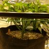

# Grow Log

## Grow details

**Name:** Blueberry Fem

**Strain:** Seedsman Blueberry Fem

**Planted:** 2018-07-14 21:31

**Medium:** Coco Coir

**Harvested:** 2018-11-17 18:57

**Yield:** 170g

## Stages

 - Planted

	 - **Set on:** 2018-07-14 21:31
	 - **In stage for:** 3.44 days


 - Germination

	 - **Set on:** 2018-07-18 08:00
	 - **In stage for:** 4.47 days


 - Vegetation

	 - **Set on:** 2018-07-22 19:16
	 - **In stage for:** 33.04 days


 - Flowering

	 - **Set on:** 2018-08-24 20:13
	 - **In stage for:** 64.03 days


 - Drying

	 - **Set on:** 2018-10-27 20:52
	 - **In stage for:** 6.83 days


 - Curing

	 - **Set on:** 2018-11-03 15:40
	 - **In stage for:** 14.14 days


 - Harvested

	 - **Set on:** 2018-11-17 18:57


## Stats

 - **Total grow time:** 125.93 days
 - **Total waters:** 42
 - **Total water used:** 42l
 - **Average time between watering:** 2.31 days

### Nutrients used

 - Rhizotonic
 - Boost
 - Cannazym
 - Topmax
 - Pk12
 - Calmag
 - Canna b
 - Canna a


### Input/runoff pH

 - **Minimum input pH:** 5.5
 - **Maximum input pH:** 5.87
 - **Average input pH:** 5.79


### EC

 - **Minimum input EC:** 0.66mS/cm
 - **Maximum input EC:** 2.68mS/cm
 - **Average input EC:** 1.88mS/cm


### Temperature (°C)

 - **Minimum input temperature:** -°C
 - **Maximum input temperature:** -°C
 - **Average input temperature:** 0°C


## Actions

| Date | Stage | Action | Details | Notes |
| ---- | ----- | ------ | ------- | ----- |
| 2018-11-17 18:57 | 125/14c | StageChange | Changed to Harvested |  |
| 2018-11-03 15:42 | 111/1c | Note |   | 170g |
| 2018-11-03 15:40 | 111/6d | StageChange | Changed to Curing |  |
| 2018-10-27 20:52 | 104/64f | StageChange | Changed to Drying |  |
| 2018-10-24 18:30 | 101/60f | Water | **pH:** 5.5 **amount:** 1l **EC:** 0.66mS/cm  / **Boost:** 2ml/l **Calmag:** 1ml/l – **Cannazym:** 4ml/l |  |
| 2018-10-21 18:57 | 98/57f | Water | **pH:** 5.5 **amount:** 1l **EC:** 0.66mS/cm  / **Boost:** 2ml/l **Calmag:** 1ml/l – **Cannazym:** 4ml/l |  |
| 2018-10-17 19:19 | 94/53f | Water | **pH:** 5.5 **amount:** 1l **EC:** 0.66mS/cm  / **Boost:** 2ml/l **Calmag:** 1ml/l – **Cannazym:** 4ml/l |  |
| 2018-10-14 17:27 | 91/50f | Water | **pH:** 5.8 **amount:** 1l **EC:** 0.78mS/cm  / **Boost:** 2ml/l **Calmag:** 1ml/l – **Cannazym:** 3ml/l |  |
| 2018-10-11 19:35 | 88/47f | Water | **pH:** 5.8 **amount:** 1l **EC:** 0.78mS/cm  / **Boost:** 2ml/l **Calmag:** 1ml/l – **Cannazym:** 3ml/l |  |
| 2018-10-09 19:35 | 86/45f | Water | **pH:** 5.8 **amount:** 1l **EC:** 0.78mS/cm  / **Boost:** 2ml/l **Calmag:** 1ml/l – **Cannazym:** 3ml/l |  |
| 2018-10-07 18:57 | 84/43f | Water | **pH:** 5.84 **amount:** 1l **EC:** 1.92mS/cm  / **Boost:** 1ml/l **Calmag:** 1ml/l – **Canna a:** 2.7ml/l – **Canna b:** 2.7ml/l – **Cannazym:** 2.5ml/l – **Rhizotonic:** 2.5ml/l |  |
| 2018-10-05 18:52 | 82/41f | Water | **pH:** 5.79 **amount:** 1l **EC:** 2.68mS/cm  / **Boost:** 3ml/l **Calmag:** 2ml/l – **Canna a:** 4.5ml/l – **Canna b:** 4.5ml/l – **Cannazym:** 2.5ml/l – **Pk12:** 3ml/l – **Rhizotonic:** 0.5ml/l – **Topmax:** 3ml/l |  |
| 2018-10-03 19:14 | 80/39f | Water | **pH:** 5.79 **amount:** 1l **EC:** 2.68mS/cm  / **Boost:** 3ml/l **Calmag:** 2ml/l – **Canna a:** 4.5ml/l – **Canna b:** 4.5ml/l – **Cannazym:** 2.5ml/l – **Pk12:** 3ml/l – **Rhizotonic:** 0.5ml/l – **Topmax:** 3ml/l |  |
| 2018-09-30 18:23 | 77/36f | Water | **pH:** 5.79 **amount:** 1l **EC:** 2.68mS/cm  / **Boost:** 3ml/l **Calmag:** 2ml/l – **Canna a:** 4.5ml/l – **Canna b:** 4.5ml/l – **Cannazym:** 2.5ml/l – **Pk12:** 3ml/l – **Rhizotonic:** 0.5ml/l – **Topmax:** 3ml/l |  |
| 2018-09-28 19:30 | 75/34f | Water | **pH:** 5.84 **amount:** 1l **EC:** 2.48mS/cm  / **Boost:** 2ml/l **Calmag:** 2ml/l – **Canna a:** 4.5ml/l – **Canna b:** 4.5ml/l – **Cannazym:** 2.5ml/l – **Pk12:** 2.5ml/l – **Rhizotonic:** 0.5ml/l – **Topmax:** 3ml/l |  |
| 2018-09-26 19:30 | 73/32f | Water | **pH:** 5.84 **amount:** 1l **EC:** 2.48mS/cm  / **Calmag:** 2ml/l – **Canna a:** 4.5ml/l – **Canna b:** 4.5ml/l – **Cannazym:** 2.5ml/l – **Pk12:** 2.5ml/l – **Rhizotonic:** 0.5ml/l – **Topmax:** 3ml/l |  |
| 2018-09-24 19:30 | 71/30f | Water | **pH:** 5.84 **amount:** 1l **EC:** 2.48mS/cm  / **Calmag:** 2ml/l – **Canna a:** 4.5ml/l – **Canna b:** 4.5ml/l – **Cannazym:** 2.5ml/l – **Pk12:** 2.5ml/l – **Rhizotonic:** 0.5ml/l – **Topmax:** 3ml/l |  |
| 2018-09-22 19:19 | 69/28f | Water | **pH:** 5.87 **amount:** 1l **EC:** 2.54mS/cm  / **Calmag:** 2ml/l – **Canna a:** 4.5ml/l – **Canna b:** 4.5ml/l – **Cannazym:** 2.5ml/l – **Pk12:** 2ml/l – **Rhizotonic:** 0.5ml/l – **Topmax:** 3ml/l |  |
| 2018-09-20 19:19 | 67/26f | Water | **pH:** 5.87 **amount:** 1l **EC:** 2.54mS/cm  / **Calmag:** 2ml/l – **Canna a:** 4.5ml/l – **Canna b:** 4.5ml/l – **Cannazym:** 2.5ml/l – **Pk12:** 2ml/l – **Rhizotonic:** 0.5ml/l – **Topmax:** 3ml/l |  |
| 2018-09-18 19:19 | 65/24f | Water | **pH:** 5.87 **amount:** 1l **EC:** 2.54mS/cm  / **Calmag:** 2ml/l – **Canna a:** 4.5ml/l – **Canna b:** 4.5ml/l – **Cannazym:** 2.5ml/l – **Pk12:** 2ml/l – **Rhizotonic:** 0.5ml/l – **Topmax:** 3ml/l |  |
| 2018-09-16 18:26 | 63/22f | Water | **pH:** 5.81 **amount:** 1l **EC:** 2.42mS/cm  / **Calmag:** 2ml/l – **Canna a:** 4.5ml/l – **Canna b:** 4.5ml/l – **Cannazym:** 2.5ml/l – **Pk12:** 2ml/l – **Rhizotonic:** 0.5ml/l – **Topmax:** 2.5ml/l |  |
| 2018-09-14 18:26 | 61/20f | Water | **pH:** 5.81 **amount:** 1l **EC:** 2.42mS/cm  / **Calmag:** 2ml/l – **Canna a:** 4.5ml/l – **Canna b:** 4.5ml/l – **Cannazym:** 2.5ml/l – **Pk12:** 2ml/l – **Rhizotonic:** 0.5ml/l – **Topmax:** 2.5ml/l |  |
| 2018-09-12 18:26 | 59/18f | Water | **pH:** 5.81 **amount:** 1l **EC:** 2.42mS/cm  / **Calmag:** 2ml/l – **Canna a:** 4.5ml/l – **Canna b:** 4.5ml/l – **Cannazym:** 2.5ml/l – **Pk12:** 2ml/l – **Rhizotonic:** 0.5ml/l – **Topmax:** 2.5ml/l |  |
| 2018-09-10 18:28 | 57/16f | Water | **pH:** 5.83 **amount:** 1l **EC:** 2.32mS/cm  / **Calmag:** 2ml/l – **Canna a:** 4ml/l – **Canna b:** 4ml/l – **Cannazym:** 2.5ml/l – **Pk12:** 2ml/l – **Rhizotonic:** 0.5ml/l – **Topmax:** 2ml/l |  |
| 2018-09-08 18:28 | 55/14f | Water | **pH:** 5.83 **amount:** 1l **EC:** 2.32mS/cm  / **Calmag:** 2ml/l – **Canna a:** 4ml/l – **Canna b:** 4ml/l – **Cannazym:** 2.5ml/l – **Pk12:** 2ml/l – **Rhizotonic:** 0.5ml/l – **Topmax:** 2ml/l |  |
| 2018-09-06 18:30 | 53/12f | Water | **pH:** 5.83 **amount:** 1l **EC:** 2.32mS/cm  / **Calmag:** 2ml/l – **Canna a:** 4ml/l – **Canna b:** 4ml/l – **Cannazym:** 2.5ml/l – **Pk12:** 2ml/l – **Rhizotonic:** 0.5ml/l – **Topmax:** 2ml/l |  |
| 2018-09-04 17:31 | 51/10f | Water | **pH:** 5.82 **amount:** 1l **EC:** 2.16mS/cm  / **Calmag:** 2ml/l – **Canna a:** 3.5ml/l – **Canna b:** 3.5ml/l – **Cannazym:** 2.5ml/l – **Pk12:** 2ml/l – **Rhizotonic:** 0.5ml/l – **Topmax:** 2ml/l |  |
| 2018-09-02 17:31 | 49/8f | Water | **pH:** 5.82 **amount:** 1l **EC:** 2.16mS/cm  / **Calmag:** 2ml/l – **Canna a:** 3.5ml/l – **Canna b:** 3.5ml/l – **Cannazym:** 2.5ml/l – **Pk12:** 2ml/l – **Rhizotonic:** 0.5ml/l – **Topmax:** 2ml/l |  |
| 2018-08-31 18:06 | 47/6f | Water | **pH:** 5.82 **amount:** 1l **EC:** 2.16mS/cm  / **Calmag:** 2ml/l – **Canna a:** 3.5ml/l – **Canna b:** 3.5ml/l – **Cannazym:** 2.5ml/l – **Pk12:** 2ml/l – **Rhizotonic:** 0.5ml/l – **Topmax:** 2ml/l |  |
| 2018-08-29 21:29 | 45/5f | Water | **pH:** 5.77 **amount:** 1l **EC:** 2.18mS/cm  / **Calmag:** 2ml/l – **Canna a:** 3ml/l – **Canna b:** 3ml/l – **Cannazym:** 2.5ml/l – **Pk12:** 1.5ml/l – **Rhizotonic:** 0.5ml/l – **Topmax:** 1.5ml/l |  |
| 2018-08-27 18:25 | 43/2f | Water | **pH:** 5.77 **amount:** 1l **EC:** 2.18mS/cm  / **Calmag:** 2ml/l – **Canna a:** 3ml/l – **Canna b:** 3ml/l – **Cannazym:** 2.5ml/l – **Pk12:** 1.5ml/l – **Rhizotonic:** 0.5ml/l – **Topmax:** 1.5ml/l |  |
| 2018-08-24 20:13 | 40/33v | StageChange | Changed to Flowering |  |
| 2018-08-24 18:49 | 40/32v | Water | **pH:** 5.77 **amount:** 1l **EC:** 2.18mS/cm  / **Calmag:** 2ml/l – **Canna a:** 3ml/l – **Canna b:** 3ml/l – **Cannazym:** 2.5ml/l – **Pk12:** 1.5ml/l – **Rhizotonic:** 0.5ml/l – **Topmax:** 1.5ml/l |  |
| 2018-08-21 21:09 | 37/30v | Action | Trim |  |
| 2018-08-20 18:49 | 36/28v | Water | **pH:** 5.82 **amount:** 1l **EC:** 1.86mS/cm  / **Calmag:** 2ml/l – **Canna a:** 3ml/l – **Canna b:** 3ml/l – **Cannazym:** 2.5ml/l **Rhizotonic:** 0.5ml/l |  |
| 2018-08-17 18:49 | 33/25v | Water | **pH:** 5.82 **amount:** 1l **EC:** 1.86mS/cm  / **Calmag:** 2ml/l – **Canna a:** 3ml/l – **Canna b:** 3ml/l – **Cannazym:** 2.5ml/l **Rhizotonic:** 0.5ml/l |  |
| 2018-08-17 20:46 | 33/26v | Action | Lollipop |  |
| 2018-08-14 18:49 | 30/22v | Water | **pH:** 5.82 **amount:** 1l **EC:** 1.58mS/cm  / **Calmag:** 1ml/l – **Canna a:** 2.7ml/l – **Canna b:** 2.7ml/l – **Cannazym:** 2.5ml/l **Rhizotonic:** 2.5ml/l |  |
| 2018-08-12 18:49 | 28/20v | Water | **pH:** 5.82 **amount:** 1l **EC:** 1.58mS/cm  / **Calmag:** 1ml/l – **Canna a:** 2.7ml/l – **Canna b:** 2.7ml/l – **Cannazym:** 2.5ml/l **Rhizotonic:** 2.5ml/l |  |
| 2018-08-10 18:49 | 26/18v | Water | **pH:** 5.82 **amount:** 1l **EC:** 1.58mS/cm  / **Calmag:** 1ml/l – **Canna a:** 2.7ml/l – **Canna b:** 2.7ml/l – **Cannazym:** 2.5ml/l **Rhizotonic:** 2.5ml/l |  |
| 2018-08-08 18:49 | 24/16v | Water | **pH:** 5.78 **amount:** 1l **EC:** 1.76mS/cm  / **Calmag:** 1ml/l – **Canna a:** 2.7ml/l – **Canna b:** 2.7ml/l – **Cannazym:** 2.5ml/l **Rhizotonic:** 2.5ml/l |  |
| 2018-08-06 18:48 | 22/14v | Water | **pH:** 5.72 **amount:** 1l **EC:** 1.59mS/cm  / **Calmag:** 1ml/l – **Canna a:** 2.7ml/l – **Canna b:** 2.7ml/l – **Cannazym:** 2.5ml/l **Rhizotonic:** 2.5ml/l |  |
| 2018-08-04 18:48 | 20/12v | Water | **pH:** 5.81 **amount:** 1l **EC:** 1.6mS/cm  / **Calmag:** 1ml/l – **Canna a:** 2.5ml/l – **Canna b:** 2.5ml/l – **Cannazym:** 2.5ml/l **Rhizotonic:** 2ml/l |  |
| 2018-08-04 18:36 | 20/12v | Action | Transplanted |  |
| 2018-08-02 18:48 | 18/10v | Water | **amount:** 1l **EC:** 1.58mS/cm  / **Calmag:** 1ml/l – **Canna a:** 2.5ml/l – **Canna b:** 2.5ml/l – **Cannazym:** 2.5ml/l **Rhizotonic:** 2ml/l |  |
| 2018-07-31 18:49 | 16/8v | Action | Topped |  |
| 2018-07-31 18:48 | 16/8v | Water | **pH:** 5.79 **amount:** 1l **EC:** 1.73mS/cm  / **Calmag:** 1ml/l – **Canna a:** 2.5ml/l – **Canna b:** 2.5ml/l – **Cannazym:** 2.5ml/l **Rhizotonic:** 2ml/l |  |
| 2018-07-29 20:48 | 14/7v | Water | **pH:** 5.79 **amount:** 1l **EC:** 1.17mS/cm  / **Calmag:** 1ml/l – **Canna a:** 2.5ml/l – **Canna b:** 2.5ml/l – **Cannazym:** 2.5ml/l **Rhizotonic:** 2ml/l |  |
| 2018-07-26 20:48 | 11/4v | Water | **pH:** 5.8 **amount:** 1l **EC:** 1.59mS/cm  / **Calmag:** 1ml/l – **Canna a:** 2.5ml/l – **Canna b:** 2.5ml/l – **Cannazym:** 2.5ml/l **Rhizotonic:** 2ml/l |  |
| 2018-07-22 19:16 | 7/4g | StageChange | Changed to Vegetation |  |
| 2018-07-21 20:48 | 6/3g | Water | **pH:** 5.78 **amount:** 1l **EC:** 1.56mS/cm  / **Calmag:** 1ml/l **Canna a:** 1.5ml/l – **Canna b:** 1.5ml/l – **Rhizotonic:** 2ml/l |  |
| 2018-07-19 15:04 | 4/1g | Water | **pH:** 5.85 **amount:** 1l **EC:** 1.24mS/cm  / **Canna a:** 1.5ml/l – **Canna b:** 1.5ml/l – **Rhizotonic:** 2ml/l |  |
| 2018-07-18 08:00 | 3/3p | StageChange | Changed to Germination |  |
| 2018-07-14 21:31 |   | StageChange | Changed to Planted |  |

## Images

### 2018-07-18 3/0g

[](images/1531897273815.jpg)

### 2018-07-19 4/1g

[](images/1532008899527.jpg)

### 2018-07-23 8/0v

[](images/1532366974712.jpg)

### 2018-07-26 11/3v

[](images/1532625999428.jpg)

### 2018-07-28 13/5v

[](images/1532774119699.jpg)

### 2018-07-29 14/6v

[](images/1532887427086.jpg)

### 2018-07-31 16/8v

[](images/1533059392016.jpg)

### 2018-08-02 18/10v

[](images/1533232010776.jpg)

### 2018-08-04 20/12v

[](images/1533404190541.jpg)

### 2018-08-06 22/15v

[](images/1533580426305.jpg)

### 2018-08-15 31/23v

[](images/1534316073584.jpg)

### 2018-08-17 33/26v

[](images/1534535183034.jpg) [](images/1534535194525.jpg)

### 2018-08-24 40/33v

[](images/1535135780432.jpg) [](images/1535135795086.jpg) [](images/1535136565329.jpg)

### 2018-08-27 43/2f

[](images/1535390663581.jpg) [](images/1535390684457.jpg)

### 2018-08-29 45/4f

[](images/1535564493698.jpg)

### 2018-09-02 49/8f

[](images/1535905835729.jpg) [](images/1535905844856.jpg)

### 2018-09-04 51/11f

[](images/1536088869012.jpg) [](images/1536088882680.jpg)

### 2018-09-10 57/16f

[](images/1536600470416.jpg)

### 2018-09-12 59/18f

[](images/1536773117396.jpg) [](images/1536773147895.jpg)

### 2018-09-14 61/20f

[](images/1536945552454.jpg) [](images/1536945564042.jpg)

### 2018-09-18 65/24f

[](images/1537293177654.jpg) [](images/1537293184907.jpg)

### 2018-09-20 67/26f

[](images/1537463722836.jpg) [](images/1537463734014.jpg) [](images/1537463746492.jpg)

### 2018-09-26 73/32f

[](images/1537982535069.jpg) [](images/1537982561300.jpg) [](images/1537982570816.jpg)

### 2018-09-30 77/36f

[](images/1538328948437.jpg) [](images/1538328955830.jpg) [](images/1538328966243.jpg)

### 2018-10-03 80/39f

[](images/1538590403706.jpg) [](images/1538590410758.jpg)

### 2018-10-07 84/43f

[](images/1538935008869.jpg) [](images/1538935016699.jpg)

### 2018-10-09 86/45f

[](images/1539106997648.jpg) [](images/1539107006026.jpg) [](images/1539107029020.jpg) [](images/1539107043592.jpg) [](images/1539107135457.jpg)

### 2018-10-11 88/47f

[](images/1539280243482.jpg) [](images/1539280274719.jpg) [](images/1539280304656.jpg)

### 2018-10-14 91/50f

[](images/1539536135211.jpg) [](images/1539536143820.jpg) [](images/1539536161184.jpg)

### 2018-10-16 93/52f

[](images/1539711375970.jpg) [](images/1539711389146.jpg) [](images/1539711424656.jpg)

### 2018-10-19 96/55f

[](images/1539969379630.jpg) [](images/1539969391724.jpg) [](images/1539969489811.jpg)

### 2018-10-24 101/60f

[](images/1540404648490.jpg) [](images/1540404656593.jpg) [](images/1540404682748.jpg)

### 2018-10-25 102/61f

[](images/1540489369579.jpg) [](images/1540489378374.jpg) [](images/1540489389733.jpg)


## Raw plant data

```
{"id":"ba20424c-0300-48ed-b6d7-71ce96c636ad","name":"Blueberry Fem","strain":"Seedsman Blueberry Fem","plantDate":1531600270016,"clone":false,"medium":"COCO","mediumDetails":"","images":["/storage/emulated/0/DCIM/GrowTracker/ba20424c-0300-48ed-b6d7-71ce96c636ad/1531897273815.jpg","/storage/emulated/0/DCIM/GrowTracker/ba20424c-0300-48ed-b6d7-71ce96c636ad/1532008899527.jpg","/storage/emulated/0/DCIM/GrowTracker/ba20424c-0300-48ed-b6d7-71ce96c636ad/1532366974712.jpg","/storage/emulated/0/DCIM/GrowTracker/ba20424c-0300-48ed-b6d7-71ce96c636ad/1532625999428.jpg","/storage/emulated/0/DCIM/GrowTracker/ba20424c-0300-48ed-b6d7-71ce96c636ad/1532774119699.jpg","/storage/emulated/0/DCIM/GrowTracker/ba20424c-0300-48ed-b6d7-71ce96c636ad/1532887427086.jpg","/storage/emulated/0/DCIM/GrowTracker/ba20424c-0300-48ed-b6d7-71ce96c636ad/1533059392016.jpg","/storage/emulated/0/DCIM/GrowTracker/ba20424c-0300-48ed-b6d7-71ce96c636ad/1533232010776.jpg","/storage/emulated/0/DCIM/GrowTracker/ba20424c-0300-48ed-b6d7-71ce96c636ad/1533404190541.jpg","/storage/emulated/0/DCIM/GrowTracker/ba20424c-0300-48ed-b6d7-71ce96c636ad/1533580426305.jpg","/storage/emulated/0/DCIM/GrowTracker/ba20424c-0300-48ed-b6d7-71ce96c636ad/1534316073584.jpg","/storage/emulated/0/DCIM/GrowTracker/ba20424c-0300-48ed-b6d7-71ce96c636ad/1534535183034.jpg","/storage/emulated/0/DCIM/GrowTracker/ba20424c-0300-48ed-b6d7-71ce96c636ad/1534535194525.jpg","/storage/emulated/0/DCIM/GrowTracker/ba20424c-0300-48ed-b6d7-71ce96c636ad/1535135780432.jpg","/storage/emulated/0/DCIM/GrowTracker/ba20424c-0300-48ed-b6d7-71ce96c636ad/1535135795086.jpg","/storage/emulated/0/DCIM/GrowTracker/ba20424c-0300-48ed-b6d7-71ce96c636ad/1535136565329.jpg","/storage/emulated/0/DCIM/GrowTracker/ba20424c-0300-48ed-b6d7-71ce96c636ad/1535390663581.jpg","/storage/emulated/0/DCIM/GrowTracker/ba20424c-0300-48ed-b6d7-71ce96c636ad/1535390684457.jpg","/storage/emulated/0/DCIM/GrowTracker/ba20424c-0300-48ed-b6d7-71ce96c636ad/1535564493698.jpg","/storage/emulated/0/DCIM/GrowTracker/ba20424c-0300-48ed-b6d7-71ce96c636ad/1535905835729.jpg","/storage/emulated/0/DCIM/GrowTracker/ba20424c-0300-48ed-b6d7-71ce96c636ad/1535905844856.jpg","/storage/emulated/0/DCIM/GrowTracker/ba20424c-0300-48ed-b6d7-71ce96c636ad/1536088869012.jpg","/storage/emulated/0/DCIM/GrowTracker/ba20424c-0300-48ed-b6d7-71ce96c636ad/1536088882680.jpg","/storage/emulated/0/DCIM/GrowTracker/ba20424c-0300-48ed-b6d7-71ce96c636ad/1536600470416.jpg","/storage/emulated/0/DCIM/GrowTracker/ba20424c-0300-48ed-b6d7-71ce96c636ad/1536773117396.jpg","/storage/emulated/0/DCIM/GrowTracker/ba20424c-0300-48ed-b6d7-71ce96c636ad/1536773147895.jpg","/storage/emulated/0/DCIM/GrowTracker/ba20424c-0300-48ed-b6d7-71ce96c636ad/1536945552454.jpg","/storage/emulated/0/DCIM/GrowTracker/ba20424c-0300-48ed-b6d7-71ce96c636ad/1536945564042.jpg","/storage/emulated/0/DCIM/GrowTracker/ba20424c-0300-48ed-b6d7-71ce96c636ad/1537293177654.jpg","/storage/emulated/0/DCIM/GrowTracker/ba20424c-0300-48ed-b6d7-71ce96c636ad/1537293184907.jpg","/storage/emulated/0/DCIM/GrowTracker/ba20424c-0300-48ed-b6d7-71ce96c636ad/1537463722836.jpg","/storage/emulated/0/DCIM/GrowTracker/ba20424c-0300-48ed-b6d7-71ce96c636ad/1537463734014.jpg","/storage/emulated/0/DCIM/GrowTracker/ba20424c-0300-48ed-b6d7-71ce96c636ad/1537463746492.jpg","/storage/emulated/0/DCIM/GrowTracker/ba20424c-0300-48ed-b6d7-71ce96c636ad/1537982535069.jpg","/storage/emulated/0/DCIM/GrowTracker/ba20424c-0300-48ed-b6d7-71ce96c636ad/1537982561300.jpg","/storage/emulated/0/DCIM/GrowTracker/ba20424c-0300-48ed-b6d7-71ce96c636ad/1537982570816.jpg","/storage/emulated/0/DCIM/GrowTracker/ba20424c-0300-48ed-b6d7-71ce96c636ad/1538328948437.jpg","/storage/emulated/0/DCIM/GrowTracker/ba20424c-0300-48ed-b6d7-71ce96c636ad/1538328955830.jpg","/storage/emulated/0/DCIM/GrowTracker/ba20424c-0300-48ed-b6d7-71ce96c636ad/1538328966243.jpg","/storage/emulated/0/DCIM/GrowTracker/ba20424c-0300-48ed-b6d7-71ce96c636ad/1538590403706.jpg","/storage/emulated/0/DCIM/GrowTracker/ba20424c-0300-48ed-b6d7-71ce96c636ad/1538590410758.jpg","/storage/emulated/0/DCIM/GrowTracker/ba20424c-0300-48ed-b6d7-71ce96c636ad/1538935008869.jpg","/storage/emulated/0/DCIM/GrowTracker/ba20424c-0300-48ed-b6d7-71ce96c636ad/1538935016699.jpg","/storage/emulated/0/DCIM/GrowTracker/ba20424c-0300-48ed-b6d7-71ce96c636ad/1539106997648.jpg","/storage/emulated/0/DCIM/GrowTracker/ba20424c-0300-48ed-b6d7-71ce96c636ad/1539107006026.jpg","/storage/emulated/0/DCIM/GrowTracker/ba20424c-0300-48ed-b6d7-71ce96c636ad/1539107029020.jpg","/storage/emulated/0/DCIM/GrowTracker/ba20424c-0300-48ed-b6d7-71ce96c636ad/1539107043592.jpg","/storage/emulated/0/DCIM/GrowTracker/ba20424c-0300-48ed-b6d7-71ce96c636ad/1539107135457.jpg","/storage/emulated/0/DCIM/GrowTracker/ba20424c-0300-48ed-b6d7-71ce96c636ad/1539280243482.jpg","/storage/emulated/0/DCIM/GrowTracker/ba20424c-0300-48ed-b6d7-71ce96c636ad/1539280274719.jpg","/storage/emulated/0/DCIM/GrowTracker/ba20424c-0300-48ed-b6d7-71ce96c636ad/1539280304656.jpg","/storage/emulated/0/DCIM/GrowTracker/ba20424c-0300-48ed-b6d7-71ce96c636ad/1539536135211.jpg","/storage/emulated/0/DCIM/GrowTracker/ba20424c-0300-48ed-b6d7-71ce96c636ad/1539536143820.jpg","/storage/emulated/0/DCIM/GrowTracker/ba20424c-0300-48ed-b6d7-71ce96c636ad/1539536161184.jpg","/storage/emulated/0/DCIM/GrowTracker/ba20424c-0300-48ed-b6d7-71ce96c636ad/1539711375970.jpg","/storage/emulated/0/DCIM/GrowTracker/ba20424c-0300-48ed-b6d7-71ce96c636ad/1539711389146.jpg","/storage/emulated/0/DCIM/GrowTracker/ba20424c-0300-48ed-b6d7-71ce96c636ad/1539711424656.jpg","/storage/emulated/0/DCIM/GrowTracker/ba20424c-0300-48ed-b6d7-71ce96c636ad/1539969379630.jpg","/storage/emulated/0/DCIM/GrowTracker/ba20424c-0300-48ed-b6d7-71ce96c636ad/1539969391724.jpg","/storage/emulated/0/DCIM/GrowTracker/ba20424c-0300-48ed-b6d7-71ce96c636ad/1539969489811.jpg","/storage/emulated/0/DCIM/GrowTracker/ba20424c-0300-48ed-b6d7-71ce96c636ad/1540404648490.jpg","/storage/emulated/0/DCIM/GrowTracker/ba20424c-0300-48ed-b6d7-71ce96c636ad/1540404656593.jpg","/storage/emulated/0/DCIM/GrowTracker/ba20424c-0300-48ed-b6d7-71ce96c636ad/1540404682748.jpg","/storage/emulated/0/DCIM/GrowTracker/ba20424c-0300-48ed-b6d7-71ce96c636ad/1540489369579.jpg","/storage/emulated/0/DCIM/GrowTracker/ba20424c-0300-48ed-b6d7-71ce96c636ad/1540489378374.jpg","/storage/emulated/0/DCIM/GrowTracker/ba20424c-0300-48ed-b6d7-71ce96c636ad/1540489389733.jpg","/storage/emulated/0/DCIM/GrowTracker/ba20424c-0300-48ed-b6d7-71ce96c636ad/1541259641890.jpg"],"actions":[{"newStage":"PLANTED","date":1531600270016,"type":"StageChange"},{"newStage":"GERMINATION","date":1531897257503,"type":"StageChange"},{"tds":{"amount":1.24,"type":"EC"},"ph":5.85,"amount":1000.0,"additives":[{"amount":1.5,"description":"Canna a"},{"amount":1.5,"description":"Canna b"},{"amount":2.0,"description":"Rhizotonic"}],"date":1532009095633,"type":"Water"},{"tds":{"amount":1.56,"type":"EC"},"ph":5.78,"amount":1000.0,"additives":[{"amount":1.5,"description":"Canna a"},{"amount":1.5,"description":"Canna b"},{"amount":2.0,"description":"Rhizotonic"},{"amount":1.0,"description":"Calmag"}],"date":1532202536132,"type":"Water"},{"newStage":"VEGETATION","date":1532283378091,"type":"StageChange"},{"tds":{"amount":1.59,"type":"EC"},"ph":5.8,"amount":1000.0,"additives":[{"amount":2.5,"description":"Canna a"},{"amount":2.5,"description":"Canna b"},{"amount":2.0,"description":"Rhizotonic"},{"amount":1.0,"description":"Calmag"},{"amount":2.5,"description":"Cannazym"}],"date":1532634536303,"type":"Water"},{"tds":{"amount":1.17,"type":"EC"},"ph":5.79,"amount":1000.0,"additives":[{"amount":2.5,"description":"Canna a"},{"amount":2.5,"description":"Canna b"},{"amount":2.0,"description":"Rhizotonic"},{"amount":1.0,"description":"Calmag"},{"amount":2.5,"description":"Cannazym"}],"date":1532893736654,"type":"Water"},{"tds":{"amount":1.73,"type":"EC"},"ph":5.79,"amount":1000.0,"additives":[{"amount":2.5,"description":"Canna a"},{"amount":2.5,"description":"Canna b"},{"amount":2.0,"description":"Rhizotonic"},{"amount":1.0,"description":"Calmag"},{"amount":2.5,"description":"Cannazym"}],"date":1533059337557,"type":"Water"},{"action":"TOP","date":1533059381919,"type":"Action"},{"tds":{"amount":1.58,"type":"EC"},"amount":1000.0,"additives":[{"amount":2.5,"description":"Canna a"},{"amount":2.5,"description":"Canna b"},{"amount":2.0,"description":"Rhizotonic"},{"amount":1.0,"description":"Calmag"},{"amount":2.5,"description":"Cannazym"}],"date":1533232138492,"type":"Water"},{"action":"TRANSPLANTED","date":1533404200706,"type":"Action"},{"tds":{"amount":1.6,"type":"EC"},"ph":5.81,"amount":1000.0,"additives":[{"amount":2.5,"description":"Canna a"},{"amount":2.5,"description":"Canna b"},{"amount":2.0,"description":"Rhizotonic"},{"amount":1.0,"description":"Calmag"},{"amount":2.5,"description":"Cannazym"}],"date":1533404939362,"type":"Water"},{"tds":{"amount":1.59,"type":"EC"},"ph":5.72,"amount":1000.0,"additives":[{"amount":2.7,"description":"Canna a"},{"amount":2.7,"description":"Canna b"},{"amount":2.5,"description":"Rhizotonic"},{"amount":1.0,"description":"Calmag"},{"amount":2.5,"description":"Cannazym"}],"date":1533577739905,"type":"Water"},{"tds":{"amount":1.76,"type":"EC"},"ph":5.78,"amount":1000.0,"additives":[{"amount":2.7,"description":"Canna a"},{"amount":2.7,"description":"Canna b"},{"amount":2.5,"description":"Rhizotonic"},{"amount":1.0,"description":"Calmag"},{"amount":2.5,"description":"Cannazym"}],"date":1533750540716,"type":"Water"},{"tds":{"amount":1.58,"type":"EC"},"ph":5.82,"amount":1000.0,"additives":[{"amount":2.7,"description":"Canna a"},{"amount":2.7,"description":"Canna b"},{"amount":2.5,"description":"Rhizotonic"},{"amount":1.0,"description":"Calmag"},{"amount":2.5,"description":"Cannazym"}],"date":1533923341243,"type":"Water"},{"tds":{"amount":1.58,"type":"EC"},"ph":5.82,"amount":1000.0,"additives":[{"amount":2.7,"description":"Canna a"},{"amount":2.7,"description":"Canna b"},{"amount":2.5,"description":"Rhizotonic"},{"amount":1.0,"description":"Calmag"},{"amount":2.5,"description":"Cannazym"}],"date":1534096141373,"type":"Water"},{"tds":{"amount":1.58,"type":"EC"},"ph":5.82,"amount":1000.0,"additives":[{"amount":2.7,"description":"Canna a"},{"amount":2.7,"description":"Canna b"},{"amount":2.5,"description":"Rhizotonic"},{"amount":1.0,"description":"Calmag"},{"amount":2.5,"description":"Cannazym"}],"date":1534268941654,"type":"Water"},{"action":"LOLLIPOP","date":1534535175114,"type":"Action"},{"tds":{"amount":1.86,"type":"EC"},"ph":5.82,"amount":1000.0,"additives":[{"amount":3.0,"description":"Canna a"},{"amount":3.0,"description":"Canna b"},{"amount":0.5,"description":"Rhizotonic"},{"amount":2.0,"description":"Calmag"},{"amount":2.5,"description":"Cannazym"}],"date":1534528142053,"type":"Water"},{"tds":{"amount":1.86,"type":"EC"},"ph":5.82,"amount":1000.0,"additives":[{"amount":3.0,"description":"Canna a"},{"amount":3.0,"description":"Canna b"},{"amount":0.5,"description":"Rhizotonic"},{"amount":2.0,"description":"Calmag"},{"amount":2.5,"description":"Cannazym"}],"date":1534787343007,"type":"Water"},{"action":"TRIM","date":1534882195496,"type":"Action"},{"tds":{"amount":2.18,"type":"EC"},"ph":5.77,"amount":1000.0,"additives":[{"amount":3.0,"description":"Canna a"},{"amount":3.0,"description":"Canna b"},{"amount":0.5,"description":"Rhizotonic"},{"amount":2.0,"description":"Calmag"},{"amount":2.5,"description":"Cannazym"},{"amount":1.5,"description":"Pk12"},{"amount":1.5,"description":"Topmax"}],"date":1535132943751,"type":"Water"},{"newStage":"FLOWER","date":1535138010965,"type":"StageChange"},{"tds":{"amount":2.18,"type":"EC"},"ph":5.77,"amount":1000.0,"additives":[{"amount":3.0,"description":"Canna a"},{"amount":3.0,"description":"Canna b"},{"amount":0.5,"description":"Rhizotonic"},{"amount":2.0,"description":"Calmag"},{"amount":2.5,"description":"Cannazym"},{"amount":1.5,"description":"Pk12"},{"amount":1.5,"description":"Topmax"}],"date":1535390716264,"type":"Water"},{"tds":{"amount":2.18,"type":"EC"},"ph":5.77,"amount":1000.0,"additives":[{"amount":3.0,"description":"Canna a"},{"amount":3.0,"description":"Canna b"},{"amount":0.5,"description":"Rhizotonic"},{"amount":2.0,"description":"Calmag"},{"amount":2.5,"description":"Cannazym"},{"amount":1.5,"description":"Pk12"},{"amount":1.5,"description":"Topmax"}],"date":1535574568191,"type":"Water"},{"tds":{"amount":2.16,"type":"EC"},"ph":5.82,"amount":1000.0,"additives":[{"amount":3.5,"description":"Canna a"},{"amount":3.5,"description":"Canna b"},{"amount":0.5,"description":"Rhizotonic"},{"amount":2.0,"description":"Calmag"},{"amount":2.5,"description":"Cannazym"},{"amount":2.0,"description":"Pk12"},{"amount":2.0,"description":"Topmax"}],"date":1535735210903,"type":"Water"},{"tds":{"amount":2.16,"type":"EC"},"ph":5.82,"amount":1000.0,"additives":[{"amount":3.5,"description":"Canna a"},{"amount":3.5,"description":"Canna b"},{"amount":0.5,"description":"Rhizotonic"},{"amount":2.0,"description":"Calmag"},{"amount":2.5,"description":"Cannazym"},{"amount":2.0,"description":"Pk12"},{"amount":2.0,"description":"Topmax"}],"date":1535905865207,"type":"Water"},{"tds":{"amount":2.16,"type":"EC"},"ph":5.82,"amount":1000.0,"additives":[{"amount":3.5,"description":"Canna a"},{"amount":3.5,"description":"Canna b"},{"amount":0.5,"description":"Rhizotonic"},{"amount":2.0,"description":"Calmag"},{"amount":2.5,"description":"Cannazym"},{"amount":2.0,"description":"Pk12"},{"amount":2.0,"description":"Topmax"}],"date":1536078665480,"type":"Water"},{"tds":{"amount":2.32,"type":"EC"},"ph":5.83,"amount":1000.0,"additives":[{"amount":4.0,"description":"Canna a"},{"amount":4.0,"description":"Canna b"},{"amount":0.5,"description":"Rhizotonic"},{"amount":2.0,"description":"Calmag"},{"amount":2.5,"description":"Cannazym"},{"amount":2.0,"description":"Pk12"},{"amount":2.0,"description":"Topmax"}],"date":1536255001223,"type":"Water"},{"tds":{"amount":2.32,"type":"EC"},"ph":5.83,"amount":1000.0,"additives":[{"amount":4.0,"description":"Canna a"},{"amount":4.0,"description":"Canna b"},{"amount":0.5,"description":"Rhizotonic"},{"amount":2.0,"description":"Calmag"},{"amount":2.5,"description":"Cannazym"},{"amount":2.0,"description":"Pk12"},{"amount":2.0,"description":"Topmax"}],"date":1536427719893,"type":"Water"},{"tds":{"amount":2.32,"type":"EC"},"ph":5.83,"amount":1000.0,"additives":[{"amount":4.0,"description":"Canna a"},{"amount":4.0,"description":"Canna b"},{"amount":0.5,"description":"Rhizotonic"},{"amount":2.0,"description":"Calmag"},{"amount":2.5,"description":"Cannazym"},{"amount":2.0,"description":"Pk12"},{"amount":2.0,"description":"Topmax"}],"date":1536600520569,"type":"Water"},{"tds":{"amount":2.42,"type":"EC"},"ph":5.81,"amount":1000.0,"additives":[{"amount":4.5,"description":"Canna a"},{"amount":4.5,"description":"Canna b"},{"amount":0.5,"description":"Rhizotonic"},{"amount":2.0,"description":"Calmag"},{"amount":2.5,"description":"Cannazym"},{"amount":2.0,"description":"Pk12"},{"amount":2.5,"description":"Topmax"}],"date":1536773174879,"type":"Water"},{"tds":{"amount":2.42,"type":"EC"},"ph":5.81,"amount":1000.0,"additives":[{"amount":4.5,"description":"Canna a"},{"amount":4.5,"description":"Canna b"},{"amount":0.5,"description":"Rhizotonic"},{"amount":2.0,"description":"Calmag"},{"amount":2.5,"description":"Cannazym"},{"amount":2.0,"description":"Pk12"},{"amount":2.5,"description":"Topmax"}],"date":1536945975427,"type":"Water"},{"tds":{"amount":2.42,"type":"EC"},"ph":5.81,"amount":1000.0,"additives":[{"amount":4.5,"description":"Canna a"},{"amount":4.5,"description":"Canna b"},{"amount":0.5,"description":"Rhizotonic"},{"amount":2.0,"description":"Calmag"},{"amount":2.5,"description":"Cannazym"},{"amount":2.0,"description":"Pk12"},{"amount":2.5,"description":"Topmax"}],"date":1537118775577,"type":"Water"},{"tds":{"amount":2.54,"type":"EC"},"ph":5.87,"amount":1000.0,"additives":[{"amount":4.5,"description":"Canna a"},{"amount":4.5,"description":"Canna b"},{"amount":0.5,"description":"Rhizotonic"},{"amount":2.0,"description":"Calmag"},{"amount":2.5,"description":"Cannazym"},{"amount":2.0,"description":"Pk12"},{"amount":3.0,"description":"Topmax"}],"date":1537294770023,"type":"Water"},{"tds":{"amount":2.54,"type":"EC"},"ph":5.87,"amount":1000.0,"additives":[{"amount":4.5,"description":"Canna a"},{"amount":4.5,"description":"Canna b"},{"amount":0.5,"description":"Rhizotonic"},{"amount":2.0,"description":"Calmag"},{"amount":2.5,"description":"Cannazym"},{"amount":2.0,"description":"Pk12"},{"amount":3.0,"description":"Topmax"}],"date":1537467571004,"type":"Water"},{"tds":{"amount":2.54,"type":"EC"},"ph":5.87,"amount":1000.0,"additives":[{"amount":4.5,"description":"Canna a"},{"amount":4.5,"description":"Canna b"},{"amount":0.5,"description":"Rhizotonic"},{"amount":2.0,"description":"Calmag"},{"amount":2.5,"description":"Cannazym"},{"amount":2.0,"description":"Pk12"},{"amount":3.0,"description":"Topmax"}],"date":1537640371145,"type":"Water"},{"tds":{"amount":2.48,"type":"EC"},"ph":5.84,"amount":1000.0,"additives":[{"amount":4.5,"description":"Canna a"},{"amount":4.5,"description":"Canna b"},{"amount":0.5,"description":"Rhizotonic"},{"amount":2.0,"description":"Calmag"},{"amount":2.5,"description":"Cannazym"},{"amount":2.5,"description":"Pk12"},{"amount":3.0,"description":"Topmax"}],"date":1537813832591,"type":"Water"},{"tds":{"amount":2.48,"type":"EC"},"ph":5.84,"amount":1000.0,"additives":[{"amount":4.5,"description":"Canna a"},{"amount":4.5,"description":"Canna b"},{"amount":0.5,"description":"Rhizotonic"},{"amount":2.0,"description":"Calmag"},{"amount":2.5,"description":"Cannazym"},{"amount":2.5,"description":"Pk12"},{"amount":3.0,"description":"Topmax"}],"date":1537986632745,"type":"Water"},{"tds":{"amount":2.48,"type":"EC"},"ph":5.84,"amount":1000.0,"additives":[{"amount":4.5,"description":"Canna a"},{"amount":4.5,"description":"Canna b"},{"amount":0.5,"description":"Rhizotonic"},{"amount":2.0,"description":"Calmag"},{"amount":2.5,"description":"Cannazym"},{"amount":2.5,"description":"Pk12"},{"amount":3.0,"description":"Topmax"},{"amount":2.0,"description":"Boost"}],"date":1538159433668,"type":"Water"},{"tds":{"amount":2.68,"type":"EC"},"ph":5.79,"amount":1000.0,"additives":[{"amount":4.5,"description":"Canna a"},{"amount":4.5,"description":"Canna b"},{"amount":0.5,"description":"Rhizotonic"},{"amount":2.0,"description":"Calmag"},{"amount":2.5,"description":"Cannazym"},{"amount":3.0,"description":"Pk12"},{"amount":3.0,"description":"Topmax"},{"amount":3.0,"description":"Boost"}],"date":1538328219984,"type":"Water"},{"tds":{"amount":2.68,"type":"EC"},"ph":5.79,"amount":1000.0,"additives":[{"amount":4.5,"description":"Canna a"},{"amount":4.5,"description":"Canna b"},{"amount":0.5,"description":"Rhizotonic"},{"amount":2.0,"description":"Calmag"},{"amount":2.5,"description":"Cannazym"},{"amount":3.0,"description":"Pk12"},{"amount":3.0,"description":"Topmax"},{"amount":3.0,"description":"Boost"}],"date":1538590440143,"type":"Water"},{"tds":{"amount":2.68,"type":"EC"},"ph":5.79,"amount":1000.0,"additives":[{"amount":4.5,"description":"Canna a"},{"amount":4.5,"description":"Canna b"},{"amount":0.5,"description":"Rhizotonic"},{"amount":2.0,"description":"Calmag"},{"amount":2.5,"description":"Cannazym"},{"amount":3.0,"description":"Pk12"},{"amount":3.0,"description":"Topmax"},{"amount":3.0,"description":"Boost"}],"date":1538761968778,"type":"Water"},{"tds":{"amount":1.92,"type":"EC"},"ph":5.84,"amount":1000.0,"additives":[{"amount":2.7,"description":"Canna a"},{"amount":2.7,"description":"Canna b"},{"amount":2.5,"description":"Rhizotonic"},{"amount":1.0,"description":"Calmag"},{"amount":2.5,"description":"Cannazym"},{"amount":1.0,"description":"Boost"}],"date":1538935050158,"type":"Water"},{"tds":{"amount":0.78,"type":"EC"},"ph":5.8,"amount":1000.0,"additives":[{"amount":1.0,"description":"Calmag"},{"amount":3.0,"description":"Cannazym"},{"amount":2.0,"description":"Boost"}],"date":1539110136740,"type":"Water"},{"tds":{"amount":0.78,"type":"EC"},"ph":5.8,"amount":1000.0,"additives":[{"amount":1.0,"description":"Calmag"},{"amount":3.0,"description":"Cannazym"},{"amount":2.0,"description":"Boost"}],"date":1539282936870,"type":"Water"},{"tds":{"amount":0.78,"type":"EC"},"ph":5.8,"amount":1000.0,"additives":[{"amount":1.0,"description":"Calmag"},{"amount":3.0,"description":"Cannazym"},{"amount":2.0,"description":"Boost"}],"date":1539534430951,"type":"Water"},{"tds":{"amount":0.66,"type":"EC"},"ph":5.5,"amount":1000.0,"additives":[{"amount":1.0,"description":"Calmag"},{"amount":4.0,"description":"Cannazym"},{"amount":2.0,"description":"Boost"}],"date":1539800381665,"type":"Water"},{"tds":{"amount":0.66,"type":"EC"},"ph":5.5,"amount":1000.0,"additives":[{"amount":1.0,"description":"Calmag"},{"amount":4.0,"description":"Cannazym"},{"amount":2.0,"description":"Boost"}],"date":1540144656119,"type":"Water"},{"tds":{"amount":0.66,"type":"EC"},"ph":5.5,"amount":1000.0,"additives":[{"amount":1.0,"description":"Calmag"},{"amount":4.0,"description":"Cannazym"},{"amount":2.0,"description":"Boost"}],"date":1540402207297,"type":"Water"},{"newStage":"DRYING","date":1540669938127,"type":"StageChange"},{"newStage":"CURING","date":1541259659621,"type":"StageChange"},{"date":1541259763754,"notes":"170g","type":"Note"},{"newStage":"HARVESTED","date":1542481023571,"type":"StageChange"}]}
```

Generated using [Grow Tracker](https://github.com/7LPdWcaW/GrowTracker-Android)
