# Grow Log

## Grow details

**Name:** purple bud

**Strain:** white label

**Planted:** 2019-03-17 21:03

**From clone?:** false

**Medium:** Soil

**Harvested:** 2019-36-17 15:36

## Stages

 - Planted

	 - **Set on:** 2019-03-17 21:03
	 - **In stage for:** 4.85 days


 - Germination

	 - **Set on:** 2019-25-22 17:25
	 - **In stage for:** 4.76 days


 - Vegetation

	 - **Set on:** 2019-36-27 11:36
	 - **In stage for:** 37.38 days


 - Flowering

	 - **Set on:** 2019-41-03 20:41
	 - **In stage for:** 70.69 days


 - Drying

	 - **Set on:** 2019-09-13 13:09
	 - **In stage for:** 6.06 days


 - Curing

	 - **Set on:** 2019-29-19 14:29
	 - **In stage for:** 29.05 days


 - Harvested

	 - **Set on:** 2019-36-17 15:36


## Stats

 - **Total grow time:** 152.77 days
 - **Total waters:** 45
 - **Total water used:** 196l
 - **Total flushes:** 0
 - **Average time between watering:** 2.30 days

### Nutrients used

 - Rhizotonic (total: 45ml)
 - Canna zym (total: 510ml)
 - Pk 13/14 (total: 75ml)
 - Topmax (total: 60ml)
 - pk 13/14 (total: 10ml)
 - Calmag (total: 316ml)
 - Canna b (total: 473ml)
 - Canna a (total: 473ml)
 - Canna boost (total: 523ml)

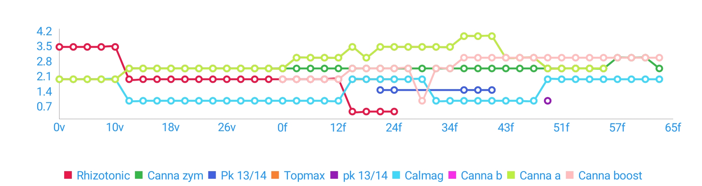

### Input/runoff pH

 - **Minimum input pH:** 5.4
 - **Maximum input pH:** 5.8
 - **Average input pH:** 5.57

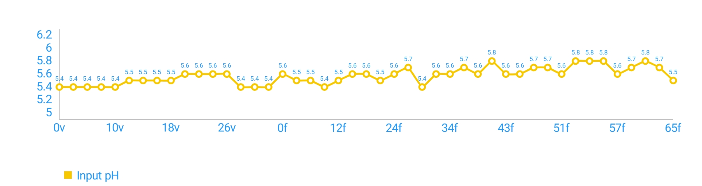

### EC

 - **Minimum input EC**: 0.25mS/cm
 - **Maximum input EC**: 1.7mS/cm
 - **Average input EC**: 1.28mS/cm

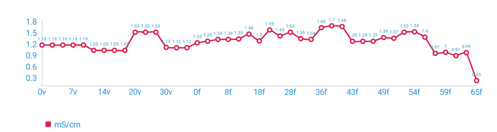

### Temperature (°C)

 - **Minimum input temperature**: -°C
 - **Maximum input temperature**: -°C
 - **Average input temperature**: 0°C


## Actions

| Date | Stage | Action | Details | Notes |
| ---- | ----- | ------ | ------- | ----- |
| 2019-36-17 15:36 | 152/29c | StageChange | Changed to Harvested |  |
| 2019-29-19 14:29 | 123/6d | StageChange | Changed to Curing |  |
| 2019-57-19 11:57 | 123/5d | Note |   | 255g |
| 2019-09-13 13:09 | 117/70f | StageChange | Changed to Drying |  |
| 2019-28-08 18:28 | 112/65f | Water | **pH:** 5.5 **EC:** 0.25mS/cm  |  |
| 2019-14-06 18:14 | 110/63f | Water | **pH:** 5.7 **amount:** 15l **EC:** 0.99mS/cm  / **Calmag:** 2ml/l -- **Canna zym:** 2.5ml/l -- **Canna boost:** 3ml/l |  |
| 2019-13-04 19:13 | 108/61f | Water | **pH:** 5.8 **amount:** 10l **EC:** 0.91mS/cm  / **Calmag:** 2ml/l -- **Canna zym:** 3ml/l -- **Canna boost:** 3ml/l |  |
| 2019-25-02 20:25 | 106/59f | Water | **pH:** 5.7 **amount:** 15l **EC:** 1mS/cm  / **Calmag:** 2ml/l -- **Canna zym:** 3ml/l -- **Canna boost:** 3ml/l |  |
| 2019-22-31 18:22 | 104/57f | Water | **pH:** 5.6 **amount:** 15l **EC:** 0.97mS/cm  / **Calmag:** 2ml/l -- **Canna zym:** 3ml/l -- **Canna boost:** 3ml/l |  |
| 2019-11-29 18:11 | 102/55f | Water | **pH:** 5.8 **EC:** 1.4mS/cm  / **Canna a:** 2.5ml/l -- **Canna b:** 2.5ml/l -- **Calmag:** 2ml/l -- **Canna zym:** 2.5ml/l -- **Canna boost:** 3ml/l |  |
| 2019-14-28 19:14 | 101/54f | Water | **pH:** 5.8 **EC:** 1.54mS/cm  / **Canna a:** 2.5ml/l -- **Canna b:** 2.5ml/l -- **Calmag:** 2ml/l -- **Canna zym:** 2.5ml/l -- **Canna boost:** 3ml/l |  |
| 2019-29-26 21:29 | 100/53f | Water | **pH:** 5.8 **EC:** 1.53mS/cm  / **Canna a:** 2.5ml/l -- **Canna b:** 2.5ml/l -- **Calmag:** 2ml/l -- **Canna zym:** 2.5ml/l -- **Canna boost:** 3ml/l |  |
| 2019-44-25 18:44 | 98/51f | Water | **pH:** 5.6 **EC:** 1.37mS/cm  / **Canna a:** 2.5ml/l -- **Canna b:** 2.5ml/l -- **Calmag:** 2ml/l -- **Canna zym:** 2.5ml/l -- **Canna boost:** 3ml/l |  |
| 2019-59-23 17:59 | 96/49f | Water | **pH:** 5.7 **amount:** 10l **EC:** 1.39mS/cm  / **Canna a:** 2.5ml/l -- **Canna b:** 2.5ml/l -- **Calmag:** 2ml/l -- **Canna zym:** 2.5ml/l -- **Canna boost:** 3ml/l -- **pk 13/14:** 1ml/l |  |
| 2019-57-21 19:57 | 94/47f | Water | **pH:** 5.7 **amount:** 6l **EC:** 1.29mS/cm  / **Canna a:** 3ml/l -- **Canna b:** 3ml/l -- **Calmag:** 1ml/l -- **Canna zym:** 2.5ml/l -- **Canna boost:** 3ml/l |  |
| 2019-45-19 20:45 | 92/46f | Water | **pH:** 5.6 **amount:** 10l **EC:** 1.29mS/cm  / **Canna a:** 3ml/l -- **Canna b:** 3ml/l -- **Calmag:** 1ml/l -- **Canna zym:** 2.5ml/l -- **Canna boost:** 3ml/l |  |
| 2019-00-17 19:00 | 90/43f | Water | **pH:** 5.6 **amount:** 10l **EC:** 1.29mS/cm  / **Canna a:** 3ml/l -- **Canna b:** 3ml/l -- **Calmag:** 1ml/l -- **Canna zym:** 2.5ml/l -- **Canna boost:** 3ml/l |  |
| 2019-01-14 20:01 | 87/40f | Water | **pH:** 5.8 **amount:** 10l **EC:** 1.68mS/cm  / **Canna a:** 4ml/l -- **Canna b:** 4ml/l -- **Calmag:** 1ml/l -- **Canna zym:** 2.5ml/l -- **Canna boost:** 3ml/l -- **Pk 13/14:** 1.5ml/l |  |
| 2019-21-12 21:21 | 86/39f | Water | **pH:** 5.6 **amount:** 15l **EC:** 1.7mS/cm  / **Canna a:** 4ml/l -- **Canna b:** 4ml/l -- **Calmag:** 1ml/l -- **Canna zym:** 2.5ml/l -- **Canna boost:** 3ml/l -- **Pk 13/14:** 1.5ml/l |  |
| 2019-45-10 18:45 | 83/36f | Water | **pH:** 5.7 **amount:** 10l **EC:** 1.65mS/cm  / **Canna a:** 4ml/l -- **Canna b:** 4ml/l -- **Calmag:** 1ml/l -- **Canna zym:** 2.5ml/l -- **Canna boost:** 3ml/l -- **Pk 13/14:** 1.5ml/l |  |
| 2019-57-10 07:57 | 83/36f | Note |   | Showing signs of revegging |
| 2019-22-08 18:22 | 81/34f | Water | **pH:** 5.6  / **Canna a:** 3.5ml/l -- **Canna b:** 3.5ml/l -- **Calmag:** 1ml/l -- **Canna zym:** 2.5ml/l -- **Canna boost:** 2.5ml/l |  |
| 2019-55-06 19:55 | 79/32f | Water | **pH:** 5.6 **EC:** 1.34mS/cm  / **Canna a:** 3.5ml/l -- **Canna b:** 3.5ml/l -- **Calmag:** 1ml/l -- **Canna zym:** 2.5ml/l -- **Canna boost:** 2.5ml/l |  |
| 2019-05-04 17:05 | 77/30f | Water | **pH:** 5.4 **amount:** 15l **EC:** 1.36mS/cm  / **Canna a:** 3.5ml/l -- **Canna b:** 3.5ml/l -- **Calmag:** 2ml/l -- **Canna zym:** 2.5ml/l -- **Canna boost:** 1ml/l |  |
| 2019-38-02 18:38 | 75/28f | Water | **pH:** 5.7 **amount:** 10l **EC:** 1.53mS/cm  / **Canna a:** 3.5ml/l -- **Canna b:** 3.5ml/l -- **Calmag:** 2ml/l -- **Canna zym:** 2.5ml/l -- **Canna boost:** 2.5ml/l |  |
| 2019-42-28 16:42 | 71/24f | Water | **pH:** 5.6 **EC:** 1.43mS/cm  / **Canna a:** 3.5ml/l -- **Canna b:** 3.5ml/l -- **Rhizotonic:** 0.5ml/l -- **Calmag:** 2ml/l -- **Canna zym:** 2.5ml/l -- **Canna boost:** 2.5ml/l -- **Topmax:** 2ml/l -- **Pk 13/14:** 1.5ml/l |  |
| 2019-35-25 20:35 | 68/21f | Water | **pH:** 5.5 **amount:** 15l **EC:** 1.59mS/cm  / **Canna a:** 3.5ml/l -- **Canna b:** 3.5ml/l -- **Rhizotonic:** 0.5ml/l -- **Calmag:** 2ml/l -- **Canna zym:** 2.5ml/l -- **Canna boost:** 2.5ml/l -- **Topmax:** 2ml/l -- **Pk 13/14:** 1.5ml/l |  |
| 2019-47-22 17:47 | 65/18f | Water | **pH:** 5.6 **amount:** 15l **EC:** 1.3mS/cm  / **Canna a:** 3ml/l -- **Canna b:** 3ml/l -- **Rhizotonic:** 0.5ml/l -- **Calmag:** 2ml/l -- **Canna zym:** 2.5ml/l -- **Canna boost:** 2.5ml/l -- **Topmax:** 2ml/l |  |
| 2019-18-20 17:18 | 63/16f | Water | **pH:** 5.6 **EC:** 1.48mS/cm  / **Canna a:** 3.5ml/l -- **Canna b:** 3.5ml/l -- **Rhizotonic:** 0.5ml/l -- **Calmag:** 2ml/l -- **Canna zym:** 2.5ml/l -- **Canna boost:** 2.5ml/l -- **Topmax:** 2ml/l |  |
| 2019-06-16 17:06 | 59/12f | Water | **pH:** 5.5 **EC:** 1.35mS/cm  / **Canna a:** 3ml/l -- **Canna b:** 3ml/l -- **Rhizotonic:** 2ml/l -- **Calmag:** 1ml/l -- **Canna zym:** 2.5ml/l -- **Canna boost:** 2ml/l |  |
| 2019-42-12 18:42 | 55/8f | Water | **pH:** 5.4 **amount:** 15l **EC:** 1.34mS/cm  / **Canna a:** 3ml/l -- **Canna b:** 3ml/l -- **Rhizotonic:** 2ml/l -- **Calmag:** 1ml/l -- **Canna zym:** 2.5ml/l -- **Canna boost:** 2ml/l |  |
| 2019-38-10 17:38 | 53/6f | Water | **pH:** 5.5 **EC:** 1.34mS/cm  / **Canna a:** 3ml/l -- **Canna b:** 3ml/l -- **Rhizotonic:** 2ml/l -- **Calmag:** 1ml/l -- **Canna zym:** 2.5ml/l -- **Canna boost:** 2ml/l |  |
| 2019-26-06 17:26 | 49/2f | Water | **pH:** 5.5 **EC:** 1.29mS/cm  / **Canna a:** 3ml/l -- **Canna b:** 3ml/l -- **Rhizotonic:** 2ml/l -- **Calmag:** 1ml/l -- **Canna zym:** 2.5ml/l -- **Canna boost:** 2ml/l |  |
| 2019-41-03 20:41 | 46/1f | Water | **pH:** 5.6 **EC:** 1.25mS/cm  / **Canna a:** 2.5ml/l -- **Canna b:** 2.5ml/l -- **Rhizotonic:** 2ml/l -- **Calmag:** 1ml/l -- **Canna zym:** 2.5ml/l -- **Canna boost:** 2ml/l |  |
| 2019-41-03 20:41 | 46/37v | StageChange | Changed to Flowering |  |
| 2019-47-02 17:47 | 45/36v | Action | Transplanted |  |
| 2019-04-01 19:04 | 44/35v | Water | **pH:** 5.4 **EC:** 1.12mS/cm  / **Canna a:** 2.5ml/l -- **Canna b:** 2.5ml/l -- **Rhizotonic:** 2ml/l -- **Calmag:** 1ml/l -- **Canna zym:** 2.5ml/l |  |
| 2019-48-30 16:48 | 42/33v | Water | **pH:** 5.4 **EC:** 1.12mS/cm  / **Canna a:** 2.5ml/l -- **Canna b:** 2.5ml/l -- **Rhizotonic:** 2ml/l -- **Calmag:** 1ml/l -- **Canna zym:** 2.5ml/l |  |
| 2019-41-27 16:41 | 39/30v | Water | **pH:** 5.4 **EC:** 1.13mS/cm  / **Canna a:** 2.5ml/l -- **Canna b:** 2.5ml/l -- **Rhizotonic:** 2ml/l -- **Calmag:** 1ml/l -- **Canna zym:** 2.5ml/l |  |
| 2019-05-23 19:05 | 35/26v | Water | **pH:** 5.6  / **Canna a:** 2.5ml/l -- **Canna b:** 2.5ml/l -- **Rhizotonic:** 2ml/l -- **Calmag:** 1ml/l -- **Canna zym:** 2.5ml/l |  |
| 2019-13-23 18:13 | 35/26v | Action | Trim |  |
| 2019-42-21 18:42 | 33/24v | Water | **pH:** 5.6 **EC:** 1.53mS/cm  / **Canna a:** 2.5ml/l -- **Canna b:** 2.5ml/l -- **Rhizotonic:** 2ml/l -- **Calmag:** 1ml/l -- **Canna zym:** 2.5ml/l |  |
| 2019-07-19 18:07 | 31/22v | Water | **pH:** 5.6 **EC:** 1.53mS/cm  / **Canna a:** 2.5ml/l -- **Canna b:** 2.5ml/l -- **Rhizotonic:** 2ml/l -- **Calmag:** 1ml/l -- **Canna zym:** 2.5ml/l |  |
| 2019-05-17 20:05 | 29/20v | Water | **pH:** 5.6 **EC:** 1.53mS/cm  / **Canna a:** 2.5ml/l -- **Canna b:** 2.5ml/l -- **Rhizotonic:** 2ml/l -- **Calmag:** 1ml/l -- **Canna zym:** 2.5ml/l |  |
| 2019-31-15 18:31 | 27/18v | Water | **pH:** 5.5 **EC:** 1.05mS/cm  / **Canna a:** 2.5ml/l -- **Canna b:** 2.5ml/l -- **Rhizotonic:** 2ml/l -- **Calmag:** 1ml/l -- **Canna zym:** 2.5ml/l |  |
| 2019-33-13 17:33 | 25/16v | Water | **pH:** 5.5 **EC:** 1.05mS/cm  / **Canna a:** 2.5ml/l -- **Canna b:** 2.5ml/l -- **Rhizotonic:** 2ml/l -- **Calmag:** 1ml/l -- **Canna zym:** 2.5ml/l |  |
| 2019-32-11 17:32 | 23/14v | Water | **pH:** 5.5 **EC:** 1.05mS/cm  / **Canna a:** 2.5ml/l -- **Canna b:** 2.5ml/l -- **Rhizotonic:** 2ml/l -- **Calmag:** 1ml/l -- **Canna zym:** 2.5ml/l |  |
| 2019-39-09 20:39 | 21/12v | Water | **pH:** 5.5 **EC:** 1.05mS/cm  / **Canna a:** 2.5ml/l -- **Canna b:** 2.5ml/l -- **Rhizotonic:** 2ml/l -- **Calmag:** 1ml/l -- **Canna zym:** 2.5ml/l |  |
| 2019-45-07 17:45 | 19/10v | Water | **pH:** 5.4 **EC:** 1.19mS/cm  / **Canna a:** 2ml/l -- **Canna b:** 2ml/l -- **Rhizotonic:** 3.5ml/l -- **Calmag:** 2ml/l |  |
| 2019-43-04 19:43 | 16/7v | Water | **pH:** 5.4 **EC:** 1.19mS/cm  / **Canna a:** 2ml/l -- **Canna b:** 2ml/l -- **Rhizotonic:** 3.5ml/l -- **Calmag:** 2ml/l |  |
| 2019-00-02 19:00 | 14/5v | Water | **pH:** 5.4 **EC:** 1.19mS/cm  / **Canna a:** 2ml/l -- **Canna b:** 2ml/l -- **Rhizotonic:** 3.5ml/l -- **Calmag:** 2ml/l |  |
| 2019-00-28 19:00 | 10/1v | Water | **pH:** 5.4 **EC:** 1.19mS/cm  / **Canna a:** 2ml/l -- **Canna b:** 2ml/l -- **Rhizotonic:** 3.5ml/l -- **Calmag:** 2ml/l |  |
| 2019-37-27 11:37 | 9/1v | Water | **pH:** 5.4 **EC:** 1.19mS/cm  / **Canna a:** 2ml/l -- **Canna b:** 2ml/l -- **Rhizotonic:** 3.5ml/l -- **Calmag:** 2ml/l |  |
| 2019-36-27 11:36 | 9/4g | StageChange | Changed to Vegetation |  |
| 2019-36-27 11:36 | 9/4g | Action | Transplanted |  |
| 2019-25-22 17:25 | 4/4p | StageChange | Changed to Germination |  |
| 2019-03-17 21:03 |   | StageChange | Changed to Planted |  |

## Images

[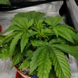](images/19-05-2019/1558285633177.jpg)
[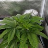](images/21-05-2019/1558460511998.jpg)
[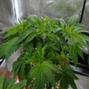](images/23-05-2019/1558631578298.jpg)
[](images/27-05-2019/1558971658724.jpg)
[](images/30-05-2019/1559231830623.jpg)
[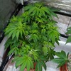](images/01-06-2019/1559412161054.jpg)
[](images/03-06-2019/1559591385920.jpg)
[](images/06-06-2019/1559838955201.jpg)
[](images/12-06-2019/1560362644144.jpg)
[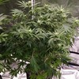](images/25-06-2019/1561489575793.jpg)
[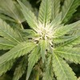](images/25-06-2019/1561489582544.jpg)
[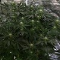](images/29-06-2019/1561821510977.jpg)
[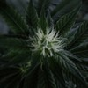](images/29-06-2019/1561821519675.jpg)
[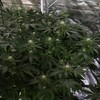](images/30-06-2019/1561910886835.jpg)
[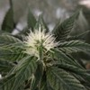](images/30-06-2019/1561910891449.jpg)
[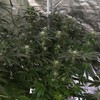](images/02-07-2019/1562090227055.jpg)
[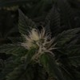](images/02-07-2019/1562090231829.jpg)
[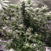](images/06-07-2019/1562439059356.jpg)
[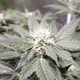](images/06-07-2019/1562439064329.jpg)
[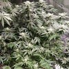](images/09-07-2019/1562695440427.jpg)
[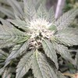](images/09-07-2019/1562695488028.jpg)
[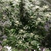](images/10-07-2019/1562781807560.jpg)
[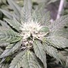](images/10-07-2019/1562781812195.jpg)
[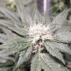](images/12-07-2019/1562963678213.jpg)
[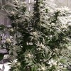](images/14-07-2019/1563131139961.jpg)
[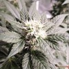](images/14-07-2019/1563131144240.jpg)
[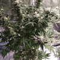](images/17-07-2019/1563386329770.jpg)
[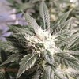](images/17-07-2019/1563386334145.jpg)
[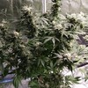](images/19-07-2019/1563566330553.jpg)
[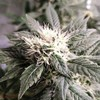](images/19-07-2019/1563566448375.jpg)
[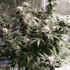](images/23-07-2019/1563903758771.jpg)
[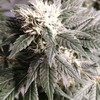](images/23-07-2019/1563903763304.jpg)
[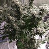](images/25-07-2019/1564077734211.jpg)
[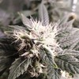](images/25-07-2019/1564077738793.jpg)
[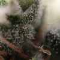](images/25-07-2019/1564077850499.jpg)
[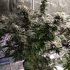](images/28-07-2019/1564338376251.jpg)
[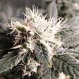](images/28-07-2019/1564338380633.jpg)
[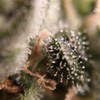](images/28-07-2019/1564338444201.jpg)
[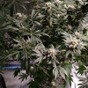](images/04-08-2019/1564943133215.jpg)
[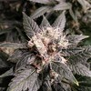](images/04-08-2019/1564943152764.jpg)
[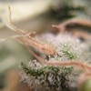](images/04-08-2019/1564943224254.jpg)
[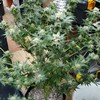](images/13-08-2019/1565720304003.jpg)
[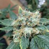](images/13-08-2019/1565720311339.jpg)
[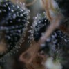](images/13-08-2019/1565720320248.jpg)
[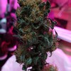](images/19-08-2019/1566209980121.jpg)
[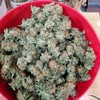](images/19-08-2019/1566212249543.jpg)

## Raw plant data

```
{"id":"64d15daa-cd6c-4070-86db-e93ac4897ad1","name":"purple bud","strain":"white label","plantDate":1555531430024,"clone":false,"medium":"SOIL","mediumDetails":"","images":["/storage/emulated/0/DCIM/GrowTracker/64d15daa-cd6c-4070-86db-e93ac4897ad1/1558285633177.jpg","/storage/emulated/0/DCIM/GrowTracker/64d15daa-cd6c-4070-86db-e93ac4897ad1/1558460511998.jpg","/storage/emulated/0/DCIM/GrowTracker/64d15daa-cd6c-4070-86db-e93ac4897ad1/1558631578298.jpg","/storage/emulated/0/DCIM/GrowTracker/64d15daa-cd6c-4070-86db-e93ac4897ad1/1558971658724.jpg","/storage/emulated/0/DCIM/GrowTracker/64d15daa-cd6c-4070-86db-e93ac4897ad1/1559231830623.jpg","/storage/emulated/0/DCIM/GrowTracker/64d15daa-cd6c-4070-86db-e93ac4897ad1/1559412161054.jpg","/storage/emulated/0/DCIM/GrowTracker/64d15daa-cd6c-4070-86db-e93ac4897ad1/1559591385920.jpg","/storage/emulated/0/DCIM/GrowTracker/64d15daa-cd6c-4070-86db-e93ac4897ad1/1559838955201.jpg","/storage/emulated/0/DCIM/GrowTracker/64d15daa-cd6c-4070-86db-e93ac4897ad1/1560362644144.jpg","/storage/emulated/0/DCIM/GrowTracker/64d15daa-cd6c-4070-86db-e93ac4897ad1/1561489575793.jpg","/storage/emulated/0/DCIM/GrowTracker/64d15daa-cd6c-4070-86db-e93ac4897ad1/1561489582544.jpg","/storage/emulated/0/DCIM/GrowTracker/64d15daa-cd6c-4070-86db-e93ac4897ad1/1561821510977.jpg","/storage/emulated/0/DCIM/GrowTracker/64d15daa-cd6c-4070-86db-e93ac4897ad1/1561821519675.jpg","/storage/emulated/0/DCIM/GrowTracker/64d15daa-cd6c-4070-86db-e93ac4897ad1/1561910886835.jpg","/storage/emulated/0/DCIM/GrowTracker/64d15daa-cd6c-4070-86db-e93ac4897ad1/1561910891449.jpg","/storage/emulated/0/DCIM/GrowTracker/64d15daa-cd6c-4070-86db-e93ac4897ad1/1562090227055.jpg","/storage/emulated/0/DCIM/GrowTracker/64d15daa-cd6c-4070-86db-e93ac4897ad1/1562090231829.jpg","/storage/emulated/0/DCIM/GrowTracker/64d15daa-cd6c-4070-86db-e93ac4897ad1/1562439059356.jpg","/storage/emulated/0/DCIM/GrowTracker/64d15daa-cd6c-4070-86db-e93ac4897ad1/1562439064329.jpg","/storage/emulated/0/DCIM/GrowTracker/64d15daa-cd6c-4070-86db-e93ac4897ad1/1562695440427.jpg","/storage/emulated/0/DCIM/GrowTracker/64d15daa-cd6c-4070-86db-e93ac4897ad1/1562695488028.jpg","/storage/emulated/0/DCIM/GrowTracker/64d15daa-cd6c-4070-86db-e93ac4897ad1/1562781807560.jpg","/storage/emulated/0/DCIM/GrowTracker/64d15daa-cd6c-4070-86db-e93ac4897ad1/1562781812195.jpg","/storage/emulated/0/DCIM/GrowTracker/64d15daa-cd6c-4070-86db-e93ac4897ad1/1562963678213.jpg","/storage/emulated/0/DCIM/GrowTracker/64d15daa-cd6c-4070-86db-e93ac4897ad1/1563131139961.jpg","/storage/emulated/0/DCIM/GrowTracker/64d15daa-cd6c-4070-86db-e93ac4897ad1/1563131144240.jpg","/storage/emulated/0/DCIM/GrowTracker/64d15daa-cd6c-4070-86db-e93ac4897ad1/1563386329770.jpg","/storage/emulated/0/DCIM/GrowTracker/64d15daa-cd6c-4070-86db-e93ac4897ad1/1563386334145.jpg","/storage/emulated/0/DCIM/GrowTracker/64d15daa-cd6c-4070-86db-e93ac4897ad1/1563566330553.jpg","/storage/emulated/0/DCIM/GrowTracker/64d15daa-cd6c-4070-86db-e93ac4897ad1/1563566448375.jpg","/storage/emulated/0/DCIM/GrowTracker/64d15daa-cd6c-4070-86db-e93ac4897ad1/1563903758771.jpg","/storage/emulated/0/DCIM/GrowTracker/64d15daa-cd6c-4070-86db-e93ac4897ad1/1563903763304.jpg","/storage/emulated/0/DCIM/GrowTracker/64d15daa-cd6c-4070-86db-e93ac4897ad1/1564077734211.jpg","/storage/emulated/0/DCIM/GrowTracker/64d15daa-cd6c-4070-86db-e93ac4897ad1/1564077738793.jpg","/storage/emulated/0/DCIM/GrowTracker/64d15daa-cd6c-4070-86db-e93ac4897ad1/1564077850499.jpg","/storage/emulated/0/DCIM/GrowTracker/64d15daa-cd6c-4070-86db-e93ac4897ad1/1564338376251.jpg","/storage/emulated/0/DCIM/GrowTracker/64d15daa-cd6c-4070-86db-e93ac4897ad1/1564338380633.jpg","/storage/emulated/0/DCIM/GrowTracker/64d15daa-cd6c-4070-86db-e93ac4897ad1/1564338444201.jpg","/storage/emulated/0/DCIM/GrowTracker/64d15daa-cd6c-4070-86db-e93ac4897ad1/1564943133215.jpg","/storage/emulated/0/DCIM/GrowTracker/64d15daa-cd6c-4070-86db-e93ac4897ad1/1564943152764.jpg","/storage/emulated/0/DCIM/GrowTracker/64d15daa-cd6c-4070-86db-e93ac4897ad1/1564943224254.jpg","/storage/emulated/0/DCIM/GrowTracker/64d15daa-cd6c-4070-86db-e93ac4897ad1/1565720304003.jpg","/storage/emulated/0/DCIM/GrowTracker/64d15daa-cd6c-4070-86db-e93ac4897ad1/1565720311339.jpg","/storage/emulated/0/DCIM/GrowTracker/64d15daa-cd6c-4070-86db-e93ac4897ad1/1565720320248.jpg","/storage/emulated/0/DCIM/GrowTracker/64d15daa-cd6c-4070-86db-e93ac4897ad1/1566209980121.jpg","/storage/emulated/0/DCIM/GrowTracker/64d15daa-cd6c-4070-86db-e93ac4897ad1/1566212249543.jpg"],"actions":[{"newStage":"PLANTED","date":1555531430024,"type":"StageChange"},{"newStage":"GERMINATION","date":1555950356952,"type":"StageChange"},{"action":"TRANSPLANTED","date":1556361393653,"type":"Action"},{"newStage":"VEGETATION","date":1556361399963,"type":"StageChange"},{"tds":{"amount":1.19,"type":"EC"},"ph":5.4,"additives":[{"amount":2.0,"description":"Canna a"},{"amount":2.0,"description":"Canna b"},{"amount":3.5,"description":"Rhizotonic"},{"amount":2.0,"description":"Calmag"}],"date":1556361437857,"type":"Water"},{"tds":{"amount":1.19,"type":"EC"},"ph":5.4,"additives":[{"amount":2.0,"description":"Canna a"},{"amount":2.0,"description":"Canna b"},{"amount":3.5,"description":"Rhizotonic"},{"amount":2.0,"description":"Calmag"}],"date":1556474426689,"type":"Water"},{"tds":{"amount":1.19,"type":"EC"},"ph":5.4,"additives":[{"amount":2.0,"description":"Canna a"},{"amount":2.0,"description":"Canna b"},{"amount":3.5,"description":"Rhizotonic"},{"amount":2.0,"description":"Calmag"}],"date":1556820026821,"type":"Water"},{"tds":{"amount":1.19,"type":"EC"},"ph":5.4,"additives":[{"amount":2.0,"description":"Canna a"},{"amount":2.0,"description":"Canna b"},{"amount":3.5,"description":"Rhizotonic"},{"amount":2.0,"description":"Calmag"}],"date":1556995401934,"type":"Water"},{"tds":{"amount":1.19,"type":"EC"},"ph":5.4,"additives":[{"amount":2.0,"description":"Canna a"},{"amount":2.0,"description":"Canna b"},{"amount":3.5,"description":"Rhizotonic"},{"amount":2.0,"description":"Calmag"}],"date":1557247531011,"type":"Water"},{"tds":{"amount":1.05,"type":"EC"},"ph":5.5,"additives":[{"amount":2.5,"description":"Canna a"},{"amount":2.5,"description":"Canna b"},{"amount":2.0,"description":"Rhizotonic"},{"amount":1.0,"description":"Calmag"},{"amount":2.5,"description":"Canna zym"}],"date":1557430750670,"type":"Water"},{"tds":{"amount":1.05,"type":"EC"},"ph":5.5,"additives":[{"amount":2.5,"description":"Canna a"},{"amount":2.5,"description":"Canna b"},{"amount":2.0,"description":"Rhizotonic"},{"amount":1.0,"description":"Calmag"},{"amount":2.5,"description":"Canna zym"}],"date":1557592358287,"type":"Water"},{"tds":{"amount":1.05,"type":"EC"},"ph":5.5,"additives":[{"amount":2.5,"description":"Canna a"},{"amount":2.5,"description":"Canna b"},{"amount":2.0,"description":"Rhizotonic"},{"amount":1.0,"description":"Calmag"},{"amount":2.5,"description":"Canna zym"}],"date":1557765207909,"type":"Water"},{"tds":{"amount":1.05,"type":"EC"},"ph":5.5,"additives":[{"amount":2.5,"description":"Canna a"},{"amount":2.5,"description":"Canna b"},{"amount":2.0,"description":"Rhizotonic"},{"amount":1.0,"description":"Calmag"},{"amount":2.5,"description":"Canna zym"}],"date":1557941498450,"type":"Water"},{"tds":{"amount":1.53,"type":"EC"},"ph":5.6,"additives":[{"amount":2.5,"description":"Canna a"},{"amount":2.5,"description":"Canna b"},{"amount":2.0,"description":"Rhizotonic"},{"amount":1.0,"description":"Calmag"},{"amount":2.5,"description":"Canna zym"}],"date":1558119949610,"type":"Water"},{"tds":{"amount":1.53,"type":"EC"},"ph":5.6,"additives":[{"amount":2.5,"description":"Canna a"},{"amount":2.5,"description":"Canna b"},{"amount":2.0,"description":"Rhizotonic"},{"amount":1.0,"description":"Calmag"},{"amount":2.5,"description":"Canna zym"}],"date":1558285630742,"type":"Water"},{"tds":{"amount":1.53,"type":"EC"},"ph":5.6,"additives":[{"amount":2.5,"description":"Canna a"},{"amount":2.5,"description":"Canna b"},{"amount":2.0,"description":"Rhizotonic"},{"amount":1.0,"description":"Calmag"},{"amount":2.5,"description":"Canna zym"}],"date":1558460546026,"type":"Water"},{"action":"TRIM","date":1558631614842,"type":"Action"},{"ph":5.6,"additives":[{"amount":2.5,"description":"Canna a"},{"amount":2.5,"description":"Canna b"},{"amount":2.0,"description":"Rhizotonic"},{"amount":1.0,"description":"Calmag"},{"amount":2.5,"description":"Canna zym"}],"date":1558634713563,"type":"Water"},{"tds":{"amount":1.13,"type":"EC"},"ph":5.4,"additives":[{"amount":2.5,"description":"Canna a"},{"amount":2.5,"description":"Canna b"},{"amount":2.0,"description":"Rhizotonic"},{"amount":1.0,"description":"Calmag"},{"amount":2.5,"description":"Canna zym"}],"date":1558971702232,"type":"Water"},{"tds":{"amount":1.12,"type":"EC"},"ph":5.4,"additives":[{"amount":2.5,"description":"Canna a"},{"amount":2.5,"description":"Canna b"},{"amount":2.0,"description":"Rhizotonic"},{"amount":1.0,"description":"Calmag"},{"amount":2.5,"description":"Canna zym"}],"date":1559231318127,"type":"Water"},{"tds":{"amount":1.12,"type":"EC"},"ph":5.4,"additives":[{"amount":2.5,"description":"Canna a"},{"amount":2.5,"description":"Canna b"},{"amount":2.0,"description":"Rhizotonic"},{"amount":1.0,"description":"Calmag"},{"amount":2.5,"description":"Canna zym"}],"date":1559412281569,"type":"Water"},{"action":"TRANSPLANTED","date":1559494061913,"type":"Action"},{"newStage":"FLOWER","date":1559590869136,"type":"StageChange"},{"tds":{"amount":1.25,"type":"EC"},"ph":5.6,"additives":[{"amount":2.5,"description":"Canna a"},{"amount":2.5,"description":"Canna b"},{"amount":2.0,"description":"Rhizotonic"},{"amount":1.0,"description":"Calmag"},{"amount":2.5,"description":"Canna zym"},{"amount":2.0,"description":"Canna boost"}],"date":1559590889334,"type":"Water"},{"tds":{"amount":1.29,"type":"EC"},"ph":5.5,"additives":[{"amount":3.0,"description":"Canna a"},{"amount":3.0,"description":"Canna b"},{"amount":2.0,"description":"Rhizotonic"},{"amount":1.0,"description":"Calmag"},{"amount":2.5,"description":"Canna zym"},{"amount":2.0,"description":"Canna boost"}],"date":1559838374436,"type":"Water"},{"tds":{"amount":1.34,"type":"EC"},"ph":5.5,"additives":[{"amount":3.0,"description":"Canna a"},{"amount":3.0,"description":"Canna b"},{"amount":2.0,"description":"Rhizotonic"},{"amount":1.0,"description":"Calmag"},{"amount":2.5,"description":"Canna zym"},{"amount":2.0,"description":"Canna boost"}],"date":1560184695040,"type":"Water"},{"tds":{"amount":1.34,"type":"EC"},"ph":5.4,"amount":15000.0,"additives":[{"amount":3.0,"description":"Canna a"},{"amount":3.0,"description":"Canna b"},{"amount":2.0,"description":"Rhizotonic"},{"amount":1.0,"description":"Calmag"},{"amount":2.5,"description":"Canna zym"},{"amount":2.0,"description":"Canna boost"}],"date":1560361358535,"type":"Water"},{"tds":{"amount":1.35,"type":"EC"},"ph":5.5,"additives":[{"amount":3.0,"description":"Canna a"},{"amount":3.0,"description":"Canna b"},{"amount":2.0,"description":"Rhizotonic"},{"amount":1.0,"description":"Calmag"},{"amount":2.5,"description":"Canna zym"},{"amount":2.0,"description":"Canna boost"}],"date":1560701202396,"type":"Water"},{"tds":{"amount":1.48,"type":"EC"},"ph":5.6,"additives":[{"amount":3.5,"description":"Canna a"},{"amount":3.5,"description":"Canna b"},{"amount":0.5,"description":"Rhizotonic"},{"amount":2.0,"description":"Calmag"},{"amount":2.5,"description":"Canna zym"},{"amount":2.5,"description":"Canna boost"},{"amount":2.0,"description":"Topmax"}],"date":1561047526394,"type":"Water"},{"tds":{"amount":1.3,"type":"EC"},"ph":5.6,"amount":15000.0,"additives":[{"amount":3.0,"description":"Canna a"},{"amount":3.0,"description":"Canna b"},{"amount":0.5,"description":"Rhizotonic"},{"amount":2.0,"description":"Calmag"},{"amount":2.5,"description":"Canna zym"},{"amount":2.5,"description":"Canna boost"},{"amount":2.0,"description":"Topmax"}],"date":1561222030927,"type":"Water"},{"tds":{"amount":1.59,"type":"EC"},"ph":5.5,"amount":15000.0,"additives":[{"amount":3.5,"description":"Canna a"},{"amount":3.5,"description":"Canna b"},{"amount":0.5,"description":"Rhizotonic"},{"amount":2.0,"description":"Calmag"},{"amount":2.5,"description":"Canna zym"},{"amount":2.5,"description":"Canna boost"},{"amount":2.0,"description":"Topmax"},{"amount":1.5,"description":"Pk 13/14"}],"date":1561491318831,"type":"Water"},{"tds":{"amount":1.43,"type":"EC"},"ph":5.6,"additives":[{"amount":3.5,"description":"Canna a"},{"amount":3.5,"description":"Canna b"},{"amount":0.5,"description":"Rhizotonic"},{"amount":2.0,"description":"Calmag"},{"amount":2.5,"description":"Canna zym"},{"amount":2.5,"description":"Canna boost"},{"amount":2.0,"description":"Topmax"},{"amount":1.5,"description":"Pk 13/14"}],"date":1561736572338,"type":"Water"},{"tds":{"amount":1.53,"type":"EC"},"ph":5.7,"amount":10000.0,"additives":[{"amount":3.5,"description":"Canna a"},{"amount":3.5,"description":"Canna b"},{"amount":2.0,"description":"Calmag"},{"amount":2.5,"description":"Canna zym"},{"amount":2.5,"description":"Canna boost"}],"date":1562089098876,"type":"Water"},{"tds":{"amount":1.36,"type":"EC"},"ph":5.4,"amount":15000.0,"additives":[{"amount":3.5,"description":"Canna a"},{"amount":3.5,"description":"Canna b"},{"amount":2.0,"description":"Calmag"},{"amount":2.5,"description":"Canna zym"},{"amount":1.0,"description":"Canna boost"}],"date":1562256352300,"type":"Water"},{"tds":{"amount":1.34,"type":"EC"},"ph":5.6,"additives":[{"amount":3.5,"description":"Canna a"},{"amount":3.5,"description":"Canna b"},{"amount":1.0,"description":"Calmag"},{"amount":2.5,"description":"Canna zym"},{"amount":2.5,"description":"Canna boost"}],"date":1562439308136,"type":"Water"},{"ph":5.6,"additives":[{"amount":3.5,"description":"Canna a"},{"amount":3.5,"description":"Canna b"},{"amount":1.0,"description":"Calmag"},{"amount":2.5,"description":"Canna zym"},{"amount":2.5,"description":"Canna boost"}],"date":1562606536120,"type":"Water"},{"date":1562741863031,"notes":"Showing signs of revegging","type":"Note"},{"tds":{"amount":1.65,"type":"EC"},"ph":5.7,"amount":10000.0,"additives":[{"amount":4.0,"description":"Canna a"},{"amount":4.0,"description":"Canna b"},{"amount":1.0,"description":"Calmag"},{"amount":2.5,"description":"Canna zym"},{"amount":3.0,"description":"Canna boost"},{"amount":1.5,"description":"Pk 13/14"}],"date":1562780739945,"type":"Water"},{"tds":{"amount":1.7,"type":"EC"},"ph":5.6,"amount":15000.0,"additives":[{"amount":4.0,"description":"Canna a"},{"amount":4.0,"description":"Canna b"},{"amount":1.0,"description":"Calmag"},{"amount":2.5,"description":"Canna zym"},{"amount":3.0,"description":"Canna boost"},{"amount":1.5,"description":"Pk 13/14"}],"date":1562962889973,"type":"Water"},{"tds":{"amount":1.68,"type":"EC"},"ph":5.8,"amount":10000.0,"additives":[{"amount":4.0,"description":"Canna a"},{"amount":4.0,"description":"Canna b"},{"amount":1.0,"description":"Calmag"},{"amount":2.5,"description":"Canna zym"},{"amount":3.0,"description":"Canna boost"},{"amount":1.5,"description":"Pk 13/14"}],"date":1563130883203,"type":"Water"},{"tds":{"amount":1.29,"type":"EC"},"ph":5.6,"amount":10000.0,"additives":[{"amount":3.0,"description":"Canna a"},{"amount":3.0,"description":"Canna b"},{"amount":1.0,"description":"Calmag"},{"amount":2.5,"description":"Canna zym"},{"amount":3.0,"description":"Canna boost"}],"date":1563386409182,"type":"Water"},{"tds":{"amount":1.29,"type":"EC"},"ph":5.6,"amount":10000.0,"additives":[{"amount":3.0,"description":"Canna a"},{"amount":3.0,"description":"Canna b"},{"amount":1.0,"description":"Calmag"},{"amount":2.5,"description":"Canna zym"},{"amount":3.0,"description":"Canna boost"}],"date":1563565545097,"type":"Water"},{"tds":{"amount":1.29,"type":"EC"},"ph":5.7,"amount":6000.0,"additives":[{"amount":3.0,"description":"Canna a"},{"amount":3.0,"description":"Canna b"},{"amount":1.0,"description":"Calmag"},{"amount":2.5,"description":"Canna zym"},{"amount":3.0,"description":"Canna boost"}],"date":1563735429040,"type":"Water"},{"tds":{"amount":1.39,"type":"EC"},"ph":5.7,"amount":10000.0,"additives":[{"amount":2.5,"description":"Canna a"},{"amount":2.5,"description":"Canna b"},{"amount":2.0,"description":"Calmag"},{"amount":2.5,"description":"Canna zym"},{"amount":3.0,"description":"Canna boost"},{"amount":1.0,"description":"pk 13/14"}],"date":1563901151945,"type":"Water"},{"tds":{"amount":1.37,"type":"EC"},"ph":5.6,"additives":[{"amount":2.5,"description":"Canna a"},{"amount":2.5,"description":"Canna b"},{"amount":2.0,"description":"Calmag"},{"amount":2.5,"description":"Canna zym"},{"amount":3.0,"description":"Canna boost"}],"date":1564076682662,"type":"Water"},{"tds":{"amount":1.53,"type":"EC"},"ph":5.8,"additives":[{"amount":2.5,"description":"Canna a"},{"amount":2.5,"description":"Canna b"},{"amount":2.0,"description":"Calmag"},{"amount":2.5,"description":"Canna zym"},{"amount":3.0,"description":"Canna boost"}],"date":1564172950100,"type":"Water"},{"tds":{"amount":1.54,"type":"EC"},"ph":5.8,"additives":[{"amount":2.5,"description":"Canna a"},{"amount":2.5,"description":"Canna b"},{"amount":2.0,"description":"Calmag"},{"amount":2.5,"description":"Canna zym"},{"amount":3.0,"description":"Canna boost"}],"date":1564337682205,"type":"Water"},{"tds":{"amount":1.4,"type":"EC"},"ph":5.8,"additives":[{"amount":2.5,"description":"Canna a"},{"amount":2.5,"description":"Canna b"},{"amount":2.0,"description":"Calmag"},{"amount":2.5,"description":"Canna zym"},{"amount":3.0,"description":"Canna boost"}],"date":1564420270404,"type":"Water"},{"tds":{"amount":0.97,"type":"EC"},"ph":5.6,"amount":15000.0,"additives":[{"amount":2.0,"description":"Calmag"},{"amount":3.0,"description":"Canna zym"},{"amount":3.0,"description":"Canna boost"}],"date":1564593731933,"type":"Water"},{"tds":{"amount":1.0,"type":"EC"},"ph":5.7,"amount":15000.0,"additives":[{"amount":2.0,"description":"Calmag"},{"amount":3.0,"description":"Canna zym"},{"amount":3.0,"description":"Canna boost"}],"date":1564773923489,"type":"Water"},{"tds":{"amount":0.91,"type":"EC"},"ph":5.8,"amount":10000.0,"additives":[{"amount":2.0,"description":"Calmag"},{"amount":3.0,"description":"Canna zym"},{"amount":3.0,"description":"Canna boost"}],"date":1564942436942,"type":"Water"},{"tds":{"amount":0.99,"type":"EC"},"ph":5.7,"amount":15000.0,"additives":[{"amount":2.0,"description":"Calmag"},{"amount":2.5,"description":"Canna zym"},{"amount":3.0,"description":"Canna boost"}],"date":1565111677026,"type":"Water"},{"tds":{"amount":0.25,"type":"EC"},"ph":5.5,"additives":[],"date":1565285289124,"type":"Water"},{"newStage":"DRYING","date":1565698196554,"type":"StageChange"},{"date":1566212279280,"notes":"255g","type":"Note"},{"newStage":"CURING","date":1566221357378,"type":"StageChange"},{"newStage":"HARVESTED","date":1568730989024,"type":"StageChange"}]}
```

Generated using [Grow Tracker](https://github.com/7LPdWcaW/GrowTracker-Android)