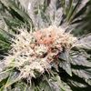

# Grow Log

## Grow details

**Name:** Red Diesel 2019

**Strain:** Barney's farm

**Planted:** 2019-04-17 21:04

**Medium:** Coco/Perlite

**Harvested:** 2019-09-17 15:36

## Stages

 - Planted

	 - **Set on:** 2019-04-17 21:04
	 - **In stage for:** 4.85 days


 - Germination

	 - **Set on:** 2019-04-22 17:25
	 - **In stage for:** 4.76 days


 - Vegetation

	 - **Set on:** 2019-04-27 11:36
	 - **In stage for:** 37.38 days


 - Flowering

	 - **Set on:** 2019-06-03 20:41
	 - **In stage for:** 70.69 days


 - Drying

	 - **Set on:** 2019-08-13 13:09
	 - **In stage for:** 6.06 days


 - Curing

	 - **Set on:** 2019-08-19 14:29
	 - **In stage for:** 29.05 days


 - Harvested

	 - **Set on:** 2019-09-17 15:36


## Stats

 - **Total grow time:** 152.77 days
 - **Total waters:** 45
 - **Average time between watering:** 2.30 days

### Nutrients used

 - Rhizotonic 
 - Canna zym 
 - Topmax 
 - pk 13/14 
 - Calmag 
 - Canna b
 - Canna a
 - Canna boost 


### Input/runoff pH

 - **Minimum input pH:** 5.4
 - **Maximum input pH:** 5.8
 - **Average input pH:** 5.58


### EC

 - **Minimum input EC:** 0.25mS/cm
 - **Maximum input EC:** 1.7mS/cm
 - **Average input EC:** 1.29mS/cm


### Temperature (°C)

 - **Minimum input temperature:** -°C
 - **Maximum input temperature:** -°C
 - **Average input temperature:** 0°C


## Actions

| Date | Stage | Action | Details | Notes |
| ---- | ----- | ------ | ------- | ----- |
| 2019-09-17 15:36 | 152/29c | StageChange | Changed to Harvested |  |
| 2019-08-19 14:29 | 123/6d | StageChange | Changed to Curing |  |
| 2019-08-19 13:45 | 123/6d | Note |   | 78g |
| 2019-08-13 13:09 | 117/70f | StageChange | Changed to Drying |  |
| 2019-08-08 18:28 | 112/65f | Water | **pH:** 5.5 **EC:** 0.25mS/cm  |  |
| 2019-08-06 18:14 | 110/63f | Water | **pH:** 5.7 **amount:** 15l **EC:** 0.99mS/cm  / **Calmag:** 2ml/l – **Canna boost:** 3ml/l**Canna zym:** 2.5ml/l |  |
| 2019-08-04 19:13 | 108/61f | Water | **pH:** 5.8 **amount:** 10l **EC:** 0.91mS/cm  / **Calmag:** 2ml/l – **Canna boost:** 3ml/l**Canna zym:** 3ml/l |  |
| 2019-08-02 20:25 | 106/59f | Water | **pH:** 5.7 **amount:** 15l **EC:** 1mS/cm  / **Calmag:** 2ml/l – **Canna boost:** 3ml/l**Canna zym:** 3ml/l |  |
| 2019-07-31 18:22 | 104/57f | Water | **pH:** 5.6 **amount:** 15l **EC:** 0.97mS/cm  / **Calmag:** 2ml/l – **Canna boost:** 3ml/l**Canna zym:** 3ml/l |  |
| 2019-07-29 18:11 | 102/55f | Water | **pH:** 5.8 **EC:** 1.4mS/cm  / **Calmag:** 2ml/l – **Canna a:** 2.5ml/l – **Canna b:** 2.5ml/l – **Canna boost:** 3ml/l**Canna zym:** 2.5ml/l |  |
| 2019-07-28 19:14 | 101/54f | Water | **pH:** 5.8 **EC:** 1.54mS/cm  / **Calmag:** 2ml/l – **Canna a:** 2.5ml/l – **Canna b:** 2.5ml/l – **Canna boost:** 3ml/l**Canna zym:** 2.5ml/l |  |
| 2019-07-26 21:29 | 100/53f | Water | **pH:** 5.8 **EC:** 1.53mS/cm  / **Calmag:** 2ml/l – **Canna a:** 2.5ml/l – **Canna b:** 2.5ml/l – **Canna boost:** 3ml/l**Canna zym:** 2.5ml/l |  |
| 2019-07-25 18:44 | 98/51f | Water | **pH:** 5.6 **EC:** 1.37mS/cm  / **Calmag:** 2ml/l – **Canna a:** 2.5ml/l – **Canna b:** 2.5ml/l – **Canna boost:** 3ml/l**Canna zym:** 2.5ml/l |  |
| 2019-07-23 17:59 | 96/49f | Water | **pH:** 5.7 **amount:** 10l **EC:** 1.39mS/cm  / **Calmag:** 2ml/l – **Canna a:** 2.5ml/l – **Canna b:** 2.5ml/l – **Canna boost:** 3ml/l – **Canna zym:** 2.5ml/l – **pk 13/14:** 1ml/l |  |
| 2019-07-21 19:57 | 94/47f | Water | **pH:** 5.7 **amount:** 6l **EC:** 1.29mS/cm  / **Calmag:** 1ml/l – **Canna a:** 3ml/l – **Canna b:** 3ml/l – **Canna boost:** 3ml/l**Canna zym:** 2.5ml/l |  |
| 2019-07-19 20:47 | 92/46f | Water | **pH:** 5.8 **amount:** 6l **EC:** 1.56mS/cm  / **Calmag:** 1ml/l – **Canna a:** 3ml/l – **Canna b:** 3ml/l – **Canna boost:** 3ml/l**Canna zym:** 2.5ml/l |  |
| 2019-07-17 19:00 | 90/43f | Water | **pH:** 5.6 **amount:** 10l **EC:** 1.29mS/cm  / **Calmag:** 1ml/l – **Canna a:** 3ml/l – **Canna b:** 3ml/l – **Canna boost:** 3ml/l**Canna zym:** 2.5ml/l |  |
| 2019-07-14 20:01 | 87/40f | Water | **pH:** 5.8 **amount:** 10l **EC:** 1.68mS/cm  / **Calmag:** 1ml/l – **Canna a:** 4ml/l – **Canna b:** 4ml/l – **Canna boost:** 3ml/l – **Canna zym:** 2.5ml/l – **Pk 13/14:** 1.5ml/l |  |
| 2019-07-12 21:21 | 86/39f | Water | **pH:** 5.6 **amount:** 15l **EC:** 1.7mS/cm  / **Calmag:** 1ml/l – **Canna a:** 4ml/l – **Canna b:** 4ml/l – **Canna boost:** 3ml/l – **Canna zym:** 2.5ml/l – **Pk 13/14:** 1.5ml/l |  |
| 2019-07-10 18:45 | 83/36f | Water | **pH:** 5.7 **amount:** 10l **EC:** 1.65mS/cm  / **Calmag:** 1ml/l – **Canna a:** 4ml/l – **Canna b:** 4ml/l – **Canna boost:** 3ml/l – **Canna zym:** 2.5ml/l – **Pk 13/14:** 1.5ml/l |  |
| 2019-07-10 07:57 | 83/36f | Note |   | Showing signs of revegging |
| 2019-07-08 18:22 | 81/34f | Water | **pH:** 5.6  / **Calmag:** 1ml/l – **Canna a:** 3.5ml/l – **Canna b:** 3.5ml/l – **Canna boost:** 2.5ml/l**Canna zym:** 2.5ml/l |  |
| 2019-07-06 19:55 | 79/32f | Water | **pH:** 5.6 **EC:** 1.34mS/cm  / **Calmag:** 1ml/l – **Canna a:** 3.5ml/l – **Canna b:** 3.5ml/l – **Canna boost:** 2.5ml/l**Canna zym:** 2.5ml/l |  |
| 2019-07-04 17:05 | 77/30f | Water | **pH:** 5.4 **amount:** 15l **EC:** 1.36mS/cm  / **Calmag:** 2ml/l – **Canna a:** 3.5ml/l – **Canna b:** 3.5ml/l – **Canna boost:** 1ml/l**Canna zym:** 2.5ml/l |  |
| 2019-07-02 18:38 | 75/28f | Water | **pH:** 5.7 **amount:** 10l **EC:** 1.53mS/cm  / **Calmag:** 2ml/l – **Canna a:** 3.5ml/l – **Canna b:** 3.5ml/l – **Canna boost:** 2.5ml/l**Canna zym:** 2.5ml/l |  |
| 2019-06-30 17:26 | 73/26f | Water | **pH:** 5.6 **amount:** 15l **EC:** 1.63mS/cm  / **Calmag:** 2ml/l – **Canna a:** 3.5ml/l – **Canna b:** 3.5ml/l – **Canna boost:** 2.5ml/l – **Canna zym:** 2.5ml/l – **Pk 13/14:** 1.5ml/l**Rhizotonic:** 0.5ml/l – **Topmax:** 2ml/l |  |
| 2019-06-28 16:42 | 71/24f | Water | **pH:** 5.6 **EC:** 1.43mS/cm  / **Calmag:** 2ml/l – **Canna a:** 3.5ml/l – **Canna b:** 3.5ml/l – **Canna boost:** 2.5ml/l – **Canna zym:** 2.5ml/l – **Pk 13/14:** 1.5ml/l**Rhizotonic:** 0.5ml/l – **Topmax:** 2ml/l |  |
| 2019-06-25 20:35 | 68/21f | Water | **pH:** 5.5 **amount:** 15l **EC:** 1.59mS/cm  / **Calmag:** 2ml/l – **Canna a:** 3.5ml/l – **Canna b:** 3.5ml/l – **Canna boost:** 2.5ml/l – **Canna zym:** 2.5ml/l – **Pk 13/14:** 1.5ml/l**Rhizotonic:** 0.5ml/l – **Topmax:** 2ml/l |  |
| 2019-06-22 17:47 | 65/18f | Water | **pH:** 5.6 **amount:** 15l **EC:** 1.3mS/cm  / **Calmag:** 2ml/l – **Canna a:** 3ml/l – **Canna b:** 3ml/l – **Canna boost:** 2.5ml/l – **Canna zym:** 2.5ml/l – **Rhizotonic:** 0.5ml/l – **Topmax:** 2ml/l |  |
| 2019-06-20 17:18 | 63/16f | Water | **pH:** 5.6 **EC:** 1.48mS/cm  / **Calmag:** 2ml/l – **Canna a:** 3.5ml/l – **Canna b:** 3.5ml/l – **Canna boost:** 2.5ml/l – **Canna zym:** 2.5ml/l – **Rhizotonic:** 0.5ml/l – **Topmax:** 2ml/l |  |
| 2019-06-16 17:06 | 59/12f | Water | **pH:** 5.5 **EC:** 1.35mS/cm  / **Calmag:** 1ml/l – **Canna a:** 3ml/l – **Canna b:** 3ml/l – **Canna boost:** 2ml/l**Canna zym:** 2.5ml/l – **Rhizotonic:** 2ml/l |  |
| 2019-06-12 18:42 | 55/8f | Water | **pH:** 5.4 **amount:** 15l **EC:** 1.34mS/cm  / **Calmag:** 1ml/l – **Canna a:** 3ml/l – **Canna b:** 3ml/l – **Canna boost:** 2ml/l**Canna zym:** 2.5ml/l – **Rhizotonic:** 2ml/l |  |
| 2019-06-10 17:38 | 53/6f | Water | **pH:** 5.5 **EC:** 1.34mS/cm  / **Calmag:** 1ml/l – **Canna a:** 3ml/l – **Canna b:** 3ml/l – **Canna boost:** 2ml/l**Canna zym:** 2.5ml/l – **Rhizotonic:** 2ml/l |  |
| 2019-06-06 17:26 | 49/2f | Water | **pH:** 5.5 **EC:** 1.29mS/cm  / **Calmag:** 1ml/l – **Canna a:** 3ml/l – **Canna b:** 3ml/l – **Canna boost:** 2ml/l**Canna zym:** 2.5ml/l – **Rhizotonic:** 2ml/l |  |
| 2019-06-03 20:41 | 46/1f | Water | **pH:** 5.6 **EC:** 1.25mS/cm  / **Calmag:** 1ml/l – **Canna a:** 2.5ml/l – **Canna b:** 2.5ml/l – **Canna boost:** 2ml/l**Canna zym:** 2.5ml/l – **Rhizotonic:** 2ml/l |  |
| 2019-06-03 20:41 | 46/37v | StageChange | Changed to Flowering |  |
| 2019-06-02 17:47 | 45/36v | Action | Transplanted |  |
| 2019-06-01 19:04 | 44/35v | Water | **pH:** 5.4 **EC:** 1.12mS/cm  / **Calmag:** 1ml/l – **Canna a:** 2.5ml/l – **Canna b:** 2.5ml/l – **Canna zym:** 2.5ml/l**Rhizotonic:** 2ml/l |  |
| 2019-05-30 16:48 | 42/33v | Water | **pH:** 5.4 **EC:** 1.12mS/cm  / **Calmag:** 1ml/l – **Canna a:** 2.5ml/l – **Canna b:** 2.5ml/l – **Canna zym:** 2.5ml/l**Rhizotonic:** 2ml/l |  |
| 2019-05-27 16:41 | 39/30v | Water | **pH:** 5.4 **EC:** 1.13mS/cm  / **Calmag:** 1ml/l – **Canna a:** 2.5ml/l – **Canna b:** 2.5ml/l – **Canna zym:** 2.5ml/l**Rhizotonic:** 2ml/l |  |
| 2019-05-23 19:05 | 35/26v | Water | **pH:** 5.6  / **Calmag:** 1ml/l – **Canna a:** 2.5ml/l – **Canna b:** 2.5ml/l – **Canna zym:** 2.5ml/l**Rhizotonic:** 2ml/l |  |
| 2019-05-23 18:13 | 35/26v | Action | Trim |  |
| 2019-05-21 18:42 | 33/24v | Water | **pH:** 5.6 **EC:** 1.53mS/cm  / **Calmag:** 1ml/l – **Canna a:** 2.5ml/l – **Canna b:** 2.5ml/l – **Canna zym:** 2.5ml/l**Rhizotonic:** 2ml/l |  |
| 2019-05-17 20:05 | 29/20v | Water | **pH:** 5.6 **EC:** 1.53mS/cm  / **Calmag:** 1ml/l – **Canna a:** 2.5ml/l – **Canna b:** 2.5ml/l – **Canna zym:** 2.5ml/l**Rhizotonic:** 2ml/l |  |
| 2019-05-15 18:31 | 27/18v | Water | **pH:** 5.5 **EC:** 1.05mS/cm  / **Calmag:** 1ml/l – **Canna a:** 2.5ml/l – **Canna b:** 2.5ml/l – **Canna zym:** 2.5ml/l**Rhizotonic:** 2ml/l |  |
| 2019-05-13 17:33 | 25/16v | Water | **pH:** 5.5 **EC:** 1.05mS/cm  / **Calmag:** 1ml/l – **Canna a:** 2.5ml/l – **Canna b:** 2.5ml/l – **Canna zym:** 2.5ml/l**Rhizotonic:** 2ml/l |  |
| 2019-05-11 17:32 | 23/14v | Water | **pH:** 5.5 **EC:** 1.05mS/cm  / **Calmag:** 1ml/l – **Canna a:** 2.5ml/l – **Canna b:** 2.5ml/l – **Canna zym:** 2.5ml/l**Rhizotonic:** 2ml/l |  |
| 2019-05-09 20:39 | 21/12v | Water | **pH:** 5.5 **EC:** 1.05mS/cm  / **Calmag:** 1ml/l – **Canna a:** 2.5ml/l – **Canna b:** 2.5ml/l – **Canna zym:** 2.5ml/l**Rhizotonic:** 2ml/l |  |
| 2019-05-07 17:45 | 19/10v | Water | **pH:** 5.4 **EC:** 1.19mS/cm  / **Calmag:** 2ml/l**Canna a:** 2ml/l – **Canna b:** 2ml/l – **Rhizotonic:** 3.5ml/l |  |
| 2019-05-04 19:43 | 16/7v | Water | **pH:** 5.4 **EC:** 1.19mS/cm  / **Calmag:** 2ml/l**Canna a:** 2ml/l – **Canna b:** 2ml/l – **Rhizotonic:** 3.5ml/l |  |
| 2019-05-02 19:00 | 14/5v | Water | **pH:** 5.4 **EC:** 1.19mS/cm  / **Calmag:** 2ml/l**Canna a:** 2ml/l – **Canna b:** 2ml/l – **Rhizotonic:** 3.5ml/l |  |
| 2019-04-28 19:00 | 10/1v | Water | **pH:** 5.4 **EC:** 1.19mS/cm  / **Calmag:** 2ml/l**Canna a:** 2ml/l – **Canna b:** 2ml/l – **Rhizotonic:** 3.5ml/l |  |
| 2019-04-27 11:37 | 9/1v | Water | **pH:** 5.4 **EC:** 1.19mS/cm  / **Calmag:** 2ml/l**Canna a:** 2ml/l – **Canna b:** 2ml/l – **Rhizotonic:** 3.5ml/l |  |
| 2019-04-27 11:36 | 9/4g | StageChange | Changed to Vegetation |  |
| 2019-04-27 11:36 | 9/4g | Action | Transplanted |  |
| 2019-04-22 17:25 | 4/4p | StageChange | Changed to Germination |  |
| 2019-04-17 21:04 |   | StageChange | Changed to Planted |  |

## Images

### 2019-05-21 33/24v

[](images/2019-05-21/1558460501746.jpg)

### 2019-05-23 35/26v

[](images/2019-05-23/1558631608621.jpg)

### 2019-05-27 39/30v

[](images/2019-05-27/1558971696495.jpg)

### 2019-05-30 42/33v

[](images/2019-05-30/1559231854180.jpg)

### 2019-06-03 46/0f

[](images/2019-06-03/1559591411258.jpg)

### 2019-06-06 49/2f

[](images/2019-06-06/1559838971822.jpg)

### 2019-06-12 55/8f 

[](images/2019-06-12/1560362655367.jpg)

### 2019-06-25 68/21f

[](images/2019-06-25/1561489641173.jpg) [](images/2019-06-25/1561489647699.jpg)

### 2019-06-29 72/25f

[](images/2019-06-29/1561821493676.jpg) [](images/2019-06-29/1561821500297.jpg)

### 2019-06-30 73/26f

[](images/2019-06-30/1561910868198.jpg) [](images/2019-06-30/1561910874934.jpg)

### 2019-07-02 75/28f

[](images/2019-07-02/1562090210902.jpg) [](images/2019-07-02/1562090215893.jpg)

### 2019-07-06 79/32f

[](images/2019-07-06/1562439733720.jpg) [](images/2019-07-06/1562439740131.jpg)

### 2019-07-10 83/36f

[](images/2019-07-10/1562781818850.jpg) [](images/2019-07-10/1562781823356.jpg)

### 2019-07-12 86/39f

[](images/2019-07-12/1562963687858.jpg) [](images/2019-07-12/1562963693076.jpg)

### 2019-07-14 87/40f

[](images/2019-07-14/1563131121576.jpg) [](images/2019-07-14/1563131126927.jpg)

### 2019-07-17 90/43f

[](images/2019-07-17/1563386313912.jpg) [](images/2019-07-17/1563386320032.jpg)

### 2019-07-19 92/46f

[](images/2019-07-19/1563566404337.jpg) [](images/2019-07-19/1563566414410.jpg)

### 2019-07-23 96/49f

[](images/2019-07-23/1563903743471.jpg) [](images/2019-07-23/1563903747908.jpg)

### 2019-07-25 98/51f

[](images/2019-07-25/1564077719295.jpg) [](images/2019-07-25/1564077723292.jpg) [](images/2019-07-25/1564077820224.jpg)

### 2019-07-28 101/54f

[](images/2019-07-28/1564338360951.jpg) [](images/2019-07-28/1564338365538.jpg) [](images/2019-07-28/1564338471433.jpg)

### 2019-08-04 108/61f

[](images/2019-08-04/1564943112574.jpg) [](images/2019-08-04/1564943122223.jpg) [](images/2019-08-04/1564943247445.jpg)

### 2019-08-13 117/70f

[](images/2019-08-13/1565698119505.jpg) [](images/2019-08-13/1565698126916.jpg) [](images/2019-08-13/1565698133149.jpg) [](images/2019-08-13/1565698158794.jpg)

### 2019-08-19 123/6d

[](images/2019-08-19/1566218108665.jpg) [](images/2019-08-19/1566218731903.jpg)

## Raw plant data

```
{"id":"02cc247e-25f9-405d-9297-849aa2443014","name":"red diesel","strain":"Barney's farm","plantDate":1555531499959,"clone":false,"medium":"SOIL","mediumDetails":"","images":["/storage/emulated/0/DCIM/GrowTracker/02cc247e-25f9-405d-9297-849aa2443014/1555963163684.jpg","/storage/emulated/0/DCIM/GrowTracker/02cc247e-25f9-405d-9297-849aa2443014/1556174803363.jpg","/storage/emulated/0/DCIM/GrowTracker/02cc247e-25f9-405d-9297-849aa2443014/1556362339372.jpg","/storage/emulated/0/DCIM/GrowTracker/02cc247e-25f9-405d-9297-849aa2443014/1556642768175.jpg","/storage/emulated/0/DCIM/GrowTracker/02cc247e-25f9-405d-9297-849aa2443014/1557247553901.jpg","/storage/emulated/0/DCIM/GrowTracker/02cc247e-25f9-405d-9297-849aa2443014/1557431385261.jpg","/storage/emulated/0/DCIM/GrowTracker/02cc247e-25f9-405d-9297-849aa2443014/1557592698534.jpg","/storage/emulated/0/DCIM/GrowTracker/02cc247e-25f9-405d-9297-849aa2443014/1557941458037.jpg","/storage/emulated/0/DCIM/GrowTracker/02cc247e-25f9-405d-9297-849aa2443014/1558460501746.jpg","/storage/emulated/0/DCIM/GrowTracker/02cc247e-25f9-405d-9297-849aa2443014/1558631608621.jpg","/storage/emulated/0/DCIM/GrowTracker/02cc247e-25f9-405d-9297-849aa2443014/1558971696495.jpg","/storage/emulated/0/DCIM/GrowTracker/02cc247e-25f9-405d-9297-849aa2443014/1559231854180.jpg","/storage/emulated/0/DCIM/GrowTracker/02cc247e-25f9-405d-9297-849aa2443014/1559591411258.jpg","/storage/emulated/0/DCIM/GrowTracker/02cc247e-25f9-405d-9297-849aa2443014/1559838971822.jpg","/storage/emulated/0/DCIM/GrowTracker/02cc247e-25f9-405d-9297-849aa2443014/1560362655367.jpg","/storage/emulated/0/DCIM/GrowTracker/02cc247e-25f9-405d-9297-849aa2443014/1561489641173.jpg","/storage/emulated/0/DCIM/GrowTracker/02cc247e-25f9-405d-9297-849aa2443014/1561489647699.jpg","/storage/emulated/0/DCIM/GrowTracker/02cc247e-25f9-405d-9297-849aa2443014/1561821493676.jpg","/storage/emulated/0/DCIM/GrowTracker/02cc247e-25f9-405d-9297-849aa2443014/1561821500297.jpg","/storage/emulated/0/DCIM/GrowTracker/02cc247e-25f9-405d-9297-849aa2443014/1561910868198.jpg","/storage/emulated/0/DCIM/GrowTracker/02cc247e-25f9-405d-9297-849aa2443014/1561910874934.jpg","/storage/emulated/0/DCIM/GrowTracker/02cc247e-25f9-405d-9297-849aa2443014/1562090210902.jpg","/storage/emulated/0/DCIM/GrowTracker/02cc247e-25f9-405d-9297-849aa2443014/1562090215893.jpg","/storage/emulated/0/DCIM/GrowTracker/02cc247e-25f9-405d-9297-849aa2443014/1562439733720.jpg","/storage/emulated/0/DCIM/GrowTracker/02cc247e-25f9-405d-9297-849aa2443014/1562439740131.jpg","/storage/emulated/0/DCIM/GrowTracker/02cc247e-25f9-405d-9297-849aa2443014/1562781818850.jpg","/storage/emulated/0/DCIM/GrowTracker/02cc247e-25f9-405d-9297-849aa2443014/1562781823356.jpg","/storage/emulated/0/DCIM/GrowTracker/02cc247e-25f9-405d-9297-849aa2443014/1562963687858.jpg","/storage/emulated/0/DCIM/GrowTracker/02cc247e-25f9-405d-9297-849aa2443014/1562963693076.jpg","/storage/emulated/0/DCIM/GrowTracker/02cc247e-25f9-405d-9297-849aa2443014/1563131121576.jpg","/storage/emulated/0/DCIM/GrowTracker/02cc247e-25f9-405d-9297-849aa2443014/1563131126927.jpg","/storage/emulated/0/DCIM/GrowTracker/02cc247e-25f9-405d-9297-849aa2443014/1563386313912.jpg","/storage/emulated/0/DCIM/GrowTracker/02cc247e-25f9-405d-9297-849aa2443014/1563386320032.jpg","/storage/emulated/0/DCIM/GrowTracker/02cc247e-25f9-405d-9297-849aa2443014/1563566404337.jpg","/storage/emulated/0/DCIM/GrowTracker/02cc247e-25f9-405d-9297-849aa2443014/1563566414410.jpg","/storage/emulated/0/DCIM/GrowTracker/02cc247e-25f9-405d-9297-849aa2443014/1563903743471.jpg","/storage/emulated/0/DCIM/GrowTracker/02cc247e-25f9-405d-9297-849aa2443014/1563903747908.jpg","/storage/emulated/0/DCIM/GrowTracker/02cc247e-25f9-405d-9297-849aa2443014/1564077719295.jpg","/storage/emulated/0/DCIM/GrowTracker/02cc247e-25f9-405d-9297-849aa2443014/1564077723292.jpg","/storage/emulated/0/DCIM/GrowTracker/02cc247e-25f9-405d-9297-849aa2443014/1564077820224.jpg","/storage/emulated/0/DCIM/GrowTracker/02cc247e-25f9-405d-9297-849aa2443014/1564338360951.jpg","/storage/emulated/0/DCIM/GrowTracker/02cc247e-25f9-405d-9297-849aa2443014/1564338365538.jpg","/storage/emulated/0/DCIM/GrowTracker/02cc247e-25f9-405d-9297-849aa2443014/1564338471433.jpg","/storage/emulated/0/DCIM/GrowTracker/02cc247e-25f9-405d-9297-849aa2443014/1564943112574.jpg","/storage/emulated/0/DCIM/GrowTracker/02cc247e-25f9-405d-9297-849aa2443014/1564943122223.jpg","/storage/emulated/0/DCIM/GrowTracker/02cc247e-25f9-405d-9297-849aa2443014/1564943247445.jpg","/storage/emulated/0/DCIM/GrowTracker/02cc247e-25f9-405d-9297-849aa2443014/1565698119505.jpg","/storage/emulated/0/DCIM/GrowTracker/02cc247e-25f9-405d-9297-849aa2443014/1565698126916.jpg","/storage/emulated/0/DCIM/GrowTracker/02cc247e-25f9-405d-9297-849aa2443014/1565698133149.jpg","/storage/emulated/0/DCIM/GrowTracker/02cc247e-25f9-405d-9297-849aa2443014/1565698158794.jpg","/storage/emulated/0/DCIM/GrowTracker/02cc247e-25f9-405d-9297-849aa2443014/1566218108665.jpg","/storage/emulated/0/DCIM/GrowTracker/02cc247e-25f9-405d-9297-849aa2443014/1566218731903.jpg"],"actions":[{"newStage":"PLANTED","date":1555531499959,"type":"StageChange"},{"newStage":"GERMINATION","date":1555950356952,"type":"StageChange"},{"action":"TRANSPLANTED","date":1556361393653,"type":"Action"},{"newStage":"VEGETATION","date":1556361417261,"type":"StageChange"},{"tds":{"amount":1.19,"type":"EC"},"ph":5.4,"additives":[{"amount":2.0,"description":"Canna a"},{"amount":2.0,"description":"Canna b"},{"amount":3.5,"description":"Rhizotonic"},{"amount":2.0,"description":"Calmag"}],"date":1556361437857,"type":"Water"},{"tds":{"amount":1.19,"type":"EC"},"ph":5.4,"additives":[{"amount":2.0,"description":"Canna a"},{"amount":2.0,"description":"Canna b"},{"amount":3.5,"description":"Rhizotonic"},{"amount":2.0,"description":"Calmag"}],"date":1556474432593,"type":"Water"},{"tds":{"amount":1.19,"type":"EC"},"ph":5.4,"additives":[{"amount":2.0,"description":"Canna a"},{"amount":2.0,"description":"Canna b"},{"amount":3.5,"description":"Rhizotonic"},{"amount":2.0,"description":"Calmag"}],"date":1556820026821,"type":"Water"},{"tds":{"amount":1.19,"type":"EC"},"ph":5.4,"additives":[{"amount":2.0,"description":"Canna a"},{"amount":2.0,"description":"Canna b"},{"amount":3.5,"description":"Rhizotonic"},{"amount":2.0,"description":"Calmag"}],"date":1556995401934,"type":"Water"},{"tds":{"amount":1.19,"type":"EC"},"ph":5.4,"additives":[{"amount":2.0,"description":"Canna a"},{"amount":2.0,"description":"Canna b"},{"amount":3.5,"description":"Rhizotonic"},{"amount":2.0,"description":"Calmag"}],"date":1557247559039,"type":"Water"},{"tds":{"amount":1.05,"type":"EC"},"ph":5.5,"additives":[{"amount":2.5,"description":"Canna a"},{"amount":2.5,"description":"Canna b"},{"amount":2.0,"description":"Rhizotonic"},{"amount":1.0,"description":"Calmag"},{"amount":2.5,"description":"Canna zym"}],"date":1557430750670,"type":"Water"},{"tds":{"amount":1.05,"type":"EC"},"ph":5.5,"additives":[{"amount":2.5,"description":"Canna a"},{"amount":2.5,"description":"Canna b"},{"amount":2.0,"description":"Rhizotonic"},{"amount":1.0,"description":"Calmag"},{"amount":2.5,"description":"Canna zym"}],"date":1557592364354,"type":"Water"},{"tds":{"amount":1.05,"type":"EC"},"ph":5.5,"additives":[{"amount":2.5,"description":"Canna a"},{"amount":2.5,"description":"Canna b"},{"amount":2.0,"description":"Rhizotonic"},{"amount":1.0,"description":"Calmag"},{"amount":2.5,"description":"Canna zym"}],"date":1557765224783,"type":"Water"},{"tds":{"amount":1.05,"type":"EC"},"ph":5.5,"additives":[{"amount":2.5,"description":"Canna a"},{"amount":2.5,"description":"Canna b"},{"amount":2.0,"description":"Rhizotonic"},{"amount":1.0,"description":"Calmag"},{"amount":2.5,"description":"Canna zym"}],"date":1557941515423,"type":"Water"},{"tds":{"amount":1.53,"type":"EC"},"ph":5.6,"additives":[{"amount":2.5,"description":"Canna a"},{"amount":2.5,"description":"Canna b"},{"amount":2.0,"description":"Rhizotonic"},{"amount":1.0,"description":"Calmag"},{"amount":2.5,"description":"Canna zym"}],"date":1558119949610,"type":"Water"},{"tds":{"amount":1.53,"type":"EC"},"ph":5.6,"additives":[{"amount":2.5,"description":"Canna a"},{"amount":2.5,"description":"Canna b"},{"amount":2.0,"description":"Rhizotonic"},{"amount":1.0,"description":"Calmag"},{"amount":2.5,"description":"Canna zym"}],"date":1558460548969,"type":"Water"},{"action":"TRIM","date":1558631614842,"type":"Action"},{"ph":5.6,"additives":[{"amount":2.5,"description":"Canna a"},{"amount":2.5,"description":"Canna b"},{"amount":2.0,"description":"Rhizotonic"},{"amount":1.0,"description":"Calmag"},{"amount":2.5,"description":"Canna zym"}],"date":1558634713563,"type":"Water"},{"tds":{"amount":1.13,"type":"EC"},"ph":5.4,"additives":[{"amount":2.5,"description":"Canna a"},{"amount":2.5,"description":"Canna b"},{"amount":2.0,"description":"Rhizotonic"},{"amount":1.0,"description":"Calmag"},{"amount":2.5,"description":"Canna zym"}],"date":1558971702232,"type":"Water"},{"tds":{"amount":1.12,"type":"EC"},"ph":5.4,"additives":[{"amount":2.5,"description":"Canna a"},{"amount":2.5,"description":"Canna b"},{"amount":2.0,"description":"Rhizotonic"},{"amount":1.0,"description":"Calmag"},{"amount":2.5,"description":"Canna zym"}],"date":1559231318127,"type":"Water"},{"tds":{"amount":1.12,"type":"EC"},"ph":5.4,"additives":[{"amount":2.5,"description":"Canna a"},{"amount":2.5,"description":"Canna b"},{"amount":2.0,"description":"Rhizotonic"},{"amount":1.0,"description":"Calmag"},{"amount":2.5,"description":"Canna zym"}],"date":1559412281569,"type":"Water"},{"action":"TRANSPLANTED","date":1559494061913,"type":"Action"},{"newStage":"FLOWER","date":1559590880875,"type":"StageChange"},{"tds":{"amount":1.25,"type":"EC"},"ph":5.6,"additives":[{"amount":2.5,"description":"Canna a"},{"amount":2.5,"description":"Canna b"},{"amount":2.0,"description":"Rhizotonic"},{"amount":1.0,"description":"Calmag"},{"amount":2.5,"description":"Canna zym"},{"amount":2.0,"description":"Canna boost"}],"date":1559590889334,"type":"Water"},{"tds":{"amount":1.29,"type":"EC"},"ph":5.5,"additives":[{"amount":3.0,"description":"Canna a"},{"amount":3.0,"description":"Canna b"},{"amount":2.0,"description":"Rhizotonic"},{"amount":1.0,"description":"Calmag"},{"amount":2.5,"description":"Canna zym"},{"amount":2.0,"description":"Canna boost"}],"date":1559838374436,"type":"Water"},{"tds":{"amount":1.34,"type":"EC"},"ph":5.5,"additives":[{"amount":3.0,"description":"Canna a"},{"amount":3.0,"description":"Canna b"},{"amount":2.0,"description":"Rhizotonic"},{"amount":1.0,"description":"Calmag"},{"amount":2.5,"description":"Canna zym"},{"amount":2.0,"description":"Canna boost"}],"date":1560184695040,"type":"Water"},{"tds":{"amount":1.34,"type":"EC"},"ph":5.4,"amount":15000.0,"additives":[{"amount":3.0,"description":"Canna a"},{"amount":3.0,"description":"Canna b"},{"amount":2.0,"description":"Rhizotonic"},{"amount":1.0,"description":"Calmag"},{"amount":2.5,"description":"Canna zym"},{"amount":2.0,"description":"Canna boost"}],"date":1560361358535,"type":"Water"},{"tds":{"amount":1.35,"type":"EC"},"ph":5.5,"additives":[{"amount":3.0,"description":"Canna a"},{"amount":3.0,"description":"Canna b"},{"amount":2.0,"description":"Rhizotonic"},{"amount":1.0,"description":"Calmag"},{"amount":2.5,"description":"Canna zym"},{"amount":2.0,"description":"Canna boost"}],"date":1560701202396,"type":"Water"},{"tds":{"amount":1.48,"type":"EC"},"ph":5.6,"additives":[{"amount":3.5,"description":"Canna a"},{"amount":3.5,"description":"Canna b"},{"amount":0.5,"description":"Rhizotonic"},{"amount":2.0,"description":"Calmag"},{"amount":2.5,"description":"Canna zym"},{"amount":2.5,"description":"Canna boost"},{"amount":2.0,"description":"Topmax"}],"date":1561047526394,"type":"Water"},{"tds":{"amount":1.3,"type":"EC"},"ph":5.6,"amount":15000.0,"additives":[{"amount":3.0,"description":"Canna a"},{"amount":3.0,"description":"Canna b"},{"amount":0.5,"description":"Rhizotonic"},{"amount":2.0,"description":"Calmag"},{"amount":2.5,"description":"Canna zym"},{"amount":2.5,"description":"Canna boost"},{"amount":2.0,"description":"Topmax"}],"date":1561222030927,"type":"Water"},{"tds":{"amount":1.59,"type":"EC"},"ph":5.5,"amount":15000.0,"additives":[{"amount":3.5,"description":"Canna a"},{"amount":3.5,"description":"Canna b"},{"amount":0.5,"description":"Rhizotonic"},{"amount":2.0,"description":"Calmag"},{"amount":2.5,"description":"Canna zym"},{"amount":2.5,"description":"Canna boost"},{"amount":2.0,"description":"Topmax"},{"amount":1.5,"description":"Pk 13/14"}],"date":1561491318831,"type":"Water"},{"tds":{"amount":1.43,"type":"EC"},"ph":5.6,"additives":[{"amount":3.5,"description":"Canna a"},{"amount":3.5,"description":"Canna b"},{"amount":0.5,"description":"Rhizotonic"},{"amount":2.0,"description":"Calmag"},{"amount":2.5,"description":"Canna zym"},{"amount":2.5,"description":"Canna boost"},{"amount":2.0,"description":"Topmax"},{"amount":1.5,"description":"Pk 13/14"}],"date":1561736572338,"type":"Water"},{"tds":{"amount":1.63,"type":"EC"},"ph":5.6,"amount":15000.0,"additives":[{"amount":3.5,"description":"Canna a"},{"amount":3.5,"description":"Canna b"},{"amount":0.5,"description":"Rhizotonic"},{"amount":2.0,"description":"Calmag"},{"amount":2.5,"description":"Canna zym"},{"amount":2.5,"description":"Canna boost"},{"amount":2.0,"description":"Topmax"},{"amount":1.5,"description":"Pk 13/14"}],"date":1561911961492,"type":"Water"},{"tds":{"amount":1.53,"type":"EC"},"ph":5.7,"amount":10000.0,"additives":[{"amount":3.5,"description":"Canna a"},{"amount":3.5,"description":"Canna b"},{"amount":2.0,"description":"Calmag"},{"amount":2.5,"description":"Canna zym"},{"amount":2.5,"description":"Canna boost"}],"date":1562089098876,"type":"Water"},{"tds":{"amount":1.36,"type":"EC"},"ph":5.4,"amount":15000.0,"additives":[{"amount":3.5,"description":"Canna a"},{"amount":3.5,"description":"Canna b"},{"amount":2.0,"description":"Calmag"},{"amount":2.5,"description":"Canna zym"},{"amount":1.0,"description":"Canna boost"}],"date":1562256352300,"type":"Water"},{"tds":{"amount":1.34,"type":"EC"},"ph":5.6,"additives":[{"amount":3.5,"description":"Canna a"},{"amount":3.5,"description":"Canna b"},{"amount":1.0,"description":"Calmag"},{"amount":2.5,"description":"Canna zym"},{"amount":2.5,"description":"Canna boost"}],"date":1562439308136,"type":"Water"},{"ph":5.6,"additives":[{"amount":3.5,"description":"Canna a"},{"amount":3.5,"description":"Canna b"},{"amount":1.0,"description":"Calmag"},{"amount":2.5,"description":"Canna zym"},{"amount":2.5,"description":"Canna boost"}],"date":1562606536120,"type":"Water"},{"date":1562741863031,"notes":"Showing signs of revegging","type":"Note"},{"tds":{"amount":1.65,"type":"EC"},"ph":5.7,"amount":10000.0,"additives":[{"amount":4.0,"description":"Canna a"},{"amount":4.0,"description":"Canna b"},{"amount":1.0,"description":"Calmag"},{"amount":2.5,"description":"Canna zym"},{"amount":3.0,"description":"Canna boost"},{"amount":1.5,"description":"Pk 13/14"}],"date":1562780739945,"type":"Water"},{"tds":{"amount":1.7,"type":"EC"},"ph":5.6,"amount":15000.0,"additives":[{"amount":4.0,"description":"Canna a"},{"amount":4.0,"description":"Canna b"},{"amount":1.0,"description":"Calmag"},{"amount":2.5,"description":"Canna zym"},{"amount":3.0,"description":"Canna boost"},{"amount":1.5,"description":"Pk 13/14"}],"date":1562962889973,"type":"Water"},{"tds":{"amount":1.68,"type":"EC"},"ph":5.8,"amount":10000.0,"additives":[{"amount":4.0,"description":"Canna a"},{"amount":4.0,"description":"Canna b"},{"amount":1.0,"description":"Calmag"},{"amount":2.5,"description":"Canna zym"},{"amount":3.0,"description":"Canna boost"},{"amount":1.5,"description":"Pk 13/14"}],"date":1563130883203,"type":"Water"},{"tds":{"amount":1.29,"type":"EC"},"ph":5.6,"amount":10000.0,"additives":[{"amount":3.0,"description":"Canna a"},{"amount":3.0,"description":"Canna b"},{"amount":1.0,"description":"Calmag"},{"amount":2.5,"description":"Canna zym"},{"amount":3.0,"description":"Canna boost"}],"date":1563386409182,"type":"Water"},{"tds":{"amount":1.56,"type":"EC"},"ph":5.8,"amount":6000.0,"additives":[{"amount":3.0,"description":"Canna a"},{"amount":3.0,"description":"Canna b"},{"amount":1.0,"description":"Calmag"},{"amount":2.5,"description":"Canna zym"},{"amount":3.0,"description":"Canna boost"}],"date":1563565669564,"type":"Water"},{"tds":{"amount":1.29,"type":"EC"},"ph":5.7,"amount":6000.0,"additives":[{"amount":3.0,"description":"Canna a"},{"amount":3.0,"description":"Canna b"},{"amount":1.0,"description":"Calmag"},{"amount":2.5,"description":"Canna zym"},{"amount":3.0,"description":"Canna boost"}],"date":1563735429040,"type":"Water"},{"tds":{"amount":1.39,"type":"EC"},"ph":5.7,"amount":10000.0,"additives":[{"amount":2.5,"description":"Canna a"},{"amount":2.5,"description":"Canna b"},{"amount":2.0,"description":"Calmag"},{"amount":2.5,"description":"Canna zym"},{"amount":3.0,"description":"Canna boost"},{"amount":1.0,"description":"pk 13/14"}],"date":1563901151945,"type":"Water"},{"tds":{"amount":1.37,"type":"EC"},"ph":5.6,"additives":[{"amount":2.5,"description":"Canna a"},{"amount":2.5,"description":"Canna b"},{"amount":2.0,"description":"Calmag"},{"amount":2.5,"description":"Canna zym"},{"amount":3.0,"description":"Canna boost"}],"date":1564076682662,"type":"Water"},{"tds":{"amount":1.53,"type":"EC"},"ph":5.8,"additives":[{"amount":2.5,"description":"Canna a"},{"amount":2.5,"description":"Canna b"},{"amount":2.0,"description":"Calmag"},{"amount":2.5,"description":"Canna zym"},{"amount":3.0,"description":"Canna boost"}],"date":1564172950100,"type":"Water"},{"tds":{"amount":1.54,"type":"EC"},"ph":5.8,"additives":[{"amount":2.5,"description":"Canna a"},{"amount":2.5,"description":"Canna b"},{"amount":2.0,"description":"Calmag"},{"amount":2.5,"description":"Canna zym"},{"amount":3.0,"description":"Canna boost"}],"date":1564337682205,"type":"Water"},{"tds":{"amount":1.4,"type":"EC"},"ph":5.8,"additives":[{"amount":2.5,"description":"Canna a"},{"amount":2.5,"description":"Canna b"},{"amount":2.0,"description":"Calmag"},{"amount":2.5,"description":"Canna zym"},{"amount":3.0,"description":"Canna boost"}],"date":1564420270404,"type":"Water"},{"tds":{"amount":0.97,"type":"EC"},"ph":5.6,"amount":15000.0,"additives":[{"amount":2.0,"description":"Calmag"},{"amount":3.0,"description":"Canna zym"},{"amount":3.0,"description":"Canna boost"}],"date":1564593731933,"type":"Water"},{"tds":{"amount":1.0,"type":"EC"},"ph":5.7,"amount":15000.0,"additives":[{"amount":2.0,"description":"Calmag"},{"amount":3.0,"description":"Canna zym"},{"amount":3.0,"description":"Canna boost"}],"date":1564773923489,"type":"Water"},{"tds":{"amount":0.91,"type":"EC"},"ph":5.8,"amount":10000.0,"additives":[{"amount":2.0,"description":"Calmag"},{"amount":3.0,"description":"Canna zym"},{"amount":3.0,"description":"Canna boost"}],"date":1564942436942,"type":"Water"},{"tds":{"amount":0.99,"type":"EC"},"ph":5.7,"amount":15000.0,"additives":[{"amount":2.0,"description":"Calmag"},{"amount":2.5,"description":"Canna zym"},{"amount":3.0,"description":"Canna boost"}],"date":1565111677026,"type":"Water"},{"tds":{"amount":0.25,"type":"EC"},"ph":5.5,"additives":[],"date":1565285289124,"type":"Water"},{"newStage":"DRYING","date":1565698196554,"type":"StageChange"},{"date":1566218717601,"notes":"78g","type":"Note"},{"newStage":"CURING","date":1566221350922,"type":"StageChange"},{"newStage":"HARVESTED","date":1568730963711,"type":"StageChange"}]}
```

Generated using [Grow Tracker](https://github.com/7LPdWcaW/GrowTracker-Android)
